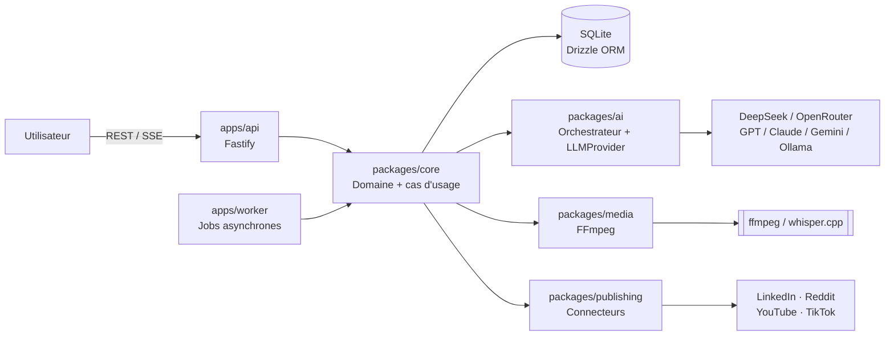

# Automatisation IA — Plateforme personnelle d'automatisation de contenu

> ## ⚠️ Statut du dépôt
>
> **La documentation de conception est la source de vérité** : le produit final, son architecture,
> son modèle de données, ses pipelines, sa stratégie de tests et son plan en 12 étapes.
>
> **Les étapes 1 à 4 sont implémentées** :
> - **étape 1** (fondations exécutables) : monorepo pnpm, API Fastify, worker, base SQLite migrée,
>   file de jobs, suivi des coûts, journalisation corrélée, écran de diagnostic ;
> - **étape 2** (mémoire des projets) : projets, faits typés avec états de vérification, sélection
>   déterministe du contexte — aucune IA ;
> - **étape 3** (conversation IA et fiche maître) : entretien par texte avec un assistant branché sur
>   DeepSeek, propositions d'écriture **validées par l'utilisateur**, fiche maître versionnée ;
> - **étape 4** (génération éditoriale) : plan de sujets et d'angles **ancrés sur les faits
>   confirmés**, sélection d'un angle, rédaction d'un lot multi-plateformes (LinkedIn, Reddit,
>   TikTok, YouTube) **par le worker**, versions conservées, contrôle local des limites de chaque
>   plateforme, relecture et approbation humaines.
>
> Le produit ne **publie** toujours rien (aucun connecteur), n'accepte pas encore d'entrée média et
> ne vérifie pas les affirmations des textes : ces parties arrivent aux étapes suivantes.
>
> Règle issue du cahier des charges (§46 — Priorité absolue) : *ne pas commencer à coder avant
> d'avoir l'architecture, le modèle de données, les flux, les responsabilités, les interfaces
> critiques, les phases, les risques et les décisions techniques.* La documentation a été écrite
> avant la première ligne de code, et elle reste la référence : **toute contribution commence par
> la mise à jour de la documentation**.
>
> Comptes rendus d'exécution : **[docs/12-mise-en-oeuvre-etape-1.md](docs/12-mise-en-oeuvre-etape-1.md)**,
> **[docs/13-mise-en-oeuvre-etape-3.md](docs/13-mise-en-oeuvre-etape-3.md)** et
> **[docs/14-mise-en-oeuvre-etape-4.md](docs/14-mise-en-oeuvre-etape-4.md)**.

---

## 1. Le produit en une phrase

Une **plateforme personnelle d'automatisation de contenu assistée par IA** qui transforme
une **conversation naturelle** (texte ou voix) avec son utilisateur en un **cycle éditorial
complet et supervisé** :

```text
conversation → idées → questions → angle éditorial → scripts → textes
→ médias → brouillons → validation humaine → publication → analytics → apprentissage
```

L'utilisateur est un **développeur** qui construit plusieurs projets techniques et veut
les documenter publiquement **sans gérer lui-même tout le processus éditorial**.

Ce n'est **pas** :

- une ferme à spam ;
- un générateur de contenu générique ;
- un outil de publication massive non supervisée.

Ce n'est **pas non plus** un simple « assistant de rédaction » : l'objectif est de
construire une **mémoire durable des projets, expériences, opinions et apprentissages**
de l'utilisateur, puis de la transformer en contenu crédible et défendable
techniquement.

---

## 2. Contraintes structurantes (non négociables)

| # | Contrainte | Conséquence architecturale |
|---|---|---|
| 1 | **Validation humaine obligatoire** avant toute publication | Machine à états de contenu + écran de validation ; aucun chemin de code ne publie sans `approved` |
| 2 | **Budget IA faible** (~5 USD/semaine de référence) | Contexte minimal par agent, routage par coût, cache, fiche maître comme contrat, table `llm_calls` |
| 3 | **Machine modeste** (usage local) | Monolithe modulaire, SQLite, pas de Kubernetes, pas de Redis au départ, modèles locaux légers uniquement |
| 4 | **Transparence IA** (ne pas inventer d'expertise) | Agent de vérification, `claims_to_verify`, distinction *expérience / test / utilisation / maîtrise* |
| 5 | **Aucune dépendance à un seul fournisseur IA** | Abstraction `LLMProvider` |
| 6 | **Le workflow ne doit jamais être bloqué par une API** | 3 niveaux de publication : API officielle → brouillon distant → brouillon local |
| 7 | **Pas de sur-ingénierie** | Pas de microservices, pas de 25 frameworks, pas de 12 agents indépendants par confort |

---

## 3. Documentation

| Document | Contenu |
|---|---|
| [docs/00-cahier-des-charges.md](docs/00-cahier-des-charges.md) | Cahier des charges source intégral (référence de vérité) |
| [docs/01-vision-produit.md](docs/01-vision-produit.md) | Produit final : objectifs, positionnement, plateformes, UX, fonctionnalités complètes |
| [docs/02-architecture.md](docs/02-architecture.md) | Architecture globale, composants, responsabilités, flux, monorepo, stack, local/cloud/hybride |
| [docs/03-modele-de-donnees.md](docs/03-modele-de-donnees.md) | Schéma de données complet, relations, diagramme ER, stratégie de migration |
| [docs/04-orchestrateur-et-agents-ia.md](docs/04-orchestrateur-et-agents-ia.md) | Orchestrateur, agents, mémoire, prompts, sorties structurées, maîtrise des coûts |
| [docs/05-pipelines.md](docs/05-pipelines.md) | Pipelines conversation, éditorial, médias, vidéo, news, publication, analytics |
| [docs/06-connecteurs-et-publication.md](docs/06-connecteurs-et-publication.md) | Abstraction `PlatformConnector`, capacités, OAuth, idempotence, contraintes API |
| [docs/07-securite-secrets-auth.md](docs/07-securite-secrets-auth.md) | Secrets, chiffrement, OAuth, authentification, uploads, CSRF/XSS |
| [docs/08-jobs-observabilite-couts.md](docs/08-jobs-observabilite-couts.md) | File de jobs, retry/backoff, reprise après crash, observabilité, contrôle des coûts |
| [docs/09-tests-et-qualite.md](docs/09-tests-et-qualite.md) | Stratégie de tests (unitaires → e2e, agents, connecteurs, migrations, idempotence) |
| [docs/10-plan-de-developpement-12-etapes.md](docs/10-plan-de-developpement-12-etapes.md) | **Les 12 étapes de développement** : objectif, livrables, dépendances, critères d'acceptation, tests, risques, complexité |
| [docs/11-risques-decisions-et-limites.md](docs/11-risques-decisions-et-limites.md) | Risques techniques/produit, compromis, décisions réversibles vs coûteuses, ce qui doit attendre |
| [docs/12-mise-en-oeuvre-etape-1.md](docs/12-mise-en-oeuvre-etape-1.md) | **Compte rendu d'exécution de l'étape 1** : décisions prises (M1 à M12), ce qui n'a pas été construit, tests, points ouverts |
| [docs/13-mise-en-oeuvre-etape-3.md](docs/13-mise-en-oeuvre-etape-3.md) | **Compte rendu d'exécution de l'étape 3** : conversation IA et fiche maître — décisions (M1 à M16), ce qui n'a pas été construit, tests, points ouverts |
| [docs/14-mise-en-oeuvre-etape-4.md](docs/14-mise-en-oeuvre-etape-4.md) | **Compte rendu d'exécution de l'étape 4** : génération éditoriale — décisions (M1 à M20), ce qui n'a pas été construit, tests, points ouverts |

---

## 3bis. Démarrage rapide (étapes 1 à 4)

```bash
pnpm install                  # dépendances (better-sqlite3 compilé localement)
cp .env.example .env          # puis renseigner les deux clés obligatoires :
openssl rand -hex 32          #   SESSION_SECRET
openssl rand -hex 32          #   ENCRYPTION_KEY
# puis DEEPSEEK_API_KEY=sk-... pour que la conversation fonctionne réellement

pnpm check:env                # état de l'environnement (bloquant ou dégradé)
pnpm db:migrate               # crée data/app.db et les 27 tables des étapes 1 à 4
pnpm dev                      # API (127.0.0.1:4317) + worker + web (127.0.0.1:5173)

pnpm job:noop -- --wait       # sonde de bout en bout : statut, événements, coût calculé
pnpm verify                   # types, lint, tests, migrations, frontières, canari, environnement
```

L'interface (`http://127.0.0.1:5173`) a trois onglets :

- **Conversation** : on discute par texte avec l'assistant, on accepte ou refuse les écritures
  proposées (chacune cite vos mots), et on relit puis valide la fiche maître ;
- **Projets** : la mémoire structurée — projets, faits typés, contexte déterministe ;
- **Diagnostic** : base migrée, worker actif, clé IA présente, budget du jour.

Sans clé DeepSeek, tout démarre et fonctionne sauf l'assistant : l'appel échoue avec
« clé absente », et l'écran de diagnostic l'indique. La **génération éditoriale** existe
désormais côté serveur (`POST /projects/:id/plan`, `POST /projects/:id/content`, relecture et
approbation) et s'exécute dans le worker, mais **aucun écran ne la pilote encore** : les trois
onglets ci-dessus sont ceux de l'étape 3. Pas de publication, pas de vérification des
affirmations, pas d'entrée média (`docs/10` §4.4, « Interdits ») — voir
[docs/14](docs/14-mise-en-oeuvre-etape-4.md) §3.

Prérequis : Node ≥ 20 LTS, pnpm ≥ 10. FFmpeg et whisper ne sont **pas** requis à ce stade
(leur absence est signalée « dégradé », jamais bloquante).

---

## 4. Résumé de l'architecture retenue

**Monolithe modulaire TypeScript en monorepo**, avec deux processus partageant les mêmes
packages :



- **Frontend** : React + TypeScript + Vite (SPA). Pas de Next.js : dashboard authentifié, aucun besoin de SEO.
- **Backend** : Node.js + TypeScript + **Fastify** (validation par schéma native, typage fort, performant).
- **Base** : **SQLite + Drizzle ORM** en local, migration planifiée vers PostgreSQL via la même couche Drizzle.
- **IA** : **DeepSeek** comme fournisseur par défaut, derrière une abstraction `LLMProvider`.
- **Voix** : **whisper.cpp / faster-whisper** en local, fallback API cloud.
- **Vidéo** : **FFmpeg / ffprobe** pilotés par `child_process`.
- **Jobs** : table `jobs` en base + worker dédié (pas de Redis en V1) derrière une abstraction `Queue`.
- **Stockage** : fichiers locaux sous `data/media/` derrière une abstraction `StorageAdapter`.

Détail complet et justifications : [docs/02-architecture.md](docs/02-architecture.md).

---

## 5. Les 12 étapes de développement

| Étape | Titre | Palier |
|---|---|---|
| 1 | Fondations exécutables — **implémentée** | **V1** |
| 2 | Conversation et mémoire — **implémentée** (mémoire à l'étape 2, conversation et fiche maître à l'étape 3) | **V1** |
| 3 | Conversation IA et fiche maître — **implémentée** (ce dépôt) ; « Sujets, angles et entrée média » du plan reste à faire | **V1** |
| 4 | Génération éditoriale — **implémentée** (sujets, angles, écriture multi-plateformes ; l'entrée média du plan reste à faire) | **V1** |
| 5 | Qualité, comptes et publication manuelle | **V1** |
| 6 | Médias et sauvegarde | **V2** |
| 7 | Vidéo | **V2** |
| 8 | Publication par API et budget | **V2** |
| 9 | Calendrier et planification | **V2** |
| 10 | Veille et exploitation continue | **V3** |
| 11 | Analytics et apprentissage | **V3** |
| 12 | Consolidation et portabilité | **V3** |

> **Numérotation** : ce tableau suit les titres de
> [`docs/10`](docs/10-plan-de-developpement-12-etapes.md) §2. Le lot livré ici est intitulé
> « étape 4 — génération éditoriale » : il apporte les parties **sujets et angles** de l'étape 3 du
> plan (`content_subjects`, `subject_angles`) et l'**écriture multi-plateformes** de l'étape 4
> (`content_items`, `content_versions`, `content_review_notes`). L'entrée média (transcription) et
> la publication restent à construire.

**V1 = étapes 1 → 5** : l'utilisateur peut discuter, l'IA construit la fiche maître,
produit des brouillons multi-plateformes vérifiés, et l'utilisateur valide puis copie
manuellement. Aucune dépendance à une API de plateforme, aucun FFmpeg. C'est le cœur de
valeur et la plus faible surface de risque.

Détail complet (objectif, livrables, dépendances, critères de sortie, tests, risques,
complexité, ce qu'il ne faut **pas** construire à ce stade) :
[docs/10-plan-de-developpement-12-etapes.md](docs/10-plan-de-developpement-12-etapes.md).

---

## 6. Règle de contribution

1. Aucune fonctionnalité n'est implémentée sans être décrite dans ce dépôt.
2. Tout changement d'architecture passe par une mise à jour de `docs/` et, si la décision
   est coûteuse à inverser, par une entrée dans
   [docs/11-risques-decisions-et-limites.md](docs/11-risques-decisions-et-limites.md).
3. Toute étape livrée doit satisfaire **ses critères de sortie** avant de passer à la
   suivante.

