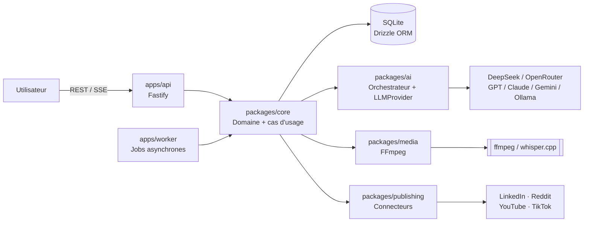

# Automatisation IA — Plateforme personnelle d'automatisation de contenu

> ## ⚠️ Statut du dépôt
>
> **Ce dépôt ne contient aucune ligne de code produit. C'est volontaire.**
>
> Il contient **uniquement la documentation de conception** : le produit final, son
> architecture, son modèle de données, ses pipelines, sa stratégie de tests et son
> **plan de développement en 12 étapes**.
>
> Règle issue du cahier des charges (§46 — Priorité absolue) : *ne pas commencer à coder
> avant d'avoir l'architecture, le modèle de données, les flux, les responsabilités, les
> interfaces critiques, les phases, les risques et les décisions techniques.*
>
> Toute contribution doit d'abord mettre à jour la documentation, jamais l'inverse.

---

## 1. Le produit en une phrase

Une **plateforme personnelle d'automatisation de contenu assistée par IA** qui transforme
une **conversation naturelle** (texte ou voix) avec son utilisateur en un **cycle éditorial
complet et supervisé** :

```text
conversation → idées → questions → angle éditorial → scripts → textes
→ médias → brouillons → validation humaine → publication → analytics → apprentissage
```

L'utilisateur est un **développeur** qui construit plusieurs projets techniques et veut
les documenter publiquement **sans gérer lui-même tout le processus éditorial**.

Ce n'est **pas** :

- une ferme à spam ;
- un générateur de contenu générique ;
- un outil de publication massive non supervisée.

Ce n'est **pas non plus** un simple « assistant de rédaction » : l'objectif est de
construire une **mémoire durable des projets, expériences, opinions et apprentissages**
de l'utilisateur, puis de la transformer en contenu crédible et défendable
techniquement.

---

## 2. Contraintes structurantes (non négociables)

| # | Contrainte | Conséquence architecturale |
|---|---|---|
| 1 | **Validation humaine obligatoire** avant toute publication | Machine à états de contenu + écran de validation ; aucun chemin de code ne publie sans `approved` |
| 2 | **Budget IA faible** (~5 USD/semaine de référence) | Contexte minimal par agent, routage par coût, cache, fiche maître comme contrat, table `llm_calls` |
| 3 | **Machine modeste** (usage local) | Monolithe modulaire, SQLite, pas de Kubernetes, pas de Redis au départ, modèles locaux légers uniquement |
| 4 | **Transparence IA** (ne pas inventer d'expertise) | Agent de vérification, `claims_to_verify`, distinction *expérience / test / utilisation / maîtrise* |
| 5 | **Aucune dépendance à un seul fournisseur IA** | Abstraction `LLMProvider` |
| 6 | **Le workflow ne doit jamais être bloqué par une API** | 3 niveaux de publication : API officielle → brouillon distant → brouillon local |
| 7 | **Pas de sur-ingénierie** | Pas de microservices, pas de 25 frameworks, pas de 12 agents indépendants par confort |

---

## 3. Documentation

| Document | Contenu |
|---|---|
| [docs/00-cahier-des-charges.md](docs/00-cahier-des-charges.md) | Cahier des charges source intégral (référence de vérité) |
| [docs/01-vision-produit.md](docs/01-vision-produit.md) | Produit final : objectifs, positionnement, plateformes, UX, fonctionnalités complètes |
| [docs/02-architecture.md](docs/02-architecture.md) | Architecture globale, composants, responsabilités, flux, monorepo, stack, local/cloud/hybride |
| [docs/03-modele-de-donnees.md](docs/03-modele-de-donnees.md) | Schéma de données complet, relations, diagramme ER, stratégie de migration |
| [docs/04-orchestrateur-et-agents-ia.md](docs/04-orchestrateur-et-agents-ia.md) | Orchestrateur, agents, mémoire, prompts, sorties structurées, maîtrise des coûts |
| [docs/05-pipelines.md](docs/05-pipelines.md) | Pipelines conversation, éditorial, médias, vidéo, news, publication, analytics |
| [docs/06-connecteurs-et-publication.md](docs/06-connecteurs-et-publication.md) | Abstraction `PlatformConnector`, capacités, OAuth, idempotence, contraintes API |
| [docs/07-securite-secrets-auth.md](docs/07-securite-secrets-auth.md) | Secrets, chiffrement, OAuth, authentification, uploads, CSRF/XSS |
| [docs/08-jobs-observabilite-couts.md](docs/08-jobs-observabilite-couts.md) | File de jobs, retry/backoff, reprise après crash, observabilité, contrôle des coûts |
| [docs/09-tests-et-qualite.md](docs/09-tests-et-qualite.md) | Stratégie de tests (unitaires → e2e, agents, connecteurs, migrations, idempotence) |
| [docs/10-plan-de-developpement-12-etapes.md](docs/10-plan-de-developpement-12-etapes.md) | **Les 12 étapes de développement** : objectif, livrables, dépendances, critères d'acceptation, tests, risques, complexité |
| [docs/11-risques-decisions-et-limites.md](docs/11-risques-decisions-et-limites.md) | Risques techniques/produit, compromis, décisions réversibles vs coûteuses, ce qui doit attendre |

---

## 4. Résumé de l'architecture retenue

**Monolithe modulaire TypeScript en monorepo**, avec deux processus partageant les mêmes
packages :



- **Frontend** : React + TypeScript + Vite (SPA). Pas de Next.js : dashboard authentifié, aucun besoin de SEO.
- **Backend** : Node.js + TypeScript + **Fastify** (validation par schéma native, typage fort, performant).
- **Base** : **SQLite + Drizzle ORM** en local, migration planifiée vers PostgreSQL via la même couche Drizzle.
- **IA** : **DeepSeek** comme fournisseur par défaut, derrière une abstraction `LLMProvider`.
- **Voix** : **whisper.cpp / faster-whisper** en local, fallback API cloud.
- **Vidéo** : **FFmpeg / ffprobe** pilotés par `child_process`.
- **Jobs** : table `jobs` en base + worker dédié (pas de Redis en V1) derrière une abstraction `Queue`.
- **Stockage** : fichiers locaux sous `data/media/` derrière une abstraction `StorageAdapter`.

Détail complet et justifications : [docs/02-architecture.md](docs/02-architecture.md).

---

## 5. Les 12 étapes de développement

| Étape | Titre | Palier |
|---|---|---|
| 1 | Fondations : monorepo, socle technique, base de données, secrets | **V1** |
| 2 | Conversation, transcription vocale et mémoire des projets | **V1** |
| 3 | Orchestrateur IA, abstraction LLM et suivi des coûts | **V1** |
| 4 | Fiche maître et génération éditoriale multi-plateformes | **V1** |
| 5 | Qualité éditoriale, vérification factuelle et anti-spam | **V1** |
| 6 | Bibliothèque de médias (images, captures, assets) | **V2** |
| 7 | Pipeline vidéo FFmpeg et sous-titres Whisper | **V2** |
| 8 | Calendrier éditorial et planification | **V2** |
| 9 | Publication et connecteurs de plateformes | **V2** |
| 10 | Veille technologique (pipeline news) | **V3** |
| 11 | Analytics et boucle d'apprentissage | **V3** |
| 12 | Durcissement : observabilité, sécurité, portabilité cloud | **V3** |

**V1 = étapes 1 → 5** : l'utilisateur peut discuter, l'IA construit la fiche maître,
produit des brouillons multi-plateformes vérifiés, et l'utilisateur valide puis copie
manuellement. Aucune dépendance à une API de plateforme, aucun FFmpeg. C'est le cœur de
valeur et la plus faible surface de risque.

Détail complet (objectif, livrables, dépendances, critères de sortie, tests, risques,
complexité, ce qu'il ne faut **pas** construire à ce stade) :
[docs/10-plan-de-developpement-12-etapes.md](docs/10-plan-de-developpement-12-etapes.md).

---

## 6. Règle de contribution

1. Aucune fonctionnalité n'est implémentée sans être décrite dans ce dépôt.
2. Tout changement d'architecture passe par une mise à jour de `docs/` et, si la décision
   est coûteuse à inverser, par une entrée dans
   [docs/11-risques-decisions-et-limites.md](docs/11-risques-decisions-et-limites.md).
3. Toute étape livrée doit satisfaire **ses critères de sortie** avant de passer à la
   suivante.

