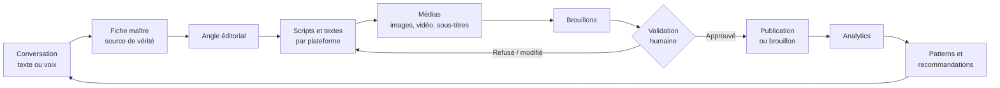
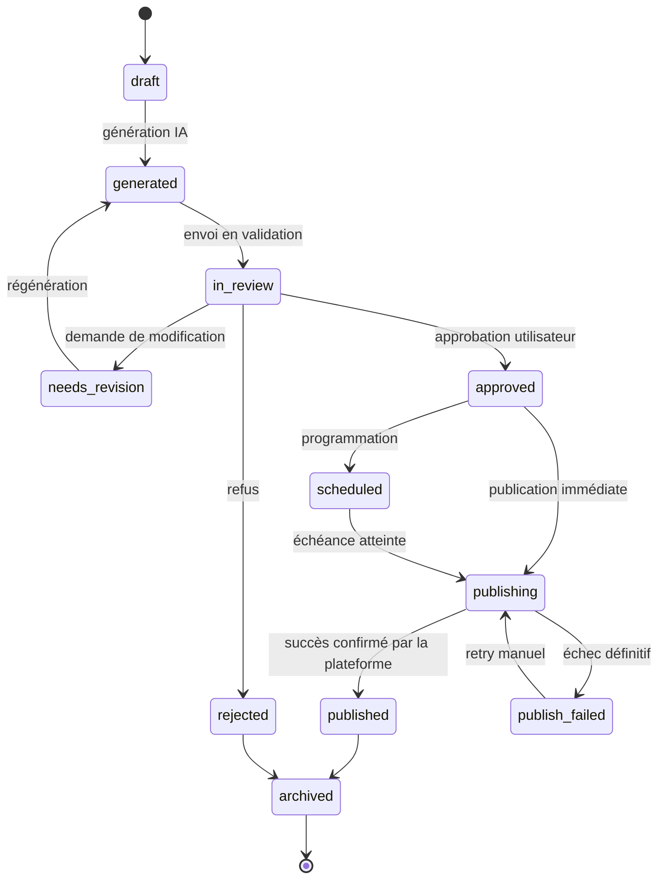

# 01 — Vision produit : le produit final

> Ce document décrit **le produit complet**, pas une MVP. La V1 est définie *après*, dans
> [`10-plan-de-developpement-12-etapes.md`](10-plan-de-developpement-12-etapes.md).

---

## 1. Résumé exécutif

Le produit est une **plateforme personnelle d'automatisation de contenu assistée par IA**,
mono-utilisateur au départ, exécutée localement sur une machine modeste.

Il transforme une **conversation naturelle** en un **pipeline éditorial supervisé** :



**Ce qui rend ce produit différent d'un simple générateur de texte :**

1. **La fiche maître** (`master_brief`) est un contrat de données structuré produit une
   seule fois par conversation, puis consommé par tous les agents. Aucun agent ne relit
   tout l'historique.
2. **La mémoire projet** stocke durablement les faits vérifiés (stack, décisions,
   difficultés, erreurs, solutions, compromis, apprentissages, angles déjà publiés) pour
   éviter de redemander les mêmes informations et surtout pour **empêcher l'IA d'inventer**.
3. **Le contrôle humain est obligatoire** : aucun contenu ne quitte le système sans un
   `approved` explicite de l'utilisateur.
4. **Le coût IA est une contrainte de premier ordre**, pas un détail d'optimisation
   (référence : ~5 USD/semaine).

---

## 2. Utilisateur et contexte

| Attribut | Valeur |
|---|---|
| **Utilisateur principal** | Un développeur solo (toi), travaillant sur plusieurs projets techniques en parallèle |
| **Nombre d'utilisateurs** | 1 au départ. L'architecture autorise le multi-utilisateur plus tard, sans le supporter en V1 |
| **Matériel** | Un PC « relativement modeste » — Linux, pas de GPU dédié exploitable |
| **Disponibilité attendue** | Daily driver local. L'application doit rester fluide même pendant qu'un rendu vidéo tourne |
| **Compétence** | Développeur capable de défendre techniquement ce qu'il publie |
| **Budget IA** | ~5 USD/semaine de référence |

### Ce que l'utilisateur sait faire et ne veut pas faire

- Il **sait** coder, expliquer ses décisions techniques, et juger de la pertinence d'un angle.
- Il **ne veut pas** passer son temps sur le travail éditorial mécanique : reformuler pour
  chaque plateforme, écrire les hooks, produire les hashtags, découper la vidéo,
  sous-titrer, reprogrammer les publications, coller les métriques dans un tableur.
- Il **ne veut pas** que l'IA parle à sa place de choses qu'il n'a pas réellement faites.

---

## 3. Le problème résolu

Un développeur qui construit des projets a une **matière première éditoriale abondante**
mais un **temps éditorial quasi nul**. Le résultat habituel est l'un des deux extrêmes :

- **rien n'est publié** — le projet reste invisible, aucun bénéfice de visibilité ;
- **le contenu est génériques** — posts « 5 astuces JavaScript » sans rapport avec ce qui
  a réellement été construit, donc sans valeur différenciante et souvent décrédibilisant.

Le produit résout cet écart en plaçant l'effort humain **uniquement là où il est
irremplaçable** : raconter ce qui a été réellement fait, valider l'angle, arbitrer la
qualité, et approuver la publication.

---

## 4. Objectifs du produit

Repris et ordonnés depuis le cahier des charges (§3) :

### Objectifs primaires (visibilité et carrière)

1. **Documenter ses projets techniques** sans effort éditorial manuel.
2. **Augmenter sa visibilité** de développeur.
3. **Construire une présence publique** cohérente autour du développement et de l'IA.
4. **Attirer des recruteurs** en rendant visibles non pas des slogans mais des
   raisonnements et des produits.
5. **Attirer éventuellement des clients freelance.**
6. **Créer un réseau professionnel** (conversations, contacts, leads).

### Objectifs opérationnels

7. **Transformer les projets en contenu** de manière reproductible.
8. **Utiliser l'actualité tech comme source secondaire**, jamais comme source principale.
9. **Réduire drastiquement le temps** de production et de publication.
10. **Conserver un contrôle humain** systématique avant publication.
11. **Apprendre progressivement** quels sujets, formats, hooks et heures fonctionnent.

### Objectif de perception

12. **Rendre visibles les capacités de raisonnement et la manière de construire des
    produits**, plutôt que des compétences déclaratives.

---

## 5. Non-objectifs (explicites)

| Non-objectif | Raison |
|---|---|
| Devenir une ferme à spam ou un réseau de comptes automatisés | Le cahier des charges l'interdit (§37). Un compte principal par plateforme |
| Publier automatiquement du contenu générique sans surveillance | Détruit la crédibilité, objectif produit inverse |
| Remplacer complètement l'utilisateur dans la création | L'angle, l'opinion et la validation restent humains |
| Devenir un SaaS multi-tenant dès la V1 | Complexité disproportionnée pour un usage personnel |
| Générer de la vidéo par IA payante (Sora-like) au démarrage | Coût incompatible avec le budget ; FFmpeg suffit |
| Faire du SEO / du référencement web | Le produit ne publie pas de site, il alimente des plateformes sociales |
| Supporter 30 plateformes | 5 plateformes bien traitées, extensible ensuite |
| Supporter plusieurs langues au départ | Français d'abord, l'architecture reste neutre |

---

## 6. Positionnement éditorial

### Sujets de prédilection

Développement web · frontend · React · TypeScript · JavaScript · Astro · architecture
logicielle · outils développeurs · automatisation · agents IA · orchestrateurs IA · LLM ·
développement assisté par IA · Linux et environnement de développement · retours
d'expérience techniques · construction de projets · tests d'outils et de technologies ·
erreurs, limites et leçons apprises.

### Posture

> **L'utilisateur ne veut pas devenir un compte d'actualité IA.**

L'actualité est une **source secondaire**. Elle n'est retenue que si :

- elle est réellement intéressante ;
- elle est liée à ses sujets ;
- elle lui permet d'apporter un **angle personnel** ;
- **et** s'il n'a pas de meilleur sujet issu de ses propres projets.

Ordre de priorité des sources : **projets > expériences > apprentissages > opinions >
actualités**.

### Règles de ton

| Plateforme | Ton attendu | Interdits |
|---|---|---|
| **LinkedIn** | Professionnel, crédible, accessible, orienté développement. Intéressant pour recruteurs, devs et clients | Jargon inutile, faux storytelling, fausse expertise, ton commercial agressif |
| **Reddit** | Communautaire, technique, transparent, utile, conversationnel | Ton publicitaire, auto-promotion non déclarée, non-respect des règles du subreddit |
| **TikTok** | Direct, accroche immédiate, concret, démonstratif | Clickbait trompeur, promesse non tenue par la vidéo |
| **YouTube Shorts** | Rythmé, vertical, une seule idée forte | Remplissage, introduction inutile |
| **YouTube long** | Structuré, pédagogique, démonstratif | Vidéo sans démonstration réelle, script sans structure |

### Interdits transverses

Contenu vide · répétitions · exagérations · hooks mensongers · clickbait trompeur ·
fausses métriques · contenu trop proche d'un post précédent · informations non vérifiées ·
présenter une technologie « utilisée avec l'IA » comme une compétence maîtrisée.

---

## 7. Mémoire des projets — matière première du produit

Le système doit accepter un **nombre indéfini de projets** et en conserver une mémoire
progressive. Exemples de projets déjà cités dans le cahier des charges : application de
gestion financière, Hire Stack, site chiens/chats (Astro), site d'apprentissage de
l'italien, orchestrateurs IA locaux, orchestrateurs IA cloud, expériences Codex,
expériences DeepSeek, outils autour des agents IA, projets frontend, prototypes,
expériences techniques futures.

### Champs mémorisés par projet

**Identité** — nom · description · problème traité · motivation · objectif · public cible

**Technique** — stack · technologies testées · technologies réellement maîtrisées ·
technologies utilisées principalement avec assistance IA · architecture · fonctionnalités ·
décisions techniques

**Vécu** — difficultés · erreurs · solutions · compromis · apprentissages · état actuel ·
prochaines étapes

**Ressources** — captures disponibles · vidéos disponibles · URLs · ressources

**Historique éditorial** — sujets déjà publiés · angles déjà utilisés · questions déjà
posées · résultats des contenus liés au projet

### Les deux fonctions de cette mémoire

1. **Éviter de redemander** une information déjà connue pendant la conversation.
2. **Éviter que l'IA invente des faits.** Ce qui n'est pas dans la mémoire et n'a pas été
   confirmé par l'utilisateur est traité comme *inconnu*, jamais comme *vrai*.

> ⚠️ Point d'architecture critique : la distinction *expérience / test / utilisation /
> maîtrise* est **stockée comme un attribut**, pas seulement demandée au modèle. Voir
> [`03-modele-de-donnees.md`](03-modele-de-donnees.md), table `project_skill_facts`.

---

## 8. Interaction principale : la conversation

L'application fonctionne comme **une conversation**, pas comme un formulaire.

```text
Assistant : De quoi veux-tu parler aujourd'hui ?

Utilisateur : Aujourd'hui je veux parler de mon orchestrateur IA.
              J'ai réussi à faire travailler plusieurs agents ensemble
              et je veux montrer pourquoi je l'ai construit.
```

L'IA doit ensuite, dans cet ordre :

1. comprendre le sujet ;
2. consulter la mémoire pertinente ;
3. détecter les informations manquantes ;
4. poser **seulement** les questions utiles ;
5. éviter les questions déjà résolues par la mémoire ;
6. déterminer les angles possibles ;
7. **signaler si le sujet est trop faible ou trop vague** ;
8. suggérer une meilleure approche si nécessaire ;
9. produire une **fiche maître du sujet**.

### Entrée vocale

L'entrée vocale fait partie du produit : enregistrement depuis le navigateur →
transcription → correction éventuelle → texte exploitable par l'orchestrateur.

Priorités : transcription **locale ou très peu coûteuse** · faible latence · **français
correctement supporté** · possibilité de basculer sur une API cloud si nécessaire.

La **réponse vocale de l'assistant n'est pas requise** : la sortie texte suffit.

### La fiche maître

Après la conversation, l'orchestrateur produit une représentation structurée commune —
**la source de vérité du contenu du jour** :

```json
{
  "subject": "",
  "project": "",
  "context": "",
  "why_it_matters": "",
  "problem": "",
  "solution": "",
  "technical_points": [],
  "personal_opinion": "",
  "lessons": [],
  "proofs": [],
  "media_available": [],
  "target_audience": [],
  "possible_angles": [],
  "selected_angle": "",
  "claims_to_verify": [],
  "sensitive_or_uncertain_points": []
}
```

Contrat d'architecture : **les agents spécialisés consomment la fiche maître**, ils ne
relisent pas l'historique de conversation. C'est la principale économie de tokens du
produit (voir [`04-orchestrateur-et-agents-ia.md`](04-orchestrateur-et-agents-ia.md)).

---

## 9. Plateformes ciblées et adaptation du contenu

**Un seul compte par plateforme au départ.** Plateformes cibles :

| Plateforme | Rythme cible | Nature du contenu |
|---|---|---|
| **LinkedIn** | Quotidien | Post texte + média recommandé |
| **Reddit** | Jusqu'à quotidien **si pertinent** | Post textuel communautaire et utile |
| **TikTok** | Quotidien | Vidéo verticale courte |
| **YouTube Shorts** | Quotidien | Vidéo verticale courte |
| **YouTube (long)** | ~2 fois/semaine, **quand la matière existe** | Vidéo structurée avec démonstration |

Le produit doit être conçu de manière **extensible** afin d'ajouter d'autres plateformes
plus tard (X, Threads, Mastodon, Instagram, newsletter…).

### Règle fondamentale : le même contenu n'est pas copié-collé

Chaque plateforme a **sa propre adaptation**, produite à partir de la même fiche maître.

#### LinkedIn

Sortie attendue : **hook · texte · CTA éventuel · hashtags · média recommandé**.
Style : professionnel, crédible, accessible, orienté développement ; utile aux recruteurs,
développeurs et clients ; pas de jargon inutile ; pas de faux storytelling ; pas de fausse
expertise.

#### Reddit

Sortie attendue : **subreddit ciblé · titre · corps · liens autorisés · flair · CTA**.
Le système doit **respecter les règles du subreddit** et évaluer le risque de spam et le
niveau d'auto-promotion acceptable. Le contenu ne doit **jamais** ressembler à une
publicité automatique.

#### TikTok

Sortie attendue : **hook · script · durée · structure · texte affiché · sous-titres ·
description · hashtags · média · CTA éventuel**.

#### YouTube Shorts

Sortie attendue : **hook · script vertical · durée · titre · description · hashtags ·
sous-titres · plan de montage · média**.

#### YouTube long

Sortie attendue : **idée · angle · titre · structure · script ou plan · chapitres ·
démonstrations · séquences écran · B-roll éventuel · description · tags · assets
nécessaires · proposition de miniature**.

> La miniature **finale** peut rester manuelle ou déléguée à un designer. Le système
> produit une **proposition** (titre court + direction visuelle + assets candidats), pas
> un livrable graphique définitif.

---

## 10. Cycle de vie d'un contenu

Tout contenu est une **entité à états** en base, jamais un simple texte. C'est cette
machine à états qui garantit l'idempotence de la publication et l'impossibilité de publier
sans validation.



| État | Signification |
|---|---|
| `draft` | Contenu amorcé, incomplet |
| `generated` | Généré par l'IA, jamais validé |
| `in_review` | Affiché dans l'écran de validation |
| `needs_revision` | L'utilisateur a demandé une modification |
| `approved` | **Seul état autorisant la publication** |
| `scheduled` | Approuvé + date de publication fixée |
| `publishing` | Tentative de publication en cours (verrou) |
| `published` | Publié, identifiant distant enregistré |
| `publish_failed` | Échec définitif, action manuelle requise |
| `rejected` / `archived` | Refusé ou rangé |

### Versioning

Chaque contenu conserve **toutes ses versions**, avec la cause de chaque changement.
Il doit toujours être possible de savoir **ce qui a été généré, ce qui a été modifié
manuellement, et ce qui a été publié**.

```text
LinkedIn post
v1 → généré par l'agent
v2 → l'utilisateur demande plus court
v3 → l'utilisateur modifie manuellement
v4 → approuvé  ← c'est cette version exacte qui part en publication
```

> **Garde-fou d'idempotence** : la publication référence un `content_version_id` **figé**.
> Si le contenu est modifié après approbation, l'approbation est invalidée et l'état
> repasse à `in_review`. On ne peut donc pas publier une version différente de celle qui a
> été approuvée, ni publier deux fois la même version.

---

## 11. Validation humaine obligatoire

> **Principe non négociable : aucun contenu ne doit être publié sans validation utilisateur.**

Avant publication, l'écran de validation doit montrer :

| Bloc | Contenu affiché |
|---|---|
| **Cible** | Plateforme(s) concernée(s) |
| **Texte** | Texte final complet |
| **Titre** | Titre / hook |
| **Hashtags** | Liste complète |
| **Média** | Image(s) associée(s) |
| **Vidéo** | Lecteur de prévisualisation si vidéo |
| **Miniature** | Proposition de miniature |
| **Description** | Description spécifique à la plateforme |
| **Planning** | Date et heure prévues |
| **Confiance** | Informations incertaines |
| **Risques** | Risques détectés (spam, règle subreddit, claim non vérifié) |
| **Historique** | Diff éventuel avec la version précédente |

Actions disponibles : **approuver · modifier manuellement · demander une modification à
l'IA · régénérer · changer d'angle · refuser · reporter · supprimer**.

### Principe de blocage doux

Si le système détecte un risque (claim non vérifié, contenu trop proche d'un ancien post,
ton publicitaire sur Reddit), il **n'empêche pas** l'utilisateur d'approuver, mais il
l'affiche explicitement et exige une confirmation. Bloquer totalement pousserait
l'utilisateur à contourner l'outil.

---

## 12. Dashboard

L'interface doit permettre de voir **clairement l'état du contenu**. Vue principale :

```text
CONTENU DU JOUR

Sujet :
Mon orchestrateur IA

LinkedIn        → prêt
Reddit          → prêt
TikTok          → montage
YouTube Short   → prêt
YouTube long    → non prévu

Vidéo :
[Prévisualiser]

Titre :
...

Description :
...

Hashtags :
...

[Modifier]  [Régénérer]  [Approuver]  [Programmer]  [Refuser]
```

### Sections de navigation

| Section | Rôle |
|---|---|
| **Historique** | Tout ce qui a été produit, y compris refusé |
| **Calendrier** | Vue planning des contenus approuvés et programmés |
| **Projets** | Mémoire par projet, état, matière disponible |
| **Idées** | Viviers d'idées générées, à trier |
| **Brouillons** | Contenus par état, filtrables |
| **Médias** | Bibliothèque d'assets |
| **Publications** | Statut réel de chaque publication |
| **Analytics** | Métriques et tendances |
| **Dépenses IA** | Coûts par tâche, agent, modèle, semaine |
| **Réglages** | Budgets, préférences, rythmes, fournisseurs |
| **Intégrations** | Comptes, OAuth, connecteurs |

### Principes d'interface

- **Une seule action prioritaire par écran** : quand un contenu attend une décision,
  l'écran par défaut propose cette décision.
- Le dashboard est **le point d'entrée de la conversation** : « De quoi veux-tu parler
  aujourd'hui ? » est un composant de la page d'accueil.
- Aucun état vide muet : un écran vide explique **quoi faire** et **pourquoi**.

---

## 13. Calendrier éditorial

Rythme cible **potentiel** (jamais une obligation) :

| Plateforme | Fréquence cible |
|---|---|
| LinkedIn | Quotidien |
| Reddit | Jusqu'à quotidien, si pertinent |
| TikTok | Quotidien |
| YouTube Shorts | Quotidien |
| YouTube long | ~2 fois par semaine |

> **Le système ne doit pas publier un contenu faible simplement pour respecter une
> fréquence.**

Il doit pouvoir répondre :

```text
Aucun sujet ne mérite une publication aujourd'hui.
```

ou

```text
Voici trois idées plus fortes.
```

Le calendrier n'est donc pas un générateur d'ordre de travail : c'est un **tableau de
bord de capacité**. Il affiche les trous à combler et les contenus qui n'ont pas la
matière nécessaire pour sortir.

---

## 14. Générateur d'idées

Si l'utilisateur dit « Je n'ai pas d'idée », le système exploite :

- projets existants ; fonctionnalités récentes ; difficultés rencontrées ; erreurs ;
- décisions techniques ; comparaisons ; apprentissages ;
- **contenus qui n'ont jamais été publiés** (stockés mais jamais sortis) ;
- **anciens sujets pouvant avoir une nouvelle perspective** ;
- actualités pertinentes.

Exemples de formats d'idées produits :

- pourquoi j'ai choisi Astro pour ce projet ;
- ce que j'ai découvert en utilisant une technologie hors de ma stack habituelle ;
- erreur faite pendant la conception ;
- comment j'utilise plusieurs agents IA ;
- ce que l'IA fait très bien et ce que je dois vérifier ;
- comparaison entre deux outils ;
- démonstration d'une fonctionnalité ;
- retour d'expérience après plusieurs jours ;
- architecture d'un projet ;
- avant / après.

**Contrainte anti-redite** : le générateur d'idées consulte l'historique éditorial du
projet pour éviter de reproposer un angle déjà publié — ou, s'il le repropose, il le
signale explicitement comme *nouvelle perspective*.

---

## 15. Veille technologique

Le produit recherche automatiquement des actualités pertinentes dans les domaines :
frontend · React · JavaScript · TypeScript · Astro · Node.js · IA · LLM · agents · Codex ·
DeepSeek · outils développeurs · Linux · open source.

### Contraintes strictes

- ne **pas** envoyer des dizaines d'articles complets au LLM ;
- récupérer d'abord des **métadonnées** ;
- **filtrer sans LLM** quand c'est possible (mots-clés, dates, sources) ;
- **dédupliquer** ;
- **scorer** ;
- n'envoyer au modèle **que les meilleurs candidats** ;
- résumer **uniquement lorsque nécessaire** ;
- **conserver les sources** ;
- **ne jamais inventer une news** ;
- pouvoir marquer une information comme **non vérifiée** ;
- **vérifier la date** et éviter les contenus obsolètes.

### Pipeline

```text
RSS / API / sources
   ↓
filtrage mécanique
   ↓
déduplication
   ↓
scoring
   ↓
petit modèle
   ↓
1 à 5 news intéressantes
   ↓
validation / choix utilisateur
   ↓
création éventuelle de contenu
```

Le résultat maximal est **1 à 5 news** proposées, jamais un flux. L'utilisateur choisit ;
le système ne décide pas de publier une news.

---

## 16. Analytics et boucle d'apprentissage

### Mesures collectées

Impressions · vues · watch time · likes · commentaires · partages · sauvegardes ·
abonnements · visites de profil · clics · CTR · clics portfolio · messages entrants ·
leads · contacts recruteurs · contacts clients.

> Lorsque l'API ne fournit pas une métrique, le système doit permettre une **saisie
> manuelle**. C'est une exigence explicite : le produit ne doit pas dépendre de la
> générosité des APIs.

### Boucle d'apprentissage

```text
Création → Publication → Résultats → Analyse → Patterns → Recommandations → Nouveau contenu
```

Ce que le système doit pouvoir apprendre : sujets performants · hooks performants ·
longueur · formats · plateformes · heures · types de vidéos · tonalités · CTA · projets
qui intéressent le plus.

> **Garde-fou majeur** : le produit **ne doit pas** tomber dans une optimisation aveugle
> basée uniquement sur les likes. Les signaux prioritaires sont les signaux **utiles** :
> visites de profil · clics · contacts · recruteurs · leads · conversations utiles.

---

## 17. Expérimentation et promotion payante (plus tard)

L'utilisateur pourra amplifier certains contenus avec un petit budget publicitaire.
**Le système ne gère pas cela automatiquement au départ.** Son modèle de données doit
simplement permettre de tracer : contenu organique vs promu · montant dépensé · période ·
impressions payées · conversions · ROI. Objectif : comparer organique et payant.

---

## 18. Qualité éditoriale, anti-spam et transparence IA

### Détections de qualité obligatoires

Le système doit détecter : contenu vide · répétitions · jargon inutile · exagérations ·
hooks mensongers · clickbait trompeur · fausses métriques · contenu trop proche d'un
ancien post · informations non vérifiées · ton trop commercial sur Reddit.

Il doit pouvoir dire : **« Ce sujet n'est pas assez intéressant en l'état. »** et proposer
une amélioration.

### Anti-spam

- un compte principal par plateforme au départ ;
- validation humaine systématique ;
- pas de publication massive non supervisée ;
- respect des politiques des plateformes ;
- fréquence raisonnable ;
- adaptation à chaque communauté.

L'architecture pourra techniquement supporter plusieurs comptes plus tard. **Ce n'est pas
la priorité actuelle.**

### Transparence IA

> Le produit ne doit pas présenter comme une compétence maîtrisée une technologie utilisée
> principalement par IA si l'utilisateur ne peut pas la défendre techniquement.

L'IA doit : éviter les affirmations fausses · signaler les claims non vérifiés ·
distinguer *expérience / test / utilisation / maîtrise* · éviter de créer une fausse
expertise · pouvoir demander confirmation à l'utilisateur.

**Implémentation** : chaque compétence déclarée est une entité (`project_skill_facts`)
portant un niveau de maîtrise. L'agent de vérification compare les affirmations du
brouillon aux faits stockés et signale tout écart. Voir
[`03-modele-de-donnees.md`](03-modele-de-donnees.md).

---

## 19. Scénario d'usage de référence (journée type)

C'est le test d'acceptation produit de bout en bout. S'il ne fonctionne pas, le produit a
échoué, quelle que soit la qualité du code.

```text
08:00  L'utilisateur ouvre le dashboard.
       « De quoi veux-tu parler aujourd'hui ? »

08:02  Il répond au micro : « J'ai terminé le pipeline de sous-titres
       de mon orchestrateur, je veux expliquer pourquoi j'ai choisi
       whisper.cpp plutôt qu'une API. »

08:03  Transcription locale, correction, extraction du sujet.
       L'IA consulte la mémoire du projet « orchestrateur IA » :
       elle connaît déjà la stack et les décisions précédentes.
       Elle pose 2 questions ciblées uniquement sur ce qui manque.

08:08  Fiche maître produite, 3 angles proposés.
       L'utilisateur choisit : « pourquoi local plutôt que cloud ».

08:10  Génération : LinkedIn (post), Reddit (post communautaire),
       TikTok (script 45 s), YouTube Short (script 60 s).
       YouTube long : « non prévu, matière insuffisante ».

08:11  Contrôle qualité : 1 claim non vérifié signalé
       (« whisper.cpp est X fois plus rapide ») → marqué à confirmer.

08:15  L'utilisateur relit le post LinkedIn, raccourcit l'intro, approuve.
       Il rejette le script TikTok (« trop générique ») → régénération.

08:20  Le post LinkedIn est approuvé ; Reddit l'est aussi.
       TikTok repart en validation après régénération.

08:25  Publication : LinkedIn et Reddit sont copiés/approuvés manuellement
       (niveau C) car les APIs demandent une configuration supplémentaire.
       Statuts passés à « publié », horodatés, avec le texte exact publié.

Total : ~25 minutes, coût IA estimé < 0,15 USD.
```

---

## 20. Indicateurs de succès du produit

| Indicateur | Cible |
|---|---|
| **Temps de production** d'un lot de contenu multi-plateformes | < 30 min, contre plusieurs heures manuellement |
| **Coût IA hebdomadaire** | ≤ 5 USD |
| **Taux d'approbation directe** (sans régénération) | En hausse progressive — mesuré, pas supposé |
| **Contenus publiés / semaine** | ≥ 5 (LinkedIn + Reddit + 1 short minimum) |
| **Zéro publication non validée** | Invariant absolu, vérifié par test automatisé |
| **Zéro fait inventé publié** | Invariant absolu sur les claims marqués `verified=false` |
| **Signal utile** (visites de profil, clics, contacts entrants) | Suivi mensuel croissant |
| **Fraîcheur de la mémoire projet** | Chaque projet a une entrée à jour après chaque session |

---

## 21. Ce que le produit n'est pas (rappel final)

1. Ce n'est pas un automate de publication : c'est un **assistant éditorial supervisé**.
2. Ce n'est pas un compte d'actualité : l'actualité est **secondaire**.
3. Ce n'est pas un générateur graphique : la miniature finale peut rester humaine.
4. Ce n'est pas une plateforme multi-tenant.
5. Ce n'est pas un moteur de croissance basé sur les likes.


