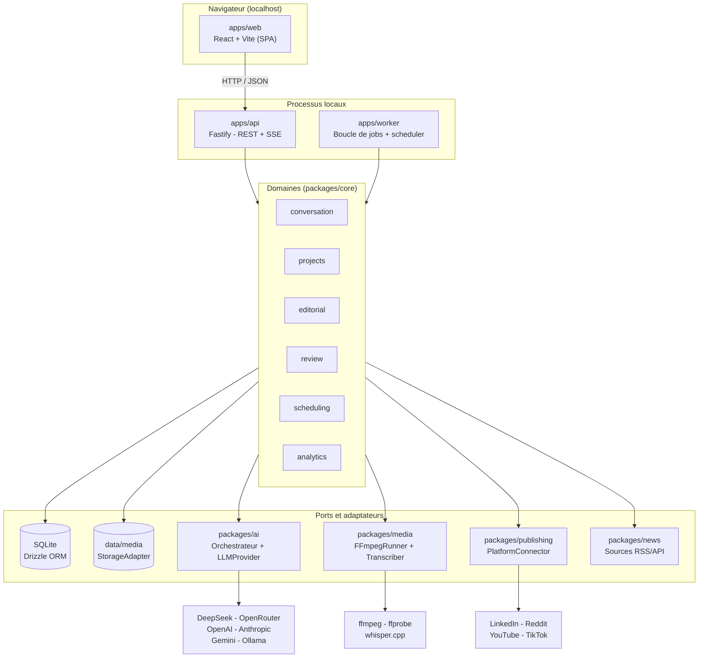
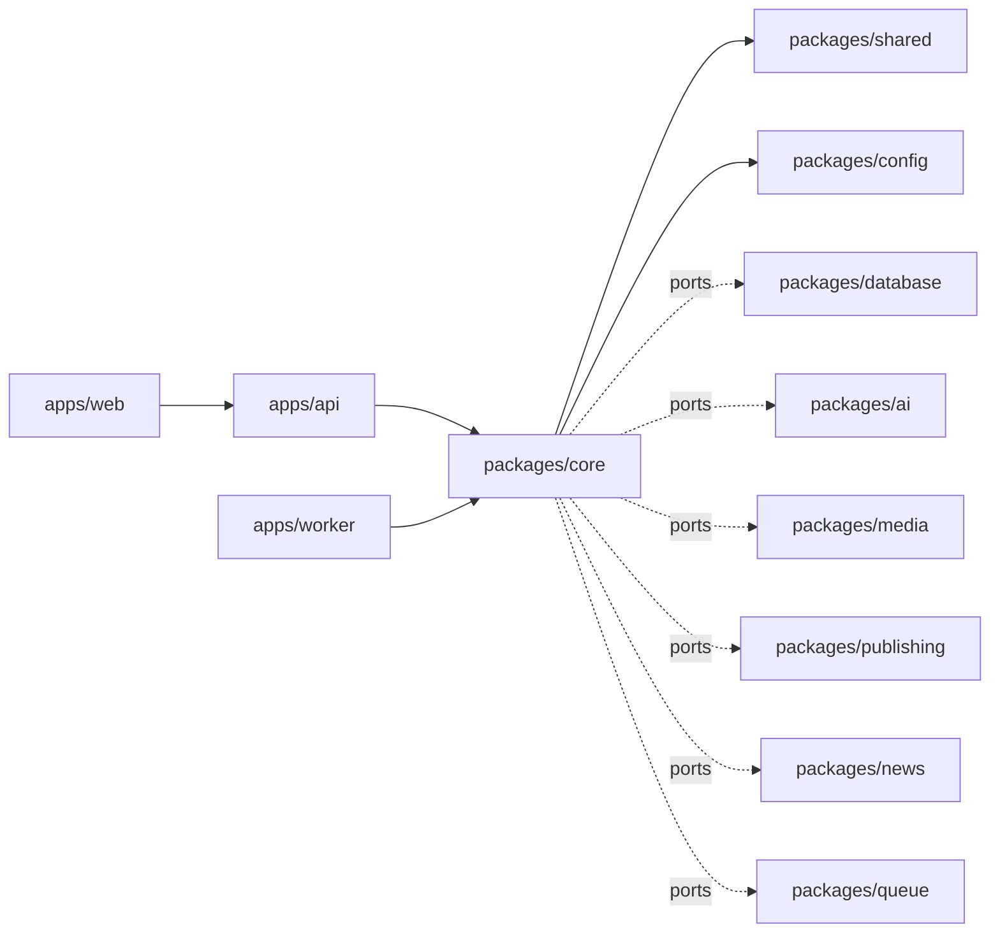
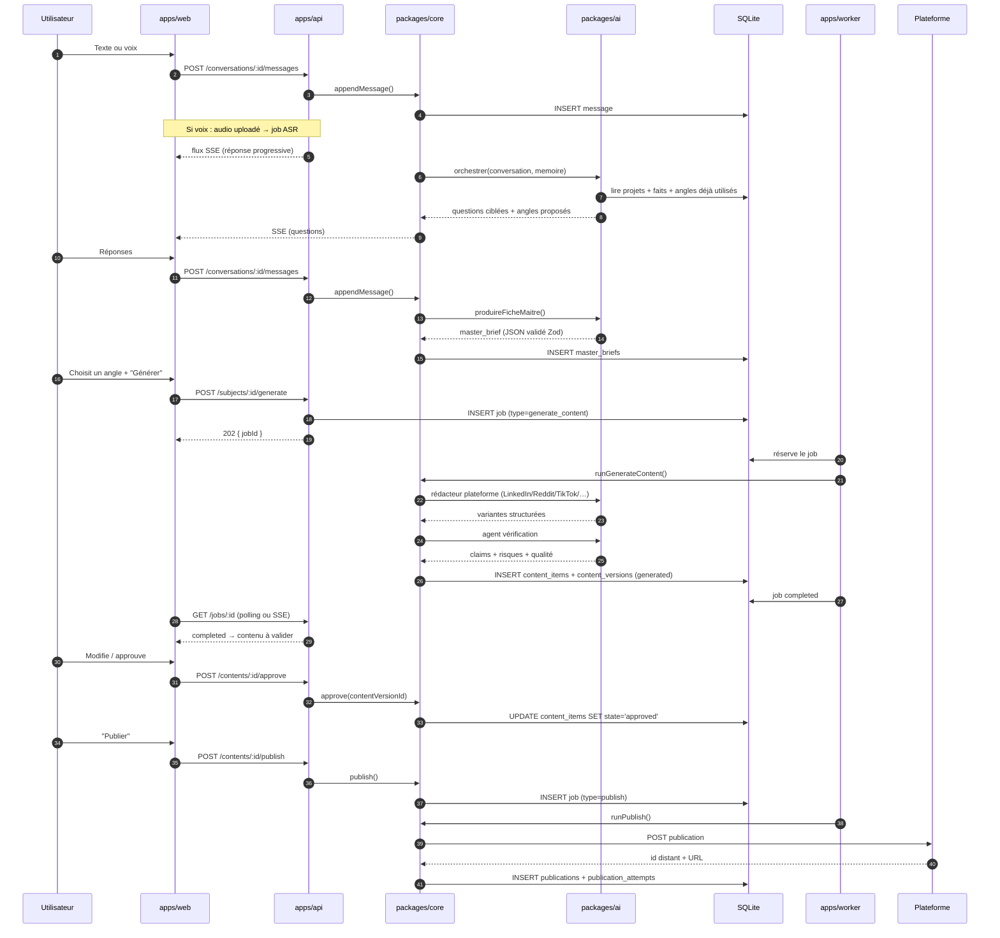

# 02 — Architecture

> Répond aux sections C, D, P, Q, R et aux questions 1 à 10, 19, 20, 21, 26, 32 du
> [cahier des charges](00-cahier-des-charges.md).

---

## 1. Principes d'architecture

Ces principes arbitrent **tous** les choix techniques du projet. En cas de doute, on
revient ici.

| # | Principe | Conséquence pratique |
|---|---|---|
| 1 | **Monolithe modulaire, pas de microservices** | Un dépôt, un déploiement local, des frontières de modules nettes. La modularité est obtenue par le code, pas par le réseau |
| 2 | **Le métier ne connaît pas l'infrastructure** | `packages/core` ne sait pas qu'il y a SQLite, Fastify ou DeepSeek. Il parle à des ports (interfaces) |
| 3 | **Une frontière réseau = un coût** | Pas d'appel HTTP interne entre nos propres modules. Seuls les appels externes (LLM, plateformes, FFmpeg) sont des frontières |
| 4 | **L'asynchrone est un concept métier, pas une optimisation** | Transcription, rendu vidéo, publication et analytics sont des jobs persistés en base, jamais des appels synchrones |
| 5 | **L'utilisateur valide, le code obéit** | Aucune transition vers `publishing` sans un `approved` en base et un `content_version_id` figé |
| 6 | **Remplaçable, pas abstrait pour rien** | On n'abstrait que ce qu'on a une raison concrète de vouloir changer : LLM, stockage, queue, plateforme. Pas de couche d'abstraction sur du code qui n'aura jamais deux implémentations |
| 7 | **Le coût est une fonctionnalité** | Chaque appel LLM est mesuré, attribué à une tâche et plafonné |
| 8 | **Local d'abord, cloud possible** | Tout composant est écrit pour tourner sur la machine de l'utilisateur. Le passage au cloud est une migration de configuration, pas une réécriture |

---

## 2. Vue d'ensemble



**Lecture du diagramme** : le navigateur ne parle qu'à `apps/api`. `apps/api` et
`apps/worker` sont **deux processus du même code** : ils importent exactement les mêmes
packages de domaine. Il n'y a **aucune** communication réseau entre eux — ils partagent la
base et le système de fichiers.

---

## 3. Décision structurante : monolithe modulaire

### Recommandation

**Monolithe modulaire TypeScript en monorepo**, exécuté en deux processus (`api` et
`worker`) qui partagent les mêmes packages métier.

### Pourquoi

| Critère | Analyse |
|---|---|
| **Contrainte matérielle** | Un PC modeste supporte un process node + un worker. Il ne supporte pas 7 conteneurs ni un broker de messages permanent. Le cahier des charges l'interdit explicitement (§39) |
| **Nature du produit** | Mono-utilisateur, un seul auteur de contenu, un volume de données faible. Un découpage en services apporte zéro bénéfice et beaucoup de latence opérationnelle |
| **Coût cognitif** | Un développeur solo doit pouvoir tenir tout le produit en tête. Les frontières réseau sont un impôt permanent sur la compréhension |
| **Déploiement** | Un `pnpm dev` doit suffire. Pas de docker-compose obligatoire |
| **Migration cloud** | Si le produit devient cloud, on sépare `api` et `worker` en deux conteneurs — ce sont **déjà** deux processus distincts. C'est une migration de configuration, pas une réécriture |

### Pourquoi la séparation `api` / `worker` existe quand même

Ce n'est pas une séparation de services, c'est une **séparation de profils d'exécution** :

- `api` doit répondre en millisecondes → il ne fait **jamais** de travail long ;
- `worker` fait du travail long et bloquant (transcription, FFmpeg, upload) → il ne sert
  aucune requête HTTP.

Sans cette séparation, un rendu FFmpeg de 4 minutes gèlerait l'interface. Avec elle, le
worker peut même être **mis en pause** (« mode économie ») sans impacter l'usage courant.

### Alternatives écartées

| Alternative | Pourquoi rejetée |
|---|---|
| Microservices (`ai-service`, `media-service`, `publish-service`…) | Complexité d'exploitation disproportionnée ; débogage distribué ; latence ; aucune contrainte réelle ne le justifie |
| Monolithe « tout dans l'API » | Un rendu vidéo bloque l'interface. Inacceptable, car l'utilisateur doit pouvoir continuer à écrire |
| Serverless (fonctions) | FFmpeg et le stockage local s'y prêtent mal ; démarrages à froid ; coût imprévisible ; l'utilisateur veut tourner **localement** |
| Tout dans le navigateur | Les clés API ne doivent jamais atteindre le navigateur ; FFmpeg n'y tourne pas de façon fiable |

### Risque assumé

Un monolithe modulaire dérive naturellement en **monolithe désordonné** si les frontières
ne sont pas activement défendues. Mitigations :

1. chaque package expose un `index.ts` qui est **la seule porte d'entrée** ; les imports
   profonds (`packages/core/src/internal/x`) sont interdits ;
2. règle ESLint de dépendances inter-packages (un sens unique, voir §5) ;
3. `packages/core` n'a **aucune** dépendance vers `apps/*` — jamais.

---

## 4. Composants, responsabilités et frontières

Chaque composant est décrit par : rôle · entrées · sorties · dépendances · stockage ·
erreurs possibles.

### `apps/web` — Interface

| Aspect | Description |
|---|---|
| **Rôle** | SPA React. Conversation, dashboard, validation, médias, analytics, réglages |
| **Entrées** | Actions utilisateur (texte, voix, fichiers), flux SSE du serveur |
| **Sorties** | Requêtes REST vers `apps/api` |
| **Dépendances** | `apps/api` uniquement. **Aucun accès direct** à la base, aux clés API, ni au système de fichiers |
| **Stockage** | Aucun stockage métier. Cache de requêtes côté client uniquement |
| **Erreurs possibles** | API indisponible, session expirée, upload interrompu, navigateur sans support MediaRecorder |

### `apps/api` — API HTTP

| Aspect | Description |
|---|---|
| **Rôle** | Exposer le domaine en REST + SSE. Authentifier. Valider. Ordonnancer des jobs |
| **Entrées** | Requêtes HTTP du navigateur |
| **Sorties** | Réponses JSON + flux SSE ; enregistrements de jobs en base |
| **Dépendances** | Tous les `packages/*` sauf `apps/worker` |
| **Stockage** | Base (via `packages/database`), fichiers média via `StorageAdapter` |
| **Erreurs possibles** | Payload invalide (422), non authentifié (401), ressource absente (404), conflit d'état de contenu (409), budget IA dépassé (429), erreur interne (500) |

**Règle absolue** : aucun endpoint ne dépasse un budget de **~2 s de travail**. Tout ce qui
est plus long devient un job et renvoie un `job_id`.

### `apps/worker` — Exécution asynchrone

| Aspect | Description |
|---|---|
| **Rôle** | Dépiler les jobs, exécuter les traitements longs, appliquer retry/backoff, faire tourner le scheduler (échéances de publication, collecte analytics, veille) |
| **Entrées** | Table `jobs` en base |
| **Sorties** | Mises à jour en base, fichiers produits, appels externes |
| **Dépendances** | Tous les `packages/*` |
| **Stockage** | Base + système de fichiers |
| **Erreurs possibles** | Crash de process (jobs `running` orphelins → récupération par lease temporel), FFmpeg absent, binaire whisper manquant, quota API atteint, disque plein |

### `packages/core` — Domaine

| Aspect | Description |
|---|---|
| **Rôle** | Cas d'usage métier. La seule couche qui décide. Contient `conversation`, `projects`, `editorial`, `review`, `scheduling`, `analytics` |
| **Entrées** | Appels de `apps/api` et `apps/worker` |
| **Sorties** | Objets de domaine, transitions d'état, tâches à exécuter |
| **Dépendances** | `packages/shared`, `packages/config` et **les ports** (`database`, `ai`, `media`, `publishing`, `news`) |
| **Stockage** | Via des **interfaces de repository**, jamais via un client SQL direct |
| **Erreurs possibles** | Violation de règle métier → erreurs typées et explicites (`ContentNotApprovedError`, `BudgetExceededError`, `InvalidStateTransitionError`) |

> C'est ici que vit l'invariant « on ne publie pas sans validation ». Il est implémenté
> **dans le domaine**, pas dans l'API ni dans le connecteur de plateforme. Un bug d'API ne
> peut donc pas contourner la règle.

### `packages/ai` — Orchestrateur et fournisseurs

| Aspect | Description |
|---|---|
| **Rôle** | L'orchestrateur IA, le registre d'agents, les prompts versionnés, l'abstraction `LLMProvider`, le comptage des tokens et des coûts |
| **Entrées** | Fiche maître, extraits de mémoire, paramètres de tâche |
| **Sorties** | Sorties **structurées et validées** par schéma (jamais du texte libre consommé par du code) |
| **Dépendances** | Base (pour `llm_calls` et `prompts`), HTTP vers les fournisseurs |
| **Stockage** | `llm_calls`, `prompt_versions`, cache de réponses |
| **Erreurs possibles** | Réponse non conforme au schéma, timeout, quota dépassé, clé absente, réponse vide, contenu filtré par le fournisseur |

### `packages/database` — Persistance

| Aspect | Description |
|---|---|
| **Rôle** | Schémas Drizzle, migrations, repositories typés |
| **Entrées** | Appels de repository du domaine |
| **Sorties** | Entités typées |
| **Dépendances** | Drizzle ORM + driver (better-sqlite3 puis `pg`) |
| **Stockage** | `data/app.db` (SQLite, mode WAL) |
| **Erreurs possibles** | Base verrouillée, migration échouée, contrainte violée, fichier corrompu |

> **Contrat de portabilité** : tous les accès passent par `packages/database`. Aucun import
> de `drizzle-orm/sqlite-core` en dehors de ce package. Les horodatages sont stockés en
> `INTEGER` (millisecondes epoch), les identifiants en texte (UUID v7), les booléens en entier,
> les montants en micro-dollars entiers, le JSON en texte validé par Zod. La migration vers
> PostgreSQL devient alors un travail de dialecte, pas une réécriture logique. Détail :
> [`03-modele-de-donnees.md`](03-modele-de-donnees.md) §2 et §17.

### `packages/media` — Médias et vidéo

| Aspect | Description |
|---|---|
| **Rôle** | Inventaire d'assets, déduplication par hash, exécution FFmpeg/ffprobe, recadrage vertical, suppression de silences, sous-titres, burn-in, normalisation audio, export |
| **Entrées** | Fichiers uploadés, chemins locaux, plans de montage |
| **Sorties** | Fichiers dérivés + métadonnées (durée, résolution, codec, langue) |
| **Dépendances** | `ffmpeg`, `ffprobe`, whisper local, système de fichiers |
| **Stockage** | `data/media/{yyyymm}/{hash}/…`, table `media_assets` |
| **Erreurs possibles** | Binaire absent, codec non supporté, disque plein, fichier corrompu, timeout d'encodage |

### `packages/publishing` — Connecteurs de plateformes

| Aspect | Description |
|---|---|
| **Rôle** | Implémenter `PlatformConnector` par plateforme : capacités déclarées, validation, brouillon, publication, programmation, métriques |
| **Entrées** | `content_version` approuvée + assets + identifiants de compte |
| **Sorties** | Identifiant distant, URL publique, statut |
| **Dépendances** | APIs des plateformes, `packages/database` (tokens chiffrés) |
| **Stockage** | `platform_accounts`, `publications`, `publication_attempts` |
| **Erreurs possibles** | OAuth expiré, quota, règle de plateforme violée, upload échoué, **publication ambiguë** (timeout après envoi) |

### `packages/news` — Veille

| Aspect | Description |
|---|---|
| **Rôle** | Collecter des métadonnées de sources, filtrer mécaniquement, dédupliquer, scorer, préparer les candidats |
| **Entrées** | Flux RSS, APIs, pages structurées |
| **Sorties** | 1 à 5 candidats scorés avec sources et dates |
| **Dépendances** | Réseau, `packages/ai` (uniquement pour l'étape finale de résumé) |
| **Stockage** | `news_sources`, `news_items` |
| **Erreurs possibles** | Flux mort, format inattendu, doublons, contenu périmé, page bloquant les robots |

### `packages/shared` et `packages/config`

| Package | Rôle | Contenu |
|---|---|---|
| `shared` | Types et contrats partagés, schémas Zod, utilitaires purs | Schémas de la fiche maître, des variantes plateforme, des statuts |
| `config` | Configuration et secrets | Chargement `.env`, validation des variables au démarrage, déchiffrement des secrets, budgets |

---

## 5. Structure du monorepo

```text
automatisation-ia/
├── apps/
│   ├── web/                     # SPA React + Vite
│   │   ├── src/
│   │   │   ├── routes/          # conversation, dashboard, review, medias, analytics, reglages
│   │   │   ├── features/        # logique par domaine UI
│   │   │   ├── api/             # client REST + hooks TanStack Query
│   │   │   └── components/      # design system minimal
│   │   └── package.json
│   ├── api/                     # Fastify : REST + SSE
│   │   ├── src/
│   │   │   ├── routes/
│   │   │   ├── plugins/         # auth, erreurs, logging, CORS
│   │   │   └── server.ts
│   │   └── package.json
│   └── worker/                  # boucle de jobs + scheduler
│       ├── src/
│       │   ├── handlers/        # un handler par type de job
│       │   ├── scheduler.ts
│       │   └── main.ts
│       └── package.json
│
├── packages/
│   ├── core/                    # DOMAINE — la seule couche qui décide
│   │   └── src/
│   │       ├── conversation/
│   │       ├── projects/
│   │       ├── editorial/
│   │       ├── review/
│   │       ├── scheduling/
│   │       ├── analytics/
│   │       └── errors.ts
│   ├── database/                # Drizzle : schémas, migrations, repositories
│   ├── ai/                      # orchestrateur, agents, prompts, LLMProvider
│   ├── media/                   # FFmpeg, whisper, inventaire d'assets
│   ├── publishing/              # PlatformConnector + un dossier par plateforme
│   ├── news/                    # collecte et scoring des actualités
│   ├── queue/                   # abstraction Queue (driver sqlite en V1)
│   ├── shared/                  # types, schémas Zod, utilitaires
│   └── config/                  # env, secrets, budgets
│
├── prompts/                     # prompts versionnés (fichiers suivis par git)
│   ├── conversation/
│   ├── editorial/
│   ├── review/
│   └── media/
│
├── docs/                        # cette documentation
├── scripts/                     # bootstrap, vérification d'environnement, sauvegarde
├── data/                        # NON VERSIONNÉ : base, médias, exports
├── .env.example
├── pnpm-workspace.yaml
├── tsconfig.base.json
└── package.json
```

### Sens unique des dépendances



- Un paquet d'infrastructure **ne dépend jamais de `packages/core`**.
- `packages/shared` **ne dépend d'aucun autre paquet** du projet.
- Aucun cycle. Vérifié par ESLint (`import/no-cycle` + contraintes de frontières).

### Pourquoi `pnpm` + workspaces plutôt que Turborepo/Nx

| Option | Verdict |
|---|---|
| **pnpm workspaces** | **Retenu.** Installation rapide, gestion de disque efficace, largement suffisant pour 9 packages |
| Turborepo / Nx | Rejeté **au départ** : apporte du cache de build et un graphe de tâches dont on n'a pas besoin tant que le build est rapide. À reconsidérer seulement si le CI dépasse ~5 minutes |
| npm / yarn workspaces | Plus lents en installation que pnpm, et pnpm est déjà utilisé sur les autres projets de l'utilisateur |

### Pourquoi les prompts sont des fichiers et pas des chaînes en base

Les prompts vivent dans `prompts/` en Markdown **et** sont synchronisés en base dans
`prompt_versions` (avec hash) au démarrage.

- **Fichiers** → versionnés par git, relus en diff, modifiables sans migration.
- **Base** → un `llm_call` référence le **hash exact** du prompt utilisé, donc on sait
  toujours ce qui a produit un contenu donné.

C'est la seule façon d'avoir à la fois la revue par git et la traçabilité en base.

---

## 6. Stack technique — choix challengés

> Le cahier des charges (§38) demande explicitement de **ne pas accepter les choix
> proposés automatiquement** et d'expliquer pour chaque technologie : pourquoi,
> alternatives, avantages, inconvénients, coût, complexité, maintenabilité,
> compatibilité PC local, compatibilité cloud.

| Composant | Technologie retenue | Pourquoi | Alternatives | Risque |
|---|---|---|---|---|
| **Frontend** | React + TypeScript + Vite (SPA) | Écosystème maîtrisé ; SPA = aucun besoin de serveur de rendu ; Vite démarre instantanément sur machine modeste | Next.js (SSR inutile ici, ajoute un serveur), Astro (excellent pour du statique, mauvais pour un dashboard très interactif), Svelte/Solid (changement d'écosystème sans gain réel) | Faible |
| **État client** | TanStack Query + état local React | Le serveur est la source de vérité ; cache, invalidation, états de chargement gérés | Redux (surdimensionné), Zustand seul (ne gère pas le cache serveur) | Faible |
| **Backend** | Node.js LTS + TypeScript + **Fastify** | Un seul langage front/back → types partagés ; Fastify : validation par schéma native, bon débit, empreinte faible | Express (plus lent, typage plus faible), Hono (très bon mais écosystème plugins plus jeune), NestJS (structure lourde, disproportionné pour un dev solo) | Faible |
| **Validation** | **Zod** | Source de vérité unique : validation HTTP, sorties LLM structurées, formulaires front | TypeBox (plus rapide, DX moins agréable), Yup (inférence TS plus faible), ajv (plus bas niveau) | Faible |
| **Base de données** | **SQLite** (better-sqlite3, WAL) **+ Drizzle ORM** | Zéro serveur ; un fichier à sauvegarder ; WAL = lecture pendant que le worker écrit ; Drizzle = typage fort et **même ORM côté PostgreSQL** | PostgreSQL d'emblée (serveur à maintenir), Prisma (moteur binaire, plus lourd), Kysely (migrations moins liées aux schémas TS) | **Moyen** — SQLite gère mal l'écriture concurrente ; mitigé par WAL + un seul writer (le worker) |
| **Migrations** | Drizzle Kit | SQL généré depuis les schémas TS, revu en git | Atlas (externe), SQL manuel (perte de temps) | Faible |
| **Fournisseurs IA** | Abstraction `LLMProvider` — **DeepSeek** par défaut, puis OpenRouter / OpenAI / Anthropic / Gemini / Ollama | Coût maîtrisé, aucune dépendance à un fournisseur unique (exigence §26) | SDK d'un seul fournisseur (violerait §26) | Moyen — disparité des JSON modes ; mitigé par adaptateur + validation Zod |
| **Sorties structurées** | JSON mode + validation Zod + réparation locale (retry ciblé) | Le code consomme de la donnée typée, jamais du texte libre | Parsing regex (fragile), function calling seul (support inégal) | Moyen — JSON invalide possible ; mitigé par retry + `jsonrepair` |
| **Transcription** | **whisper.cpp** / faster-whisper en local (`small`/`medium`) + fallback API cloud | Gratuit, hors ligne, bon en français, aucune fuite de données | API Whisper (coût par minute), Vosk (moins précis), serveur Python permanent (2e runtime) | Moyen — `medium` lent sur CPU ; mitigé par jobs + `small` par défaut |
| **Vidéo** | **FFmpeg + ffprobe** via `child_process.spawn` | Gratuit, local, scriptable, contrôle total | `fluent-ffmpeg` (peu maintenu), Cloudinary/Mux (coût, dépendance), Remotion (bon pour du 100 % généré, mauvais pour découper une vraie capture) | **Élevé** — compétence à part ; mitigé par une bibliothèque de presets testés |
| **Sous-titres** | SRT/VTT depuis Whisper → burn-in FFmpeg (filtre `subtitles`) | Une seule chaîne d'outils, aucun service externe | Service externe (coût), libass manuel (complexe) | Moyen — échappement des filtres, polices manquantes |

| **Queue de jobs** | Table `jobs` SQLite + worker à polling, derrière une abstraction `Queue` | Pas de Redis à installer ; reprise après crash ; suffisant en mono-utilisateur | BullMQ + Redis (serveur en plus), pg-boss (impose Postgres), cron système (pas de reprise) | Faible en V1 ; migration Redis possible sans changer les appels |
| **Stockage médias** | Fichiers locaux `data/media/` derrière `StorageAdapter` | Simplicité, coût nul, accès direct pour FFmpeg | S3/R2 d'emblée (latence, coût, réseau), BLOB en base (inadapté aux vidéos) | Faible |
| **Recherche** | SQLite **FTS5** ; embeddings locaux plus tard | Instantané, zéro dépendance | pgvector (impose Postgres), Qdrant/Chroma (service à maintenir) | Faible |
| **News** | RSS/Atom via `fast-xml-parser` | Filtrer avant de dépenser, gratuit | APIs d'agrégation payantes, scraping HTML complet (fragile) | Moyen — flux instables ; tolérance aux erreurs par source |
| **Publication** | Connecteurs maison sur APIs officielles + fallback brouillon local | Contrôle, pas de tiers payant, respect des règles | Ayrshare/Buffer (coût récurrent, dépendance critique), automatisation navigateur (fragile, contraire aux CGU) | **Élevé** — voir [`06-connecteurs-et-publication.md`](06-connecteurs-et-publication.md) |
| **Logs** | `pino` + tables `job_events`, `errors` | Rapide, JSON structuré, exploitable en base comme en console | winston (plus lourd), `console.log` (inexploitable) | Faible |
| **Tests** | **Vitest** (unitaire/intégration) + **Playwright** (e2e) | Compatible Jest mais bien plus rapide, ESM natif | Jest (ESM pénible), `node:test` (mocks plus limités) | Faible |
| **Monorepo** | pnpm workspaces | Voir §5 | Turborepo/Nx (prématuré) | Faible |
| **Langage** | TypeScript strict partout | Contrats partagés, refactorings sûrs | JavaScript (inacceptable sur un produit qui manipule des dizaines de formes de données) | Faible |

### Verdict sur la stack proposée dans le cahier des charges

| Proposition d'origine | Verdict |
|---|---|
| React + TypeScript | ✅ Conservé |
| Node.js + TypeScript | ✅ Conservé (cadre retenu : **Fastify**) |
| SQLite → PostgreSQL | ✅ Conservé, avec Drizzle comme couche de portabilité |
| DeepSeek + abstraction multi-provider | ✅ Conservé |
| Transcription locale | ✅ Conservé (whisper.cpp) |
| FFmpeg | ✅ Conservé — seule option gratuite et locale crédible |
| Stockage local → object storage | ✅ Conservé via `StorageAdapter` |
| Jobs asynchrones | ✅ Conservé, mais **table + worker**, pas Redis en V1 |
| RSS/APIs pour la veille | ✅ Conservé |

**Ajouts par rapport au brief** : Fastify (cadre backend explicite, absent du brief),
Drizzle ORM (non tranché par le brief), FTS5 comme stratégie de recherche initiale, Zod
comme contrat unique de validation.

**Refus explicites** : Redis/BullMQ, scheduler externe, Kubernetes, microservices, base
vectorielle dédiée, framework SSR.

---

## 7. Classification : local, cloud ou hybride

Question 4, 5 et 6 du cahier des charges. Décision par composant, avec la règle de
décision : **local par défaut**, cloud seulement si le local coûte plus cher ou est
irréaliste, hybride quand le local doit rester possible mais que le cloud améliore.

| Composant | Verdict | Justification |
|---|---|---|
| **Frontend (SPA)** | **Local** | Servi par le serveur local. Aucune raison de payer un hébergement pour un dashboard privé |
| **API** | **Local** | Accès direct à la base et au disque ; latence nulle |
| **Base de données** | **Local** → **Cloud plus tard** | SQLite = un fichier. PostgreSQL seulement si multi-device ou multi-utilisateur |
| **Stockage médias** | **Local** → **Cloud plus tard** | Les vidéos sont volumineuses ; le disque local est gratuit |
| **Orchestration IA** | **Hybride** | Le code tourne localement ; **les modèles** sont des APIs distantes, avec option Ollama local |
| **Transcription** | **Hybride** | whisper.cpp local par défaut, API cloud en repli si la machine peine ou pour un long fichier |
| **Rendu vidéo (FFmpeg)** | **Local** | C'est le composant le plus coûteux en cloud et le plus simple en local |
| **Scheduler** | **Local** | `node-cron` dans le worker. Pas de service de cron managé |
| **Publication** | **Hybride** | Le connecteur tourne localement mais appelle des APIs distantes (obligatoire) |
| **Analytics** | **Hybride** | Collecte locale des métriques via APIs distantes ; calcul local |
| **Veille** | **Hybride** | Récupération distante (RSS/API), filtrage et scoring locaux |
| **Modèles LLM** | **Cloud** (défaut) | DeepSeek très bon marché ; un modèle local de qualité équivalente demanderait un GPU absent |

### Règle d'évolution vers le cloud

Le jour où le produit doit tourner sur un serveur, **seulement trois choses changent** :

1. `DATABASE_URL` passe de `file:data/app.db` à une URL PostgreSQL ;
2. `STORAGE_DRIVER` passe de `local` à `s3` ;
3. `api` et `worker` deviennent deux conteneurs au lieu de deux processus.

Aucun code métier ne change. C'est le test qui valide l'architecture : **si migrer vers le
cloud demande de modifier `packages/core`, l'architecture a échoué.**

---

## 8. Flux de données

### 8.1 Flux nominal : de la conversation à la publication



### 8.2 Flux médias

```text
Upload navigateur
   ↓ POST /media (multipart, limites de taille)
Hash SHA-256 + ffprobe (durée, dimensions, codec)
   ↓
Déduplication : hash déjà présent ? → réutilisation, pas de copie
   ↓
data/media/{yyyymm}/{hash}/original.<ext>
   ↓ fiche media_assets
   ↓
Jobs de dérivation à la demande :
  poster · vignette · version verticale · version carrée
   ↓
Rendu vidéo (job) : découpe → silences → vertical → sous-titres → audio → export
   ↓
media_assets (rendition) + `video_renders`
   ↓
Lecteur de prévisualisation dans l'écran de validation
```

### 8.3 Flux analytics

```text
Scheduler (worker, quotidien)
   ↓
Pour chaque publication publiée avec un `remote_id` :
   ↓
PlatformConnector.fetchMetrics()  ← API ou saisie manuelle
   ↓
Normalisation → table `metric_snapshots` (une ligne par jour et par publication)
   ↓
Agrégation → patterns (sujets, hooks, heures, formats)
   ↓
Recommandations stockées dans `learnings` et injectées dans le contexte
des futurs agents (via le `project_memory` et le `style_profile`)
```

### 8.4 Flux news

```text
Scheduler (worker, 2×/jour)
   ↓
packages/news.collect() : RSS/API → métadonnées uniquement
   ↓
Filtrage mécanique (mots-clés, date, source, langue) — sans LLM
   ↓
Déduplication (titre normalisé + URL + similarité)
   ↓
Scoring local (fraîcheur, pertinence thématique, autorité de la source, doublon)
   ↓
Les 5 à 10 meilleurs candidats seulement → petit modèle LLM
   ↓
`news_items` scorés + résumé court + source conservée
   ↓
Écran « Idées » → l'utilisateur choisit → éventuelle création de contenu
```

> Aucune news n'est **jamais** inventée. Si la source n'est pas récupérée, l'élément
> n'existe pas. Un indicateur `verified` et un `source_url` sont **obligatoires**.

---

## 9. Interfaces critiques (contrats à figer avant le code)

Le cahier des charges (§46) exige que les **interfaces critiques** soient définies avant
toute implémentation. Ce sont les seules abstractions du projet. Elles sont volontairement
peu nombreuses.

### 9.1 `LLMProvider` — abstraction des fournisseurs

```ts
export interface GenerateOptions {
  model?: string;
  temperature?: number;
  maxOutputTokens?: number;
  /** Contrainte de budget : le provider refuse si l'estimation dépasse */
  maxCostUsd?: number;
  /** Cache : clé logique pour réutiliser une réponse déjà payée */
  cacheKey?: string;
  signal?: AbortSignal;
}

export interface LLMCallContext {
  /** Traçabilité : qui a appelé */
  agent: string;            // 'interviewer' | 'strategist' | 'platform_writer' | ...
  task: string;             // 'master_brief' | 'linkedin_post' | 'news_summary' | ...
  projectId?: string;
  subjectId?: string;
  contentId?: string;
}

export interface LLMUsage {
  provider: string;
  model: string;
  inputTokens: number;
  outputTokens: number;
  cachedTokens: number;
  costUsd: number;
  latencyMs: number;
}

export interface LLMProvider {
  readonly id: string;

  /** Texte libre. Uniquement pour de la conversation affichée à l'utilisateur. */
  generate(prompt: string, options: GenerateOptions, ctx: LLMCallContext)
    : Promise<{ text: string; usage: LLMUsage }>;

  /** Sortie structurée. À utiliser pour TOUT ce que du code doit consommer. */
  structuredOutput<T>(
    prompt: string,
    schema: ZodType<T>,
    options: GenerateOptions,
    ctx: LLMCallContext,
  ): Promise<{ data: T; usage: LLMUsage; repaired: boolean }>;

  /** Estimation AVANT appel, pour respecter les plafonds. */
  estimateCost(prompt: string, options: GenerateOptions): Promise<number>;

  /** Ce que le modèle sait faire : JSON mode, outils, contexte, vision. */
  capabilities(): {
    jsonMode: boolean;
    toolCalling: boolean;
    vision: boolean;
    maxContextTokens: number;
    streaming: boolean;
  };

  healthCheck(): Promise<{ ok: boolean; latencyMs?: number; error?: string }>;
}
```

**Règles non négociables**

1. Le domaine appelle **`structuredOutput`** dans 95 % des cas. `generate` est réservé à la
   conversation affichée à l'utilisateur.
2. Chaque appel est **enregistré** dans `llm_calls` avec son `agent`, sa `task` et son coût.
   Un appel non journalisé est un bug.
3. `estimateCost` est appelé **avant** l'appel réel : si le budget du jour ou de la semaine
   est dépassé, le provider lève `BudgetExceededError` **avant** de dépenser.

### 9.2 `PlatformConnector` — abstraction des plateformes

```ts
export interface ConnectorCapabilities {
  directPublish: boolean;
  draft: boolean;
  schedule: boolean;
  analytics: boolean;
  videoUpload: boolean;
  imageUpload: boolean;
  maxTextLength: number;
  maxVideoDurationSec?: number;
  requiresReview: boolean;   // ex. TikTok : revue côté plateforme
}

export interface PublishRequest {
  /** Version APPROUVÉE et FIGÉE du contenu */
  contentVersionId: string;
  /** Clé d'idempotence fournie au connecteur */
  idempotencyKey: string;
  scheduledAt?: Date;
  assets: MediaAssetRef[];
}

export interface PublishResult {
  outcome: 'published' | 'draft_created' | 'scheduled' | 'rejected' | 'ambiguous' | 'manual_required';
  remoteId?: string;
  remoteUrl?: string;
  raw?: unknown;
}

export interface PlatformConnector {
  readonly platform: PlatformId;

  /** Authentification / rafraîchissement du token */
  authenticate(accountId: string): Promise<void>;

  /** Validation AVANT envoi : longueur, format, règles de la plateforme */
  validateContent(req: PublishRequest): Promise<ValidationReport>;

  createDraft(req: PublishRequest): Promise<PublishResult>;
  publish(req: PublishRequest): Promise<PublishResult>;
  schedule(req: PublishRequest, at: Date): Promise<PublishResult>;

  /** Peut lever NotSupportedError selon les capacités */
  fetchMetrics(remoteId: string, since: Date): Promise<MetricSnapshot[]>;

  /** Repli de niveau C : ce qu'il faut afficher pour publier à la main */
  buildManualPackage(req: PublishRequest): Promise<ManualPackage>;
}
```

**Le résultat `ambiguous` est obligatoire.** Si un POST de publication expire sans réponse,
on ne peut pas savoir si le contenu est parti. Le connecteur doit alors :

1. tenter une **vérification** (GET sur la ressource, recherche par clé d'idempotence) ;
2. si la vérification échoue, marquer `ambiguous` — **jamais** `publish_failed`, ce qui
   autoriserait un retry automatique et créerait un doublon ;
3. exiger une **décision humaine** pour toute nouvelle tentative.

### 9.3 `Queue` — abstraction des jobs

```ts
export interface JobDefinition<TInput, TOutput> {
  type: string;
  inputSchema: ZodType<TInput>;
  maxAttempts: number;
  /** Retry exponentiel : 30s, 2m, 8m, 32m… */
  backoff: (attempt: number) => number;
  /** Durée maximale avant reprise du lease par le worker */
  leaseMs: number;
  handler: (input: TInput, ctx: JobContext) => Promise<TOutput>;
  /** Un job idempotent peut être rejoué sans effet de bord */
  idempotent: boolean;
}

export interface Queue {
  enqueue<TInput>(type: string, input: TInput, opts?: EnqueueOptions): Promise<string>;
  /** Réservation atomique : UPDATE ... WHERE status='queued' LIMIT n */
  claim(workerId: string, limit: number): Promise<ClaimedJob[]>;
  complete(jobId: string, result: unknown): Promise<void>;
  fail(jobId: string, error: SerializedError, retry: boolean): Promise<void>;
  /** Récupère les jobs `running` dont le lease a expiré (crash du worker) */
  reclaimExpired(now: Date): Promise<number>;
}
```

Le driver V1 est `SqliteQueue` (table `jobs`, transaction `BEGIN IMMEDIATE` pour la
réservation atomique). Un driver `RedisQueue` (BullMQ) pourra être ajouté **sans modifier un
seul appel dans le domaine**.

### 9.4 `StorageAdapter`

```ts
export interface StorageAdapter {
  put(key: string, data: Readable | Buffer, meta?: { contentType?: string })
    : Promise<{ key: string; bytes: number; hash: string }>;
  get(key: string): Promise<Readable>;
  exists(key: string): Promise<boolean>;
  delete(key: string): Promise<void>;
  /** URL locale signée/streamée pour l'affichage dans le navigateur */
  getReadUrl(key: string): Promise<string>;
  /** Chemin local absolu si le driver est local — nécessaire pour FFmpeg */
  getLocalPath?(key: string): string;
}
```

> `getLocalPath` est optionnel et **assumé**. Le driver local l'implémente ; le driver S3
> passera par un téléchargement temporaire. C'est une concession pragmatique documentée et
> non un oubli : **FFmpeg a besoin de fichiers**, pas de flux HTTP.

### 9.5 `Transcriber`

```ts
export interface Transcriber {
  readonly engine: 'whisper_cpp' | 'faster_whisper' | 'cloud';
  capabilities(): { languages: string[]; wordTimestamps: boolean; maxDurationSec: number };
  transcribe(input: { path: string; language?: string; wordTimestamps?: boolean })
    : Promise<{
        text: string;
        segments: TranscriptSegment[];
        language: string;
        durationSec: number;
      }>;
  healthCheck(): Promise<{ ok: boolean; modelLoaded: boolean; error?: string }>;
}
```

### 9.6 `FFmpegRunner` — volontairement sans DSL de montage

```ts
export interface FFmpegRunner {
  run(args: string[], opts?: { signal?: AbortSignal; onProgress?: (p: Progress) => void })
    : Promise<{ exitCode: number; stderr: string }>;
  probe(path: string): Promise<MediaProbe>;
  /** Le plan de montage est compilé en arguments par des fonctions PURES, testables */
  buildArgs(plan: EditPlan): string[];
}
```

**Pourquoi pas une DSL de montage maison** : ce serait un projet dans le projet. À la place,
une bibliothèque de **presets** — vertical 9:16, sous-titres brûlés, normalisation audio,
suppression des silences, découpe multi-plateformes — compilés en `string[]` purs. Ces
`string[]` sont testables **sans lancer FFmpeg**, ce qui rend cette partie la plus risquée du
produit réellement contrôlable.

---

## 10. Modules natifs, dépendances système et portabilité

Question 7 du cahier des charges. C'est la partie qui casse le plus souvent un projet local.
Elle est donc traitée explicitement.

| Dépendance | Type | Installation | Statut si absente |
|---|---|---|---|
| **Node.js ≥ 20 LTS** | Runtime | Obligatoire | Bloquant (message clair au démarrage) |
| **better-sqlite3** | Module natif (compilé) | `pnpm` installe, peut nécessiter `build-essential` + `python3` | Bloquant |
| **FFmpeg / ffprobe** | Binaire système | `apt install ffmpeg` / `brew install ffmpeg` | **Dégradé** : tout sauf le rendu vidéo |
| **whisper.cpp** (+ modèle) | Binaire + fichier de modèle (~500 Mo) | `scripts/bootstrap` télécharge le binaire et le modèle | **Dégradé** : transcription désactivée, saisie texte OK |
| **polices** (ex. DejaVu, Inter) | Fichiers système | Paquet système | Burn-in de sous-titres échoue → fallback sans sous-titres |

### Règle de démarrage : `scripts/check-env.ts`

Au lancement, l'API et le worker exécutent une vérification et écrivent dans
`system_health` :

```text
✅ node         v20.x        OK
✅ sqlite       3.45.x       OK
✅ ffmpeg       6.1          OK
⚠️  whisper      absent       → transcription désactivée
✅ polices       DejaVu Sans  OK
✅ DEEPSEEK_API_KEY           OK
```

- Un composant **manquant mais non bloquant** n'empêche pas le démarrage : la
  fonctionnalité correspondante est marquée indisponible **dans l'interface**.
- Un composant **bloquant** manquant arrête le processus avec un message qui donne la
  commande d'installation.

**Pourquoi ce choix** : un utilisateur doit pouvoir rédiger et publier du texte même si
FFmpeg n'est pas installé. Refuser de démarrer pour une dépendance optionnelle est la
meilleure façon de faire abandonner un produit personnel.

### Compilation des modules natifs

- `better-sqlite3` est le **seul** module natif direct.
- Aucun module d'image ou de vidéo en dépendance native (pas de `sharp`, pas de
  `canvas`) : **les images sont manipulées via FFmpeg**, ce qui évite une seconde
  chaîne de compilation.
- Un `pnpm rebuild better-sqlite3` documenté dans le README résout les 95 % de cas de
  changement de version de Node.

### Compatibilité mobile : explicitement hors périmètre (V1)

- **Aucune application mobile** ; l'interface web est responsive mais l'usage visé est
  le poste de travail.
- La capture vidéo/audio sur téléphone se fait **hors produit** (partage vers un dossier
  surveillé, ou upload depuis le navigateur mobile sur le réseau local).
- Le brief mentionne une saisie « depuis le téléphone » : la réponse V1 est **l'upload
  navigateur sur le réseau local**, pas une app native.

---

## 11. Configuration et secrets

### Principe

- **Un seul fichier non versionné** : `.env` (précédence la plus haute).
- **`.env.example` versionné** : liste exhaustive des variables, avec valeurs d'exemple et
  un commentaire par variable.
- **Le code ne lit jamais `process.env` directement.** Seul `packages/config` y accède,
  valide avec Zod et expose un objet typé `config`. Une variable manquante ou malformée
  = erreur au démarrage, pas au milieu d'un job.

### Catégories de variables

| Catégorie | Exemples | Sensible |
|---|---|---|
| Application | `APP_ENV`, `APP_PORT`, `APP_URL`, `LOG_LEVEL` | non |
| Base | `DATABASE_URL`, `DB_WAL` | non |
| Stockage | `STORAGE_DRIVER`, `MEDIA_ROOT`, `S3_*` | oui si S3 |
| IA | `LLM_DEFAULT_PROVIDER`, `DEEPSEEK_API_KEY`, `OPENROUTER_API_KEY`, `OLLAMA_BASE_URL` | **oui** |
| Transcription | `ASR_ENGINE`, `WHISPER_BIN`, `WHISPER_MODEL_PATH` | non |
| Vidéo | `FFMPEG_BIN`, `FFPROBE_BIN`, `MEDIA_MAX_UPLOAD_MB` | non |
| Plateformes | `LINKEDIN_CLIENT_ID`, `LINKEDIN_CLIENT_SECRET`, `REDDIT_*`, `TIKTOK_*` | **oui** |
| Budget | `MONTHLY_BUDGET_USD`, `DAILY_TOKEN_LIMIT`, `REQUIRE_APPROVAL_ABOVE_USD` | non |
| Sécurité | `SESSION_SECRET`, `ENCRYPTION_KEY` | **oui** |

### Stockage des secrets de plateformes

Les jetons OAuth **ne sont pas** dans `.env` : ils sont en base dans
`platform_accounts`, **chiffrés au repos** avec `ENCRYPTION_KEY` (AES-256-GCM, nonce
unique par enregistrement, `key_version` stockée pour permettre la rotation).

Justification : un token LinkedIn expire et se rafraîchit tout seul ; il doit vivre en base.
`.env` ne contient que **les clés d'application**.

### Politique si un secret manque

- **Clé LLM absente** → l'application démarre, tous les appels IA échouent avec
  `MissingCredentialError` et l'interface affiche « Configurez votre clé IA » avec un lien
  direct vers l'écran de réglages. Aucun crash silencieux.
- **Identifiants d'une plateforme absents** → le connecteur correspondant apparaît
  « non configuré » dans l'interface, avec la procédure de configuration.
- **`ENCRYPTION_KEY` absente alors que des tokens existent** → blocage explicite, avec
  l'explication : sinon on risque d'écraser des tokens irrécupérables.

---

## 12. Modèle d'erreurs

Une seule hiérarchie, dans `packages/core/src/errors.ts`. Chaque erreur porte une
**catégorie** qui détermine mécaniquement le comportement (retry, affichage, alerte).

```ts
export type ErrorCategory =
  | 'validation'    // entrée invalide                       → 400, pas de retry
  | 'auth'          // identifiants absents/expirés          → 401, action utilisateur
  | 'forbidden'     // action interdite par les règles       → 403, jamais de retry
  | 'not_found'     // ressource absente                     → 404, pas de retry
  | 'conflict'      // état incompatible (double approbation)→ 409, pas de retry
  | 'transient'     // réseau, 429, 5xx, timeout             → retry exponentiel
  | 'budget'        // plafond de coût atteint               → pas de retry, alerte
  | 'capability'    // la plateforme ne sait pas faire ça    → pas de retry, repli manuel
  | 'ambiguous'     // résultat indéterminé                  → PAS de retry auto, décision humaine
  | 'internal';     // bug                                   → retry 1×, puis alerte
```

### Table de décision (appliquée par le worker, jamais par le handler)

| Catégorie | Retry auto | Action utilisateur | Alerte |
|---|---|---|---|
| `validation` | non | corriger la saisie | non |
| `auth` | non | reconnecter le compte | **oui** |
| `forbidden` | non | — | **oui** |
| `not_found` | non | — | non |
| `conflict` | non | recharger l'écran | non |
| `transient` | **oui** (max `maxAttempts`) | rien pendant les essais | après épuisement |
| `budget` | non | augmenter le plafond ou attendre | **oui** |
| `capability` | non | publier manuellement | non |
| `ambiguous` | **jamais** | vérifier la plateforme, décider | **oui** |
| `internal` | 1 fois | — | **oui** |

**Règle absolue** : un handler **ne décide pas** de la politique de retry. Il lève une
erreur typée ; la queue décide. Cela évite qu'un handler décide de réessayer une
publication ambiguë.

### Erreurs non fonctionnelles volontaires

- **`BudgetExceededError`** : levée **avant** l'appel LLM, jamais après. Un dépassement
  détecté après coup est une erreur de conception.
- **`NeedsHumanDecisionError`** : utilisée quand le système ne peut pas trancher (contenu
  ambigu, claims contradictoires, publication ambiguë). Elle **arrête** le pipeline et
  fait apparaître une tâche dans l'écran de validation. Le système préfère bloquer que
  deviner.

---

## 13. Temps réel et progression

Question : comment l'utilisateur voit-il une génération longue ou un rendu vidéo ?

### Choix : SSE (Server-Sent Events), pas WebSocket

| Option | Verdict |
|---|---|
| **SSE** | **Retenu.** Unidirectionnel serveur → navigateur, exactement le besoin. Fonctionne sur HTTP simple, reconnexion automatique native (`EventSource`), aucun handshake, rien à installer |
| WebSocket | Rejeté : bidirectionnel non nécessaire. L'utilisateur envoie ses actions par REST classique |
| Polling pur | Conservé **en repli** (utile derrière un proxy capricieux) |
| Long polling | Rejeté : plus complexe que SSE sans bénéfice |

### Canaux

| Canal | Contenu | Écran |
|---|---|---|
| `GET /events/conversations/:id` | tokens de la réponse LLM en streaming, questions posées | Conversation |
| `GET /events/jobs/:id` | `queued → running (progress %) → completed/failed` + étapes | Génération, rendu vidéo |
| `GET /events/dashboard` | jobs actifs, alertes (budget, token expiré, publication ambiguë) | Tableau de bord |
| `GET /events/notifications` | file d'attente de validation | Partout (badge) |

**Détail FFmpeg** : `FFmpegRunner` lit `stderr`, en extrait `time=HH:MM:SS.ms`, le
rapporte à la durée totale (via `ffprobe`) et publie la progression. Un rendu de 3 minutes
n'est donc jamais une boîte noire — c'est la différence entre un outil qui semble figé et
un outil vivant.

**Reprise** : un client qui se reconnecte reçoit d'abord un **état complet** (snapshot)
avant les événements incrémentaux. Aucun événement n'est perdu silencieusement.

---

## 14. Ce qu'il ne faut PAS construire (maintenant)

Le cahier des charges (§39, §42) insiste sur la maîtrise du périmètre. Voici la liste des
refus, avec la raison et la condition de réexamen.

| Refus | Raison | Condition de réexamen |
|---|---|---|
| **Microservices** | Un utilisateur, un processus, un disque. Le coût d'exploitation dépasserait le bénéfice | Jamais à cette échelle |
| **Kubernetes / Docker Compose d'emblée** | Rien à orchestrer. `pnpm dev` doit suffire | Le jour où il faut déployer sur un serveur distant |
| **Redis / BullMQ** | Une dépendance système de plus pour un volume de jobs trivial | > 1000 jobs/jour ou plusieurs workers |
| **Base vectorielle dédiée** | FTS5 + mémoire structurée couvrent 90 % du besoin réel | Quand la similarité sémantique sera mesurablement utile |
| **SSR / Next.js** | Aucun besoin SEO sur une application privée | Jamais |
| **Application mobile** | Coût élevé, capture vidéo déjà possible autrement | Si l'usage quotidien se déplace réellement sur mobile |
| **Traitement NLP maison (classification, sentiment)** | Un LLM fait mieux, pour moins cher qu'un modèle entraîné | Jamais |
| **Génération vidéo par IA (texte → vidéo)** | Coût prohibitif, qualité insuffisante, APIs instables | Plus tard, et **jamais** en cœur de pipeline |
| **Génération d'images par IA** | Idem ; les visuels viennent d'actifs réels ou d'extraits de capture | Plus tard, en option |
| **Automatisation navigateur (Selenium/Playwright) pour publier** | Fragile, contraire aux CGU de la plupart des plateformes, casse à chaque refonte d'interface | **Jamais.** On utilise les APIs, sinon on publie à la main |
| **Détection d'émotion, analyse psychologique poussée** | Aucun fondement fiable, aucune utilité produit | Jamais |
| **Multi-utilisateur / équipes / permissions** | Le produit est personnel. Ajouter les rôles serait de la complexité gratuite | Si un collaborateur rejoint le projet |
| **Facturation / SaaS** | Ce n'est pas le but | Jamais pour cette version |
| **Scraping massif de concurrents** | Légalement et techniquement hasardeux | Jamais. Les APIs publiques de métriques suffisent |
| **Auto-publication sans validation humaine** | Violerait l'invariant n°1 et mettrait en danger le compte de l'utilisateur | **Jamais** dans le périmètre actuel |
| **Fine-tuning du style** | Coût, complexité, risque de dérive du ton | Après plusieurs mois de données réelles, et seulement si les réglages par prompt ne suffisent plus |
| **Détection de voix / clonage vocal** | Éthiquement et légalement risqué | Jamais |
| **Design system complet dès le départ** | On a besoin de 10 composants, pas de 100 | Si l'interface dépasse ~15 écrans |

### Le test de YAGNI appliqué ici

Avant d'ajouter **toute** dépendance ou couche, trois questions :

1. Une fonctionnalité visible pour l'utilisateur en dépend-elle **dans les 2 prochaines
   semaines** ?
2. Puis-je le remplacer par 50 lignes de code local ?
3. Est-ce que cela n'ajoute **aucune** dépendance système à installer ?

S'il y a une réponse « non » et deux « oui », on n'ajoute pas.

---

## 15. Décisions ouvertes (à trancher avant le code correspondant)

Ces points ne sont **pas** bloquants pour commencer l'étape 1 du plan, mais doivent être
tranchés avant d'attaquer l'étape concernée. Ils sont listés ici volontairement plutôt que
cachés dans un chapitre tardif.

| # | Décision | À trancher avant | Options |
|---|---|---|---|
| D1 | Nombre exact de plateformes de la V1 | Étape 5 | 1 (LinkedIn) / 2 (LinkedIn + Reddit) / 3 (+ X) |
| D2 | Voix : transcription locale par défaut ou en option « qualité » | Étape 3 | `small` par défaut / `medium` par défaut |
| D3 | Adapter un contenu à plusieurs plateformes le même jour : réécriture LLM validée, ou réécriture humaine ? | Étape 6 | Adaptation LLM soumise à validation / l'utilisateur réécrit lui-même |
| D4 | Fréquence de collecte analytics avant d'avoir des données exploitables | Étape 8 | Quotidien / toutes les 6 h |
| D5 | Politique de sauvegarde des médias volumineux | Étape 10 | Snapshot complet / base et médias séparés |
| D6 | Faut-il un mode « démo » avec données fictives ? | Étape 11 | Oui (démontrable) / non (charge de travail) |

**Procédure** : chaque décision tranchée produit une entrée dans
[`11-risques-decisions-et-limites.md`](11-risques-decisions-et-limites.md) au format
contexte / options / décision / conséquences. **Pas de décision orale non écrite.**

---

## 16. Synthèse de l'architecture en dix lignes

1. **Un monorepo pnpm**, une seule langue (TypeScript strict), 3 applications et 9 paquets.
2. **`packages/core` ne connaît aucune infrastructure** : il définit des ports, les autres
   paquets les implémentent.
3. **Local d'abord** : SQLite, disque local, processus local, modèles distants uniquement
   pour le LLM.
4. **Trois applications séparées** : `web` (React/Vite), `api` (Fastify REST+SSE),
   `worker` (jobs + scheduler). Un crash du worker ne casse pas l'interface.
5. **Jobs en base**, avec lease, retry typé par catégorie d'erreur, et **pas de retry
   automatique** sur un résultat ambigu.
6. **Tout appel LLM est structuré et journalisé** : schéma Zod, coût, agent, tâche.
7. **Rien n'est publié** sans un contenu explicitement `approved` lié à une version figée.
8. **La progression est visible** (SSE), y compris le temps restant d'un rendu FFmpeg.
9. **Les dépendances manquantes dégradent** l'application au lieu de l'empêcher de
   démarrer — sauf Node et SQLite.
10. **Le passage au cloud ne touche pas le domaine** : URL de base, driver de stockage,
    conteneurs. C'est le critère qui valide ou invalide tout le reste.

---

**Suite de la lecture**

- Modèle de données détaillé → [`03-modele-de-donnees.md`](03-modele-de-donnees.md)
- Orchestrateur et agents → [`04-orchestrateur-et-agents-ia.md`](04-orchestrateur-et-agents-ia.md)
- Pipelines détaillés → [`05-pipelines.md`](05-pipelines.md)
- Connecteurs et publication → [`06-connecteurs-et-publication.md`](06-connecteurs-et-publication.md)
- Sécurité → [`07-securite-secrets-auth.md`](07-securite-secrets-auth.md)
- Jobs, observabilité, coûts → [`08-jobs-observabilite-couts.md`](08-jobs-observabilite-couts.md)
- Tests → [`09-tests-et-qualite.md`](09-tests-et-qualite.md)
- Plan de développement → [`10-plan-de-developpement-12-etapes.md`](10-plan-de-developpement-12-etapes.md)
- Risques et décisions → [`11-risques-decisions-et-limites.md`](11-risques-decisions-et-limites.md)


