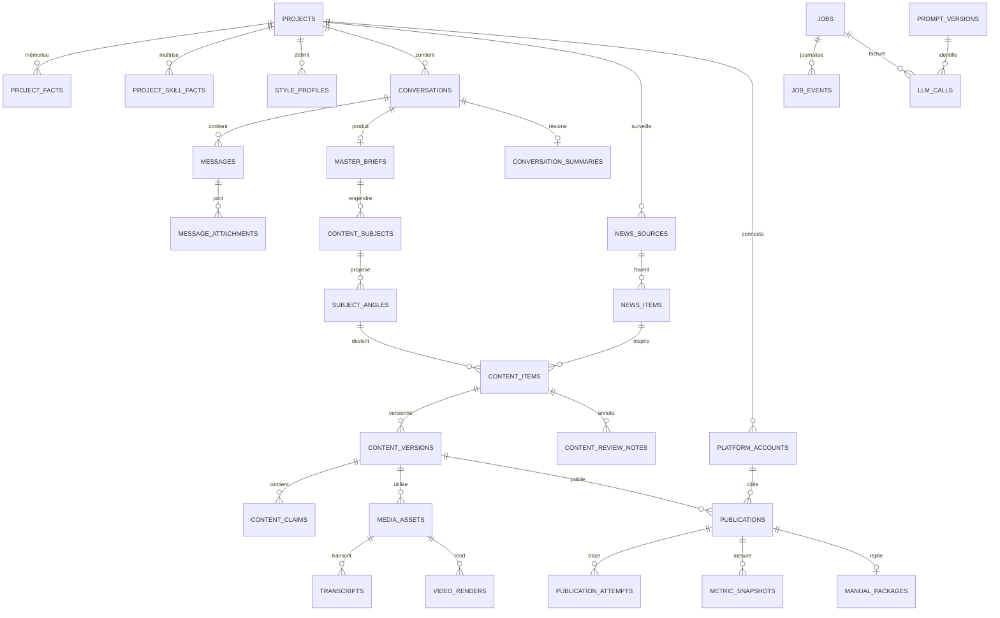
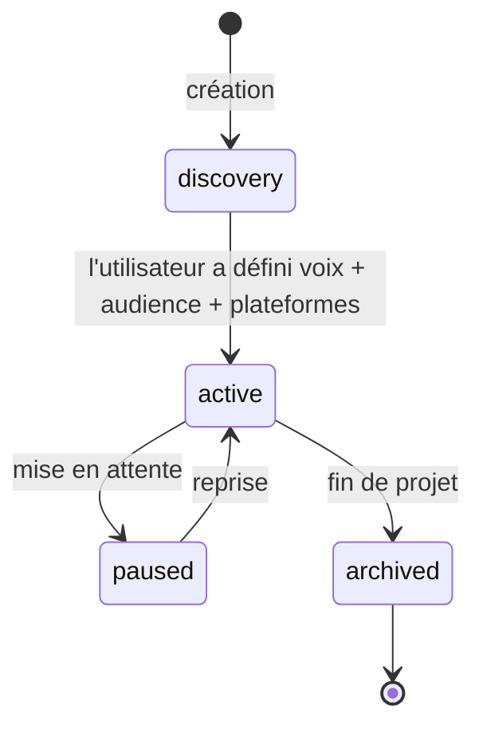
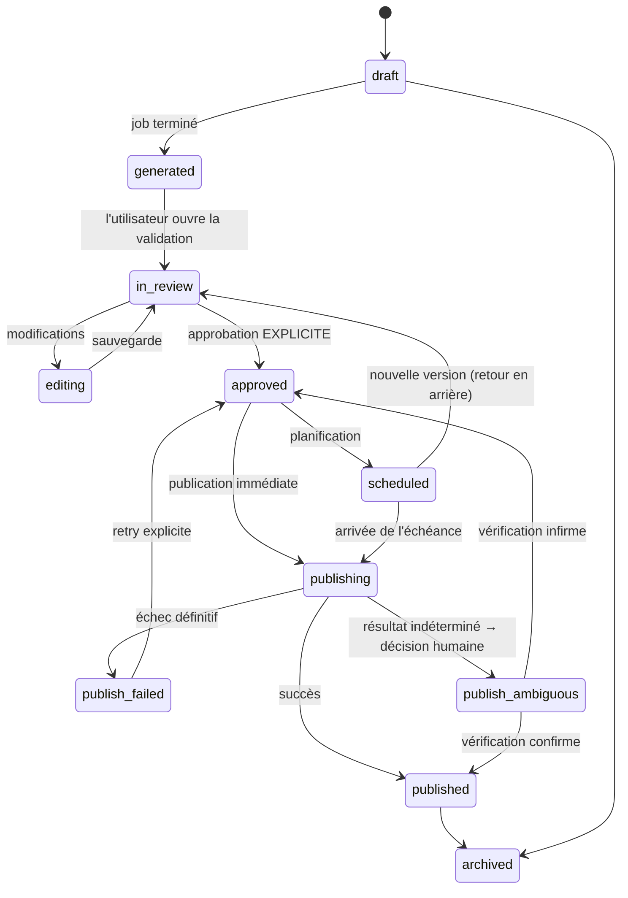

# 03 — Modèle de données

> Répond aux sections B, O et aux questions 14, 15, 16, 22, 33 du
> [cahier des charges](00-cahier-des-charges.md).

Le modèle de données est le cœur du produit. Une mauvaise table se paie pendant des mois ;
une table manquante se paie en perte d'information irréparable. Ce document décrit **chaque
table, sa raison d'être, ses invariants et ses index**, puis comment il survit au passage de
SQLite à PostgreSQL.

---

## 1. Principes

| # | Principe | Conséquence |
|---|---|---|
| 1 | **On ne perd jamais une donnée produite** | Un contenu remplacé n'est pas supprimé : il devient une nouvelle version. L'historique est immuable |
| 2 | **Chaque table a une raison produit** | Aucune table « au cas où ». Si aucune fonctionnalité des étapes 1 à 12 ne lit une table, elle n'existe pas |
| 3 | **Le passé est figé** | Une version publiée n'est jamais modifiée. Une métrique passée n'est jamais écrasée : chaque mesure est un point daté |
| 4 | **Rien n'est devinable depuis le code** | Chaque donnée qu'un agent doit connaître est **stockée**, pas recalculée à chaque appel (on ne veut pas d'un LLM qui réinvente le style à chaque génération) |
| 5 | **Portabilité SQLite → PostgreSQL** | Types, identifiants et JSON choisis pour être valides dans les deux moteurs |
| 6 | **L'IA n'écrit jamais directement en base** | Elle renvoie du JSON validé par Zod ; le domaine écrit. Aucun SQL généré par un modèle |

---

## 2. Conventions transverses

### 2.1 Identifiants

- **Clé primaire** : `id` en **TEXT** contenant un UUID v7 (trié temporellement) — généré
  côté application, jamais par la base.
- **Pourquoi pas un auto-incrément** : les identifiants apparaissent dans les URLs, les noms
  de fichiers et les prompts. Un compteur expose le volume d'activité et se marie mal avec
  une future fusion de bases ou une synchronisation multi-device.
- **Pourquoi UUID v7 plutôt que v4** : il est trié par date de création, donc les insertions
  restent séquentielles et les index ne se fragmentent pas — un point qui compte beaucoup sur
  SQLite et qui reste utile sur PostgreSQL.

### 2.2 Horodatage

- Toutes les colonnes de temps sont en **INTEGER (millisecondes Unix)**.
- **Pourquoi pas `DATETIME`** : SQLite n'a pas de type date réel, et un entier se compare,
  s'indexe et se sérialise sans ambiguïté de fuseau. Sur PostgreSQL, la migration convertit
  en `timestamptz`.
- Le fuseau de référence du produit est celui de l'utilisateur ; il est stocké une fois dans
  `app_settings.timezone` et utilisé pour la planification.

### 2.3 Énumérations

- Stockées en **TEXT** avec contrainte `CHECK`, jamais en entier.
- **Pourquoi** : un `3` dans une colonne ne veut rien dire lors d'un débogage, et une valeur
  inconnue casse silencieusement les anciennes versions du code. Un texte est lisible en base,
  dans les logs et dans les exports.
- Toute valeur d'énumération existe **aussi** comme type TypeScript et comme schéma Zod, dans
  un seul fichier (`packages/shared/src/enums.ts`). Une valeur ajoutée sans être ajoutée aux
  trois endroits est détectée par un test.

### 2.4 Argent et coûts

- Stockés en **`INTEGER` de micro-dollars** (`cost_micro_usd`), jamais en flottant.
- `1 000 000` micro-dollars = 1 USD. Le plus petit incrément utile (un appel LLM court) est
  de l'ordre de quelques centaines de micro-dollars.
- **Pourquoi pas un `REAL`** : les arrondis flottants s'accumulent et un total de coûts qui
  dérive de quelques centimes en quelques mois rend le suivi budgétaire inutilisable.

### 2.5 JSON

- Colonnes `TEXT` contenant du JSON valide, préfixées `_json` (`master_brief_json`).
- **Chaque colonne JSON possède un schéma Zod** dans le code. Le JSON est un moyen de
  stockage, pas une excuse pour ne pas typer.
- Sur PostgreSQL, la migration peut convertir certaines colonnes en `jsonb` — **sauf** si le
  code dépend du texte exact, ce qui ne doit jamais arriver (on ne compare pas du JSON).
- On ne **requête jamais** dans du JSON pour du filtrage métier. Si on doit filtrer, c'est
  que la donnée mérite une vraie colonne.

### 2.6 Suppression

- **Aucune suppression physique** sur les tables de contenu. On utilise `deleted_at`
  (soft delete) ou un état `archived`.
- Seules exceptions : `job_events` (rétention), et les fichiers médias orphelins explicitement
  confirmés par l'utilisateur.
- **Pourquoi** : une donnée supprimée par erreur dans un produit qui construit une mémoire
  longue est un échec du produit, pas un incident mineur.

---

## 3. Vue d'ensemble

### 3.1 Les 41 tables, par domaine

| Domaine | Tables |
|---|---|
| **Utilisateur et configuration** | `users`, `app_settings`, `llm_providers_config`, `budget_limits` |
| **Projets** | `projects`, `project_platforms`, `project_goals` |
| **Mémoire longue** | `project_facts`, `project_skill_facts`, `style_profiles`, `audience_profiles`, `learnings` |
| **Conversation** | `conversations`, `messages`, `message_attachments`, `conversation_summaries` |
| **Éditorial** | `master_briefs`, `content_subjects`, `subject_angles` |
| **Contenus** | `content_items`, `content_versions`, `content_review_notes`, `content_claims` |
| **Médias** | `media_assets`, `transcripts`, `video_renders` |
| **Publication** | `platform_accounts`, `publications`, `publication_attempts`, `manual_packages` |
| **Analytics** | `metric_snapshots`, `performance_patterns` |
| **Veille** | `news_sources`, `news_items` |
| **Système** | `jobs`, `job_events`, `llm_calls`, `prompt_versions`, `errors`, `system_health`, `notifications` |

> 41 tables au total, regroupées en 11 domaines. Toutes ne sont pas créées à l'étape 1 :
> la colonne « étape » est indiquée dans chaque fiche ci-dessous.

### 3.2 Diagramme des relations principales



### 3.3 Rappel des trois invariants portés par le schéma

1. **Aucune publication sans approbation.** `publications.content_version_id` référence une
   ligne `content_versions` dont `approved_at` n'est pas nul. Un déclencheur (ou une
   vérification transactionnelle dans le domaine) l'impose.
2. **Le versionnage n'est pas optionnel.** `content_items.current_version_id` désigne
   toujours une ligne existante ; les versions antérieures restent lisibles à jamais.
3. **Une compétence n'est pas une automatisation.** `project_skill_facts` ne contient que des
   compétences que **l'utilisateur** maîtrise ou apprend activement, jamais celles que le
   pipeline peut faire seul.

---

## 4. Utilisateur et configuration

### 4.1 `users` — étape 1

Un seul utilisateur en V1, mais la table existe pour ne pas avoir à réécrire le schéma.

```ts
users: {
  id: text().primaryKey(),
  display_name: text().notNull(),
  email: text().unique(),            // nullable : usage purement local
  password_hash: text(),             // nullable : mode local sans mot de passe (cf. 07-sécurité)
  locale: text().notNull().default('fr-FR'),
  created_at: integer().notNull(),
  updated_at: integer().notNull(),
}
```

**Pourquoi une table et pas une constante** : tout le reste du schéma porte un `owner_id`.
Le jour où un second utilisateur apparaît, aucune migration destructive n'est nécessaire.

### 4.2 `app_settings` — étape 1

Configuration modifiable depuis l'interface, en **lignes clé/valeur typées**.

```ts
app_settings: {
  key: text().primaryKey(),          // 'timezone', 'default_platform', 'asr_engine', …
  value_json: text().notNull(),
  value_type: text().notNull(),      // 'string' | 'number' | 'boolean' | 'json'
  updated_at: integer().notNull(),
}
```

**Pourquoi pas des colonnes** : la liste des réglages grandit à chaque étape (transcription,
rendu, publication, budget). Une table clé/valeur évite une migration par réglage.
Le revers — pas de contrainte de type en base — est compensé par un schéma Zod **unique**
par clé (`SETTINGS_SCHEMAS`), qui valide toute écriture et fournit la valeur par défaut.

**Clés connues en V1** : `timezone`, `default_platform`, `asr_engine`, `asr_model`,
`llm_default_provider`, `llm_model_light`, `llm_model_standard`, `daily_budget_usd`,
`monthly_budget_usd`, `require_approval_above_usd`, `auto_publish_after_days` (désactivé par
défaut), `news_refresh_hours`, `metrics_refresh_hours`, `media_max_upload_mb`,
`notification_level`.

### 4.3 `llm_providers_config` — étape 1

Un enregistrement par fournisseur connu.

```ts
llm_providers_config: {
  id: text().primaryKey(),
  provider: text().notNull(),            // 'deepseek'|'openrouter'|'openai'|'anthropic'|'gemini'|'ollama'
  api_key_encrypted: text(),             // chiffré AES-256-GCM ; null si Ollama local
  key_version: integer().notNull().default(1),
  base_url: text(),
  enabled: integer({ mode: 'boolean' }).notNull().default(false),
  default_model: text(),
  is_default: integer({ mode: 'boolean' }).notNull().default(false),
  last_health_ok_at: integer(),
  last_health_error: text(),
  created_at: integer().notNull(),
  updated_at: integer().notNull(),
}
```

> **Un seul `is_default = true`** : contrainte par index unique partiel
> (`CREATE UNIQUE INDEX ... WHERE is_default = 1`), appliquée par le domaine **et** par la
> base. Deux fournisseurs par défaut rendraient le comportement des agents imprévisible.

**Pourquoi la clé est en base et non dans `.env`** : l'utilisateur doit pouvoir changer de
fournisseur depuis l'interface, sans redémarrer l'application. Le `.env` sert
d'amorçage (`DEEPSEEK_API_KEY` est importée dans cette table au premier démarrage).

### 4.4 `budget_limits` — étape 8

```ts
budget_limits: {
  id: text().primaryKey(),
  scope: text().notNull(),        // 'global' | 'project' | 'task'
  scope_ref: text(),              // projectId ou nom de tâche, null si global
  period: text().notNull(),       // 'day' | 'week' | 'month'
  limit_micro_usd: integer().notNull(),
  hard_stop: integer({ mode: 'boolean' }).notNull().default(true),
  created_at: integer().notNull(),
}
```

**Différence avec `app_settings.daily_budget_usd`** : `app_settings` porte le réglage simple
affiché à l'utilisateur ; `budget_limits` permet des plafonds **par projet** ou **par tâche**
(par exemple : « la veille n'a droit qu'à 0,50 $ / jour, quel que soit le budget global »).
C'est la table que l'orchestrateur consulte **avant** chaque appel.

---

## 5. Projets

### 5.1 `projects` — étape 1

C'est **l'unité de contexte**. Un projet = un positionnement à construire, avec un public,
une voix, des plateformes et une mémoire.

```ts
projects: {
  id: text().primaryKey(),
  owner_id: text().notNull().references(() => users.id),
  name: text().notNull(),                        // « Automatisation IA : apprendre et partager »
  slug: text().notNull().unique(),
  positioning: text(),                           // en une phrase, écrit par l'utilisateur
  status: text().notNull().default('discovery'), // 'discovery'|'active'|'paused'|'archived'
  target_goal: text(),                           // « 500 abonnés LinkedIn en 6 mois »
  start_date: integer(),
  timezone: text(),                              // hérité de app_settings si null
  language: text().notNull().default('fr'),
  created_at: integer().notNull(),
  updated_at: integer().notNull(),
  archived_at: integer(),
}

// index
idx_projects_status (status)
idx_projects_owner (owner_id)
```

**`status` et son cycle de vie** :



- Le projet reste en `discovery` tant que `style_profiles` et `audience_profiles` n'existent
  pas. Les agents y posent **plus de questions** et proposent **moins de contenus** : c'est
  volontaire. Sans voix ni audience, un contenu généré est générique, donc inutile.
- Le passage à `active` est **automatique** dès que les deux profils existent — l'utilisateur
  n'a pas à cliquer sur un bouton « activer ».

### 5.2 `project_platforms` — étape 5

```ts
project_platforms: {
  id: text().primaryKey(),
  project_id: text().notNull().references(() => projects.id),
  platform: text().notNull(),            // 'linkedin'|'reddit'|'x'|'youtube'|'tiktok'|'instagram'|'blog'
  enabled: integer({ mode: 'boolean' }).notNull().default(true),
  priority: integer().notNull().default(0),   // 0 = principale
  purposes_json: text(),                 // ['notoriete','vente','portfolio','reseautage']
  cadence_per_week: integer(),           // objectif de rythme, sert aux alertes
  default_account_id: text().references(() => platform_accounts.id),
  created_at: integer().notNull(),
}

// index
uq_project_platform (project_id, platform)   // unicité
```

**Pourquoi `purposes_json`** : un même projet n'utilise pas LinkedIn et Reddit pour la même
raison. Le rédacteur en tient compte. C'est aussi la donnée qui alimente la question « est-ce
que cette plateforme sert cet objectif ? » posée par l'agent stratégique.

### 5.3 `project_goals` — étape 1

```ts
project_goals: {
  id: text().primaryKey(),
  project_id: text().notNull().references(() => projects.id),
  label: text().notNull(),               // « publier 3×/semaine »
  metric: text().notNull(),              // 'cadence'|'abonnes'|'vues'|'engagement'|'clics'|'ventes'
  target_value: integer(),
  current_value: integer(),
  period: text().notNull().default('month'),
  deadline: integer(),
  status: text().notNull().default('active'),  // 'active'|'reached'|'missed'|'abandoned'
  created_at: integer().notNull(),
  updated_at: integer().notNull(),
}

idx_project_goals_project (project_id, status)
```

**Utilité réelle** (et non décorative) : les objectifs sont injectés dans le contexte de
l'agent stratégique **et** dans les alertes. Si un projet a un objectif de cadence de
3 publications par semaine et qu'aucune publication n'est planifiée cette semaine, le
tableau de bord le signale. C'est la différence entre un outil qui produit du contenu et un
outil qui aide à tenir un objectif.

---

## 6. Mémoire longue — le différenciateur du produit

Sans cette section, le produit n'est qu'un générateur de texte. C'est ici qu'on stocke **ce
qui rend la génération personnelle** : ce que l'utilisateur sait, ce qu'il a vécu, comment il
parle, à qui il parle, et ce qui a fonctionné.

### 6.1 `project_facts` — étape 1

Les faits durables du projet : expériences, chiffres, opinions, projets réalisés, échecs.

```ts
project_facts: {
  id: text().primaryKey(),
  project_id: text().notNull().references(() => projects.id),
  category: text().notNull(),     // 'experience'|'chiffre'|'opinion'|'projet'|'echec'|'ressource'|'contrainte'
  statement: text().notNull(),    // « J'ai automatisé la facturation de mon activité avec n8n »
  detail: text(),
  source: text().notNull(),       // 'conversation'|'user_edit'|'user_import'
  source_message_id: text().references(() => messages.id),
  verified_by_user: integer({ mode: 'boolean' }).notNull().default(false),
  importance: integer().notNull().default(3),   // 1–5
  used_count: integer().notNull().default(0),   // combien de fois cité dans un contenu
  last_used_at: integer(),
  created_at: integer().notNull(),
  updated_at: integer().notNull(),
  deleted_at: integer(),
}

idx_facts_project (project_id, deleted_at)
idx_facts_category (project_id, category)
idx_facts_verified (project_id, verified_by_user)
```

**Pourquoi `verified_by_user`** : un fait extrait automatiquement d'une conversation peut être
mal interprété (« je ne sais pas faire X » devient « sait faire X »). **Seuls les faits
vérifiés sont injectés dans les prompts**, sauf en mode brouillon. C'est le principal
garde-fou contre l'invention biographique, qui est la faute la plus grave que ce produit
puisse commettre.

**Pourquoi `used_count` / `last_used_at`** : c'est la première source de diversité
anti-répétition. Un fait utilisé 8 fois ne doit plus ressortir en premier. Le calcul est local,
gratuit, et évite un appel LLM.

### 6.2 `project_skill_facts` — étape 1 — **table critique**

> Le cahier des charges insiste lourdement sur la distinction entre **automatiser une tâche**
> et **maîtriser une compétence**. Confondre les deux transformerait l'utilisateur en
> spectateur de son propre produit.

```ts
project_skill_facts: {
  id: text().primaryKey(),
  project_id: text().notNull().references(() => projects.id),
  skill: text().notNull(),               // « n8n », « Python », « copywriting », « montage vidéo »
  level: text().notNull(),               // 'debutant'|'intermediaire'|'avance'|'expert'
  evidence: text(),                      // ce qui prouve le niveau (« 12 workflows en prod »)
  learned_how: text(),                   // 'autodidacte'|'formation'|'projet'|'travail'|'en_apprentissage'
  is_learning: integer({ mode: 'boolean' }).notNull().default(false),
  learning_target: text(),               // ce qu'il cherche à apprendre maintenant
  confidence: integer().notNull().default(3),  // 1–5 : fiabilité de l'information
  last_updated_at: integer().notNull(),
  created_at: integer().notNull(),
}

uq_skill_project (project_id, skill)
```

**Règle absolue** : un sujet qui porte sur une compétence **absente** de cette table et
marquée `is_learning = false` doit déclencher un avertissement explicite dans l'interface :

> ⚠️ Aucune compétence « Docker » enregistrée pour ce projet. Publier sur ce sujet présente
> un risque de contenu générique ou inexact.

L'utilisateur peut décider de continuer, mais **le produit ne l'encourage jamais** à publier
sur ce qu'il ne connaît pas. C'est une contrainte produit, pas une fonctionnalité.

### 6.3 `style_profiles` — étape 1

Plusieurs profils par projet sont autorisés : un par plateforme, ou un par tonalité.

```ts
style_profiles: {
  id: text().primaryKey(),
  project_id: text().notNull().references(() => projects.id),
  name: text().notNull(),            // « LinkedIn sobre », « Reddit direct »
  scope: text().notNull().default('project'),  // 'project' | 'platform'
  platform: text(),                  // requis si scope = 'platform'
  tone: text(),                      // 'pedagogue'|'direct'|'chaleureux'|'technique'|'provocateur'
  formality: integer().notNull().default(3),   // 1 (tu) → 5 (vouvoiement strict)
  sentence_length: text(),           // 'courte'|'moyenne'|'longue'
  humor_level: integer().notNull().default(2), // 0–5
  emoji_level: integer().notNull().default(2), // 0–5
  forbidden_words_json: text(),      // ['révolutionnaire','game changer']
  signature_openings_json: text(),   // ouvertures typiques observées
  signature_closings_json: text(),
  example_paragraphs_json: text(),   // 3–5 exemples RÉELS de l'utilisateur
  derived_from_texts: integer().notNull().default(0),  // nb de textes analysés
  confidence: integer().notNull().default(1),          // 1–5
  created_at: integer().notNull(),
  updated_at: integer().notNull(),
}

uq_style_scope (project_id, scope, platform)
```

**Deux façons de remplir ce profil**, dans cet ordre de préférence :

1. **Manuel** : l'utilisateur colle 3 à 5 textes qu'il a réellement écrits. Un LLM en extrait
   les traits. **C'est la méthode fiable.**
2. **Guidé** : l'utilisateur répond à 6 questions de ton. Utilisé tant qu'aucun exemple réel
   n'a été fourni.

**Pourquoi `example_paragraphs_json` est la colonne la plus précieuse de la table** :
quelques paragraphes réels valent mieux que dix adjectifs. Ils sont injectés **verbatim** dans
le prompt du rédacteur. `confidence` reflète le nombre et la qualité des échantillons.

### 6.4 `audience_profiles` — étape 1

```ts
audience_profiles: {
  id: text().primaryKey(),
  project_id: text().notNull().references(() => projects.id),
  name: text().notNull(),                 // « Freelances qui démarrent »
  description: text(),
  pain_points_json: text(),               // ["manque de temps", "peur de l'IA", "trop d'outils"]
  goals_json: text(),                     // ce qu'ils veulent atteindre
  objections_json: text(),                // ['trop cher','pas technique','déjà essayé']
  knowledge_level: text().notNull(),      // 'debutant'|'intermediaire'|'avance'
  vocabulary_json: text(),                // mots qu'ils emploient eux-mêmes
  platforms_json: text(),                 // où ils sont
  created_at: integer().notNull(),
  updated_at: integer().notNull(),
}

idx_audience_project (project_id)
```

**Pourquoi séparer audience et style** : ce sont deux axes indépendants. Le même style peut
s'adresser à deux audiences ; la même audience reçoit deux styles différents selon la
plateforme. Les fusionner obligerait à dupliquer des profils.

### 6.5 `learnings` — étape 8

Ce que le produit a **appris des résultats réels**. C'est la table qui rend l'automatisation
« intelligente » plutôt que statique.

```ts
learnings: {
  id: text().primaryKey(),
  project_id: text().notNull().references(() => projects.id),
  scope: text().notNull(),          // 'platform'|'topic'|'format'|'hook'|'timing'|'length'
  platform: text(),
  statement: text().notNull(),      // « Les posts LinkedIn en liste de 5 points performent mieux »
  evidence_json: text(),            // { publicationIds: [...], metric: 'engagement_rate', ... }
  sample_size: integer().notNull(), // nombre de publications analysées
  confidence: text().notNull(),     // 'faible'|'moyenne'|'forte'
  human_reviewed: integer({ mode: 'boolean' }).notNull().default(false),
  active: integer({ mode: 'boolean' }).notNull().default(true),
  created_at: integer().notNull(),
  last_confirmed_at: integer(),
}

idx_learnings_project (project_id, active, confidence)
```

**Règles anti-superstition** — essentielles sur un produit personnel, où l'échantillon est
minuscule :

1. Aucun apprentissage n'est créé avec `sample_size < 5`. En dessous, c'est du bruit.
2. La confiance est **`faible` par défaut** et ne monte que si l'écart se **reproduit** sur des
   publications **distinctes**.
3. Un écart observé une seule fois sur un volume très faible est marqué `faible` et **affiché
   comme tel** à l'utilisateur, jamais utilisé comme directive.
4. Un `learning` n'entre dans un prompt que si `human_reviewed = true` **ou**
   `confidence = 'forte'`.
5. Un `learning` jamais reconfirmé depuis 90 jours est **automatiquement désactivé**.

**Pourquoi ces règles plutôt qu'un simple « le LLM analysera »** : sur 30 publications
personnelles, un modèle trouvera toujours des « patterns ». Sans garde-fou statistique, il
produit des superstitions (« publier le mardi à 14 h 07 ») qui dégradent la qualité réelle tout
en donnant une impression de sophistication.

### 6.6 Comment la mémoire est assemblée pour un appel

À chaque génération, l'orchestrateur construit un **paquet de contexte** par sélection locale
(gratuite), dans cet ordre :

| Priorité | Source | Nombre | Critère de sélection |
|---|---|---|---|
| 1 | `project_skill_facts` | toutes | sujet abordé couvert ou non |
| 2 | `project_facts` vérifiés | 5–8 max | `importance` × récence ÷ (`used_count` + 1) |
| 3 | `style_profiles` | 1 | le profil plateforme, sinon le profil projet |
| 4 | `audience_profiles` | 1 | l'audience principale du projet |
| 5 | `learnings` actifs et fiables | 3 max | `confidence = 'forte'` ou validés |
| 6 | faits récents de la conversation | 10 messages | fenêtre glissante |

**Le paquet est journalisé** dans `llm_calls.context_fingerprint` (hash) : on peut donc
reconstituer ce que le modèle a vu. Sans cela, un résultat inattendu serait indébogable.

---

## 7. Conversation

### 7.1 `conversations` — étape 2

La conversation est **le point d'entrée du produit**. On n'ouvre pas un formulaire : on parle.
Elle porte son propre état d'avancement, ce qui permet de reprendre un entretien interrompu.

```ts
conversations: {
  id: text().primaryKey(),
  project_id: text().notNull().references(() => projects.id),
  title: text(),                        // généré après 3 messages
  kind: text().notNull().default('interview'),  // 'interview'|'news_discussion'|'feedback'|'freeform'
  stage: text().notNull().default('intake'),
  // 'intake'|'positioning'|'audience'|'voice'|'fact_extraction'|'strategy'|'brief_ready'|'closed'
  missing_slots_json: text(),           // ce qu'il reste à apprendre : ['voice','audience']
  model_used: text(),
  message_count: integer().notNull().default(0),
  last_message_at: integer(),
  created_at: integer().notNull(),
  updated_at: integer().notNull(),
  closed_at: integer(),
}

idx_conversations_project (project_id, last_message_at)
idx_conversations_stage (project_id, stage)
```

**`missing_slots_json` est la clé du produit.** C'est la liste des informations dont
l'orchestrateur a besoin et qu'il n'a pas encore. Il la recalcule après chaque tour
**localement** (comparaison avec les tables de mémoire), sans appel LLM. Les questions posées
en découlent directement : le produit ne pose donc jamais une question dont il connaît déjà la
réponse, ce qui est la première cause d'abandon d'un assistant conversationnel.

**`stage` est un état explicite, pas une inférence.** Une machine à états simple et lisible
vaut mieux qu'un LLM qui « décide » où il en est à chaque tour : les transitions sont
testables, et une conversation interrompue reprend exactement au bon endroit.

### 7.2 `messages` — étape 2

```ts
messages: {
  id: text().primaryKey(),
  conversation_id: text().notNull().references(() => conversations.id),
  role: text().notNull(),               // 'user'|'assistant'|'system'|'tool'
  content: text(),
  content_json: text(),                 // messages structurés (questions, options, angles)
  message_type: text().notNull().default('text'),
  // 'text'|'question'|'options'|'proposal'|'confirmation'|'error'
  agent: text(),                        // agent émetteur si role='assistant'
  input_mode: text(),                   // 'text'|'voice'|'file'
  audio_asset_id: text().references(() => media_assets.id),
  transcript_status: text(),            // null si non vocal ; 'pending'|'done'|'failed'
  tokens_in: integer(),
  tokens_out: integer(),
  cost_micro_usd: integer().notNull().default(0),
  llm_call_id: text().references(() => llm_calls.id),
  parent_message_id: text(),            // pour les questions à options multiples
  created_at: integer().notNull(),
  edited_at: integer(),
  deleted_at: integer(),
}

idx_messages_conversation (conversation_id, created_at)
idx_messages_role (conversation_id, role)
```

**Pourquoi `role='tool'`** : quand un agent interroge la base (faits, skills, calendrier), le
résultat est journalisé comme un message `tool`. Cela rend la conversation **auditable** et
permet de rejouer un raisonnement. Sans cela, on ne peut pas expliquer une sortie.

**Pourquoi `cost_micro_usd` par message** : l'écran de conversation affiche le coût cumulé de
l'échange. C'est un signal direct pour l'utilisateur et un moyen immédiat de repérer une
dérive (un prompt qui devient trop gros).

### 7.3 `message_attachments` — étape 3

```ts
message_attachments: {
  id: text().primaryKey(),
  message_id: text().notNull().references(() => messages.id),
  media_asset_id: text().notNull().references(() => media_assets.id),
  kind: text().notNull(),          // 'audio'|'image'|'video'|'document'
  purpose: text(),                 // 'voice_input'|'example_text'|'reference'|'screenshot'
  created_at: integer().notNull(),
}

idx_attachments_message (message_id)
uq_attachment (message_id, media_asset_id, kind)
```

### 7.4 `conversation_summaries` — étape 2

Résumé cumulatif, régénéré par paliers, pour ne pas envoyer toute la conversation au modèle.

```ts
conversation_summaries: {
  id: text().primaryKey(),
  conversation_id: text().notNull().references(() => conversations.id),
  scope: text().notNull(),          // 'rolling' | 'final'
  from_message_index: integer().notNull(),
  to_message_index: integer().notNull(),
  summary: text().notNull(),
  decisions_json: text(),           // décisions prises dans cette portion
  facts_extracted_json: text(),     // faits candidats extraits
  tokens_saved_estimate: integer(),
  created_at: integer().notNull(),
}

idx_summaries_conversation (conversation_id, scope, created_at)
```

**Stratégie de contexte** (détaillée dans
[`04-orchestrateur-et-agents-ia.md`](04-orchestrateur-et-agents-ia.md)) : on garde les
**10 derniers messages verbatim** + un ou deux résumés + la mémoire structurée. La taille du
prompt reste donc **bornée**, ce qui borne le coût par tour. Un entretien de 80 messages ne
coûte pas 8 fois plus cher qu'un entretien de 10 messages.

**Découpage** : un résumé couvre des blocs de 20 messages. Un nouveau résumé est créé quand un
bloc de 20 est atteint ; les anciens résumés restent, permettant de reconstituer
l'historique complet sans jamais le renvoyer au modèle.

---

## 8. Éditorial — de la conversation au contenu

### 8.1 `master_briefs` — étape 2

La **fiche maître** est la synthèse validée d'un entretien : le document dont tout le reste
découle. Elle est **immuable** : une modification crée une nouvelle version.

```ts
master_briefs: {
  id: text().primaryKey(),
  project_id: text().notNull().references(() => projects.id),
  conversation_id: text().notNull().references(() => conversations.id),
  version: integer().notNull().default(1),
  status: text().notNull().default('draft'),   // 'draft'|'validated'|'superseded'
  summary: text().notNull(),                   // synthèse en quelques phrases
  positioning: text().notNull(),
  target_audience: text().notNull(),
  content_pillars_json: text().notNull(),      // 3–5 piliers de contenu
  themes_json: text().notNull(),               // thèmes concrets
  formats_json: text(),                        // formats visés par plateforme
  skill_map_json: text(),                      // ce que l'utilisateur sait faire (copie au moment T)
  gaps_json: text(),                           // ce qu'il ne sait PAS faire — pour éviter d'en parler
  cadence_json: text(),                        // { linkedin: 3, reddit: 1 }
  success_criteria_json: text(),
  source_message_ids_json: text(),             // traçabilité : messages ayant produit la fiche
  llm_call_id: text().references(() => llm_calls.id),
  validated_at: integer(),
  superseded_by_id: text(),
  created_at: integer().notNull(),
  updated_at: integer().notNull(),
}

idx_briefs_project (project_id, status)
uq_brief_version (conversation_id, version)
```

**`gaps_json` est la colonne la plus importante et la plus souvent oubliée.** Elle liste ce
que l'utilisateur **ne maîtrise pas**. Elle est utilisée en **négatif** : un sujet qui tombe
dans un `gap` est refusé ou signalé. C'est ce qui empêche le produit de faire écrire à
l'utilisateur des posts d'expert sur des sujets qu'il découvre.

**Immuabilité** : quand la fiche évolue, l'ancienne passe en `superseded` avec un lien
`superseded_by_id`. Les contenus générés restent rattachés à la version qui les a produits.

### 8.2 `content_subjects` — étape 3

Un **sujet** est une unité de sens (« Automatiser sa facturation avec n8n »), indépendante
d'une plateforme. C'est volontairement distinct de l'angle et du contenu.

```ts
content_subjects: {
  id: text().primaryKey(),
  project_id: text().notNull().references(() => projects.id),
  master_brief_id: text().references(() => master_briefs.id),
  news_item_id: text().references(() => news_items.id),   // si le sujet vient de la veille
  conversation_id: text().references(() => conversations.id),
  title: text().notNull(),
  thesis: text().notNull(),          // l'idée défendue, en une phrase
  pillar: text(),                    // pilier de contenu rattaché
  audience_id: text().references(() => audience_profiles.id),
  origin: text().notNull(),          // 'conversation'|'news'|'manual'|'recycling'|'analytics'
  status: text().notNull().default('proposed'),
  // 'proposed'|'selected'|'in_production'|'produced'|'archived'
  skill_coverage: text(),            // 'couverte'|'partielle'|'non_couverte' — calculée localement
  evidence_json: text(),             // faits et sources qui soutiennent le sujet
  priority_score: integer(),         // calcul local (voir ci-dessous)
  created_at: integer().notNull(),
  updated_at: integer().notNull(),
  archived_at: integer(),
}

idx_subjects_project (project_id, status, priority_score)
idx_subjects_origin (project_id, origin)
```

**`priority_score`** est calculé **localement**, sans LLM, à partir de :

```text
score = 2 × (pertinence pilier)
      + 2 × (couverture de compétence)      → 0 si le sujet tombe dans un gap
      + 1 × (fraîcheur)                     → bonus si issu de la veille du jour
      + 1 × (diversité)                     → pénalité si le thème a été traité récemment
      − 3 × (déjà traité il y a moins de 30 jours)
```

**Pourquoi ce calcul est local** : le tri de 50 sujets ne doit pas coûter un centime. Le LLM
n'intervient qu'**après** le tri, sur les 3 à 5 meilleurs, pour rédiger. C'est le principe
économique central du produit : **filtrer mécaniquement, générer intelligemment**.

### 8.3 `subject_angles` — étape 3

Un sujet peut avoir plusieurs angles. C'est l'angle que l'utilisateur choisit, pas le sujet.

```ts
subject_angles: {
  id: text().primaryKey(),
  subject_id: text().notNull().references(() => content_subjects.id),
  platform: text().notNull(),
  hook: text().notNull(),          // la première phrase / l'accroche
  angle_type: text().notNull(),    // 'retour_experience'|'tutoriel'|'opinion'|'comparaison'
                                   // 'erreur'|'coulisses'|'question'|'etude_de_cas'
  structure_json: text(),          // plan proposé : [{role:'hook'},{role:'body',points:[…]}]
  audience_id: text().references(() => audience_profiles.id),
  estimated_length: text(),        // 'court'|'moyen'|'long'
  difficulty: text(),              // ce que l'angle exige de l'utilisateur : 'faible'|'moyenne'|'elevee'
  score: integer(),
  selected: integer({ mode: 'boolean' }).notNull().default(false),
  rejection_reason: text(),        // si l'utilisateur rejette : apprentissage gratuit
  created_at: integer().notNull(),
}

idx_angles_subject (subject_id, score)
```

**`difficulty`** : un angle « tutoriel pas à pas » exige que l'utilisateur ait réellement fait
le pas à pas. Un angle « opinion » est plus accessible. Ce champ est calculé à partir de
`project_skill_facts` et affiché dans l'interface, ce qui permet à l'utilisateur de choisir en
connaissance de cause.

**`rejection_reason`** alimente les `learnings` : quand l'utilisateur rejette systématiquement
un type d'angle, le produit cesse de le proposer. C'est de l'apprentissage **gratuit et
fiable**, obtenu par observation directe plutôt que par inférence statistique.

---

## 9. Contenus et versions

### 9.1 `content_items` — étape 4

Un **contenu** est un objet éditorial destiné à une plateforme. Il porte la **machine à
états** qui protège l'utilisateur.

```ts
content_items: {
  id: text().primaryKey(),
  project_id: text().notNull().references(() => projects.id),
  subject_id: text().references(() => content_subjects.id),
  angle_id: text().references(() => subject_angles.id),
  platform: text().notNull(),
  platform_account_id: text().references(() => platform_accounts.id),
  format: text().notNull(),          // 'post_texte'|'post_image'|'video_courte'|'video_longue'|'thread'|'article'
  title: text(),
  state: text().notNull().default('draft'),
  current_version_id: text(),
  approved_version_id: text(),
  content_hash: text(),              // hash de l'angle + du brief + du style utilisé
  ai_generated: integer({ mode: 'boolean' }).notNull().default(true),
  human_edited: integer({ mode: 'boolean' }).notNull().default(false),
  edit_ratio: integer(),             // % du texte modifié par l'humain (proxy d'utilité réelle)
  regenerated_count: integer().notNull().default(0),
  created_at: integer().notNull(),
  updated_at: integer().notNull(),
  approved_at: integer(),
  scheduled_for: integer(),
  published_at: integer(),
  archived_at: integer(),
}

idx_items_project (project_id, state)
idx_items_platform (platform, state)
idx_items_scheduled (scheduled_for)
idx_items_hash (content_hash)     // détection de doublons
```

**Machine à états** — c'est l'invariant n°1 du produit :



**Règles de transition, appliquées dans `packages/core`** (jamais dans l'API ni dans le
worker) :

| Transition | Garde-fou |
|---|---|
| `in_review → approved` | `current_version_id` non nul **et** `approved_version_id = current_version_id` |
| `approved → publishing` | `approved_version_id` non nul **et** cette version n'a **pas** été modifiée depuis |
| `publishing → published` | un `remote_id` non nul existe |
| toute modification après `approved` | crée une **nouvelle version**, repasse à `editing` et **efface** `approved_version_id` |
| `→ archived` | jamais depuis `publishing` |

> **La table de transitions réellement appliquée est
> `CONTENT_STATE_TRANSITIONS`** (`packages/core/src/editorial/content.ts`, implémentée à l'étape 4).
> Elle suit ce diagramme et s'en écarte sur deux points, tous deux commentés dans le code :
> les **retours en arrière** d'une régénération (`generated → editing`, `editing → generated`,
> `approved → editing`, `approved → in_review`) et l'**archivage** possible depuis presque tous les
> états (sauf `publishing`, `published` et `archived`). Elle **retire** en revanche une transition du
> diagramme : `generated → approved` n'existe pas, donc aucune approbation ne peut contourner la
> relecture. Voir [`14-mise-en-oeuvre-etape-4.md`](14-mise-en-oeuvre-etape-4.md) §2 (M10).

**`edit_ratio`** est la mesure honnête de l'utilité du produit. Si l'utilisateur réécrit 85 %
de chaque contenu, l'automatisation n'apporte rien et il faut changer les prompts, pas ajouter
des fonctionnalités. Cette métrique est calculée localement (diff de texte) et affichée dans
l'écran analytique.

### 9.2 `content_versions` — étape 4

Toute modification produit une nouvelle ligne. Aucune ligne n'est jamais modifiée après
approbation.

```ts
content_versions: {
  id: text().primaryKey(),
  content_item_id: text().notNull().references(() => content_items.id),
  version_number: integer().notNull(),
  body: text().notNull(),
  title: text(),
  hook: text(),                     // première ligne, souvent décisive
  hashtags_json: text(),
  mentions_json: text(),
  link_url: text(),
  media_asset_ids_json: text(),
  char_count: integer(),
  word_count: integer(),
  reading_time_sec: integer(),
  generation: text().notNull(),     // 'initial'|'regenerated'|'edited'|'reformatted'
  prompt_version_hash: text(),      // quel prompt exact a produit ce texte
  llm_call_id: text().references(() => llm_calls.id),
  model_used: text(),
  temperature_x100: integer(),      // ×100, pour tracer la créativité utilisée
  critique_json: text(),            // critique du vérificateur : risques, claims, scores
  quality_score: integer(),         // 0–100, calculé
  approved_at: integer(),
  approved_by: text().references(() => users.id),
  created_at: integer().notNull(),
}

uq_content_version (content_item_id, version_number)
idx_versions_item (content_item_id, version_number)
```

**`prompt_version_hash` est indispensable.** Six mois plus tard, la question « pourquoi ce post
était-il bon et pas celui-là ? » n'a de réponse que si on sait exactement quel prompt a servi.
C'est aussi ce qui permet de revenir à un prompt antérieur quand une modification dégrade la
qualité — un **rollback de prompt**, pas de code.

### 9.3 `content_claims` — étape 4

Les affirmations vérifiables extraites d'un contenu, avec leur statut de vérification.

```ts
content_claims: {
  id: text().primaryKey(),
  content_version_id: text().notNull().references(() => content_versions.id),
  claim: text().notNull(),          // « n8n réduit de 70 % le temps de facturation »
  claim_type: text().notNull(),     // 'chiffre'|'fait'|'experience'|'opinion'|'prediction'|'generalite'
  verifiability: text().notNull(),  // 'verifiable'|'non_verifiable'|'depend_du_contexte'
  evidence: text(),                 // source interne (id de project_fact) ou externe (URL)
  evidence_source: text(),          // 'project_fact'|'news_item'|'user'|'web'|'none'
  risk: text().notNull(),           // 'faible'|'moyen'|'eleve' ← 'eleve' peut bloquer l'approbation
  status: text().notNull(),         // 'supported'|'unsupported'|'needs_user_confirmation'|'rejected'
  user_confirmed_at: integer(),
  created_at: integer().notNull(),
}

idx_claims_version (content_version_id, risk)
idx_claims_status (content_version_id, status)
```

**Règle bloquante** : un contenu contenant **au moins un** claim avec `risk = 'eleve'` **et**
`status ≠ 'supported'` ne peut **pas** passer à `approved`. L'interface affiche alors
précisément la phrase en cause et propose trois issues : apporter une preuve, reformuler, ou
supprimer. C'est le garde-fou anti-hallucination le plus concret du produit : il ne bloque pas
le style, il bloque les **affirmations non étayées**.

### 9.4 `content_review_notes` — étape 4

```ts
content_review_notes: {
  id: text().primaryKey(),
  content_item_id: text().notNull().references(() => content_items.id),
  content_version_id: text().references(() => content_versions.id),
  author: text().notNull(),         // 'user' ou nom d'agent : 'verifier','fact_checker','style_critic'
  note_type: text().notNull(),      // 'critique'|'suggestion'|'erreur'|'warning'|'decision'
  severity: text().notNull(),       // 'info'|'basse'|'moyenne'|'haute'
  message: text().notNull(),
  anchor_text: text(),              // extrait de texte visé
  resolved: integer({ mode: 'boolean' }).notNull().default(false),
  resolved_by: text(),
  resolved_at: integer(),
  created_at: integer().notNull(),
}

idx_notes_item (content_item_id, resolved)
```

**Pourquoi les agents écrivent aussi dans cette table** : les remarques sont affichées à côté
du texte, pas noyées dans un log. L'utilisateur voit « le vérificateur signale un chiffre non
sourcé au paragraphe 3 » directement sur le contenu. Un commentaire dans un journal technique
ne serait jamais lu.

---

## 10. Médias

### 10.1 `media_assets` — étape 3

Un enregistrement par fichier **unique** (déduplication par hash), avec ses dérivés.

```ts
media_assets: {
  id: text().primaryKey(),
  project_id: text().references(() => projects.id),   // null = asset global
  kind: text().notNull(),           // 'audio'|'image'|'video'|'document'
  role: text().notNull().default('original'),
  // 'original'|'poster'|'thumbnail'|'vertical'|'square'|'subtitled'|'audio_normalized'
  parent_asset_id: text(),          // l'asset dont celui-ci dérive
  storage_key: text().notNull(),    // chemin relatif dans le StorageAdapter
  original_filename: text(),
  mime_type: text().notNull(),
  size_bytes: integer().notNull(),
  sha256: text().notNull(),
  width: integer(),
  height: integer(),
  duration_ms: integer(),
  bitrate: integer(),
  codec: text(),
  fps: integer(),                   // ×100 pour éviter les flottants (29.97 → 2997)
  has_audio: integer({ mode: 'boolean' }),
  language: text(),
  source: text().notNull(),         // 'upload'|'generated'|'url_import'|'render'
  source_url: text(),
  usage_count: integer().notNull().default(0),
  last_used_at: integer(),
  created_at: integer().notNull(),
  deleted_at: integer(),
}

uq_asset_hash (sha256, role)          // déduplication : même fichier + même rôle = une ligne
idx_assets_project (project_id, kind, deleted_at)
idx_assets_orphans (usage_count, created_at)   // nettoyage des non utilisés
```

**Déduplication par `sha256`** : si l'utilisateur renvoie deux fois la même vidéo, elle n'est
stockée qu'une fois. `usage_count` compte les contenus qui la référencent et protège du
nettoyage. Un asset avec `usage_count = 0` depuis 90 jours est proposé à la suppression
(jamais supprimé automatiquement).

**`role` et `parent_asset_id`** : tous les dérivés d'un même original sont rattachés à lui.
Supprimer la version verticale n'affecte pas l'original ; supprimer l'original prévient
l'utilisateur des dérivés dépendants.

### 10.2 `transcripts` — étape 3

```ts
transcripts: {
  id: text().primaryKey(),
  media_asset_id: text().notNull().references(() => media_assets.id),
  engine: text().notNull(),         // 'whisper_cpp'|'faster_whisper'|'cloud'
  model: text(),                    // 'small','medium','large-v3'
  language: text(),
  text: text().notNull(),
  segments_json: text().notNull(),  // [{start, end, text, words?: [{w, s, e}]}]
  word_count: integer(),
  duration_ms: integer(),
  confidence: integer(),            // ×100 ; basse = à relire
  has_word_timestamps: integer({ mode: 'boolean' }).notNull().default(false),
  processing_ms: integer(),
  cost_micro_usd: integer().notNull().default(0),
  edited_body: text(),              // version corrigée par l'utilisateur (prioritaire à l'usage)
  created_at: integer().notNull(),
}

uq_transcript_asset (media_asset_id, engine, model)
idx_transcripts_lang (language)
```

**Pourquoi `edited_body`** : la transcription automatique contient toujours des erreurs
(noms propres, jargon). Quand l'utilisateur corrige, on garde **les deux** : le brut pour la
traçabilité, le corrigé pour l'usage. Sans ce champ, chaque régénération de contenu repartirait
des erreurs.

**Un seul transcript par (asset, moteur, modèle)** : la transcription est chère en temps, on
ne la refait jamais deux fois pour les mêmes paramètres.

### 10.3 `video_renders` — étape 4

Chaque opération de montage est un enregistrement, avec le **plan** exact qui l'a produite.

```ts
video_renders: {
  id: text().primaryKey(),
  project_id: text().notNull().references(() => projects.id),
  content_item_id: text().references(() => content_items.id),
  source_asset_ids_json: text().notNull(),
  output_asset_id: text().references(() => media_assets.id),
  preset: text().notNull(),         // 'vertical_9_16'|'square_1_1'|'landscape_16_9'|'clip_short'
  edit_plan_json: text().notNull(), // le plan complet : découpes, sous-titres, audio, vitesse
  ffmpeg_args_json: text().notNull(), // les arguments EXACTS passés à FFmpeg
  ffmpeg_version: text(),
  status: text().notNull(),         // 'queued'|'running'|'completed'|'failed'|'cancelled'
  progress: integer().notNull().default(0),
  duration_ms: integer(),
  output_size_bytes: integer(),
  render_time_ms: integer(),
  exit_code: integer(),
  error_message: text(),
  created_at: integer().notNull(),
  started_at: integer(),
  completed_at: integer(),
}

idx_renders_item (content_item_id, status)
idx_renders_project (project_id, created_at)
```

**`edit_plan_json` et `ffmpeg_args_json` sont conservés séparément, volontairement.**
Le plan est l'intention ; les arguments sont le résultat de sa compilation. En cas de bug de
compilation, comparer les deux est immédiat. Cela permet aussi de **rejouer un rendu à
l'identique** après une mise à jour de FFmpeg pour vérifier qu'aucune régression n'est
introduite — un test de non-régression sur de la vidéo, sans stocker la vidéo en CI.

---

## 11. Publication

### 11.1 `platform_accounts` — étape 5

Un compte connecté sur une plateforme. Les jetons sont chiffrés.

```ts
platform_accounts: {
  id: text().primaryKey(),
  project_id: text().notNull().references(() => projects.id),
  platform: text().notNull(),
  account_label: text().notNull(),        // « LinkedIn perso », « r/automatisation »
  remote_account_id: text(),              // id côté plateforme (subreddit, page, chaîne…)
  access_token_encrypted: text(),
  refresh_token_encrypted: text(),
  token_key_version: integer().notNull().default(1),
  scopes_json: text(),
  token_expires_at: integer(),
  capabilities_json: text(),              // copie du ConnectorCapabilities au moment de la connexion
  connection_state: text().notNull().default('disconnected'),
  // 'connected'|'expired'|'revoked'|'disconnected'|'rate_limited'
  last_ok_at: integer(),
  last_error: text(),
  last_rate_limit_at: integer(),
  rate_limit_reset_at: integer(),
  created_at: integer().notNull(),
  updated_at: integer().notNull(),
}

uq_platform_account (project_id, platform, remote_account_id)
idx_accounts_state (platform, connection_state)
idx_accounts_expiry (token_expires_at)
```

**Pourquoi `capabilities_json` est *copié* et non recalculé** : les capacités d'une plateforme
peuvent changer (TikTok modifie régulièrement son API). Au moment d'une publication, on veut
savoir **ce que le connecteur croyait possible** quand le compte a été configuré. Un écart
entre la copie et la réalité actuelle est un signal exploitable — et surtout, il ne faut pas
qu'un changement d'API transforme silencieusement tous les contenus planifiés en échecs
inexplicables.

**`rate_limit_reset_at`** : la limite de débit est la première cause d'échec réel de
publication (LinkedIn et Reddit sont stricts). Le stocker permet au scheduler de **ne pas
planifier** pendant une fenêtre bloquée au lieu de générer des erreurs évitables.

### 11.2 `publications` — étape 5

Une ligne par (version de contenu, compte) publié ou prévu. C'est la table qui porte l'état
**distant**.

```ts
publications: {
  id: text().primaryKey(),
  project_id: text().notNull().references(() => projects.id),
  content_item_id: text().notNull().references(() => content_items.id),
  content_version_id: text().notNull().references(() => content_versions.id),
  platform_account_id: text().notNull().references(() => platform_accounts.id),
  platform: text().notNull(),
  status: text().notNull().default('planned'),
  // 'planned'|'queued'|'publishing'|'published'|'failed'|'ambiguous'|'manual_required'|'cancelled'
  scheduled_for: integer(),
  idempotency_key: text().notNull(),
  remote_id: text(),
  remote_url: text(),
  remote_status: text(),            // statut brut retourné par la plateforme
  manual_package_id: text().references(() => manual_packages.id),
  first_attempt_at: integer(),
  published_at: integer(),
  last_attempt_at: integer(),
  attempt_count: integer().notNull().default(0),
  needs_human_decision: integer({ mode: 'boolean' }).notNull().default(false),
  decision_note: text(),
  created_at: integer().notNull(),
  updated_at: integer().notNull(),
}

uq_publication_version_account (content_version_id, platform_account_id)
uq_publication_idempotency (idempotency_key)
idx_publications_schedule (status, scheduled_for)
idx_publications_item (content_item_id, status)
idx_publications_platform (platform, published_at)
```

**`uq_publication_version_account`** empêche structurellement de publier deux fois la même
version sur le même compte. C'est une contrainte de **base de données**, pas une règle de code :
c'est le seul endroit où un garde-fou ne peut pas être contourné par un bug applicatif.

**`idempotency_key`** est généré en local
(`sha256(content_version_id + platform_account_id + scheduled_for_bucket)`) et transmis au
connecteur quand la plateforme le supporte. Quand la plateforme ne le supporte pas, la clé sert
au moins à la **vérification après échec**.

**`needs_human_decision`** : le marqueur qui empêche un retry automatique silencieux sur un
résultat ambigu. Tant qu'il est à vrai, le scheduler **ignore** cette publication.

### 11.3 `publication_attempts` — étape 5

Chaque tentative, avec sa requête et sa réponse. La table qui permet de comprendre un échec
six mois plus tard.

```ts
publication_attempts: {
  id: text().primaryKey(),
  publication_id: text().notNull().references(() => publications.id),
  attempt_number: integer().notNull(),
  started_at: integer().notNull(),
  finished_at: integer(),
  outcome: text().notNull(),
  // 'success'|'rate_limited'|'auth_error'|'validation_error'|'server_error'
  // 'timeout'|'network_error'|'ambiguous'|'rejected_by_platform'
  http_status: integer(),
  request_json: text(),             // SANS les jetons (rédigés)
  response_json: text(),
  error_code: text(),
  error_message: text(),
  duration_ms: integer(),
  created_at: integer().notNull(),
}

uq_attempt_number (publication_id, attempt_number)
idx_attempts_outcome (outcome, created_at)
```

> **`request_json` ne contient jamais de jeton.** Le connecteur applique une fonction de
> rédaction (`redactSecrets`) avant d'écrire. Un jeton OAuth stocké en clair dans une table de
> journal est la fuite la plus banale et la plus grave d'un projet local — cf.
> [`07-securite-secrets-auth.md`](07-securite-secrets-auth.md).

### 11.4 `manual_packages` — étape 5

Le **repli de niveau C** : quand une plateforme ne permet pas la publication automatique, le
produit prépare tout ce qu'il faut pour publier à la main en moins d'une minute.

```ts
manual_packages: {
  id: text().primaryKey(),
  content_item_id: text().notNull().references(() => content_items.id),
  content_version_id: text().notNull().references(() => content_versions.id),
  platform: text().notNull(),
  body_text: text().notNull(),
  title_text: text(),
  copy_blocks_json: text(),         // blocs prêts à copier (corps, hashtags, description)
  asset_paths_json: text(),         // fichiers locaux à téléverser
  instructions: text(),             // ce que l'utilisateur doit faire, étape par étape
  deep_link: text(),                // lien direct vers l'écran de publication si possible
  downloaded_at: integer(),
  marked_published_at: integer(),
  created_at: integer().notNull(),
}

idx_manual_item (content_item_id, platform)
```

**Pourquoi cette table plutôt qu'un simple bouton « copier »** : le repli manuel doit rester
**traçable**. Sans elle, un contenu publié à la main disparaîtrait des analytics et de la
détection de doublons. `marked_published_at` confirme la publication manuelle et permet de
rattacher des métriques saisies à la main.

---

## 12. Analytics

### 12.1 `metric_snapshots` — étape 8

Une ligne par **publication et par jour**. Jamais d'écrasement : les métriques ne font que
s'ajouter, ce qui permet de tracer une courbe dans le temps.

```ts
metric_snapshots: {
  id: text().primaryKey(),
  publication_id: text().notNull().references(() => publications.id),
  project_id: text().notNull().references(() => projects.id),
  platform: text().notNull(),
  captured_at: integer().notNull(),      // moment de la mesure
  captured_date: text().notNull(),       // 'YYYY-MM-DD' dans le fuseau utilisateur
  source: text().notNull(),              // 'api'|'manual'|'estimated'
  impressions: integer(),
  reach: integer(),
  views: integer(),
  likes: integer(),
  comments: integer(),
  shares: integer(),
  saves: integer(),
  clicks: integer(),
  follows_gained: integer(),
  watch_time_sec: integer(),
  avg_view_duration_sec: integer(),
  completion_rate_x100: integer(),       // ×100
  engagement_rate_x100: integer(),       // ×100 ; calculé, stocké pour la stabilité
  profile_visits: integer(),
  raw_json: text(),                      // réponse brute de l'API, pour audit
  created_at: integer().notNull(),
}

uq_metric_day (publication_id, captured_date, source)
idx_metrics_project_date (project_id, captured_date)
idx_metrics_platform (platform, captured_date)
```

**`uq_metric_day`** : une seule mesure par jour et par source. Si la collecte tourne deux fois
dans la journée, elle **met à jour** le point du jour au lieu d'en créer un second — sinon
toutes les courbes seraient faussées par des doublons.

**`source = 'manual'`** est **indispensable** : plusieurs plateformes n'exposent pas
d'analytics utilisables (ou leurs quotas sont trop restrictifs). L'utilisateur doit pouvoir
saisir ses chiffres à la main, et le produit doit les traiter avec la **même** valeur que les
données d'API. Refuser la saisie manuelle condamnerait la boucle d'amélioration sur la moitié
des plateformes.

**`engagement_rate_x100` est stocké, pas calculé à la volée** : la formule dépend de la
plateforme (impressions ou reach ou vues au dénominateur). Le stocker garantit que les
comparaisons historiques restent cohérentes même si la formule évolue.

### 12.2 `performance_patterns` — étape 8

Les corrélations **calculées localement** entre les caractéristiques d'un contenu et son
résultat. C'est le socle factuel avant toute interprétation par un LLM.

```ts
performance_patterns: {
  id: text().primaryKey(),
  project_id: text().notNull().references(() => projects.id),
  platform: text().notNull(),
  dimension: text().notNull(),
  // 'hook_type'|'length'|'posting_hour'|'posting_weekday'|'topic'|'format'|'hashtag_count'
  // 'has_media'|'has_video'|'structure'
  value: text().notNull(),           // « hook sous forme de question »
  metric: text().notNull(),          // 'engagement_rate'|'reach'|'saves'
  sample_size: integer().notNull(),
  avg_value_x100: integer().notNull(),
  median_value_x100: integer(),
  baseline_x100: integer(),          // moyenne générale de la plateforme, pour comparer
  delta_percent: integer(),          // (avg − baseline) / baseline × 100
  computed_at: integer().notNull(),
  period_start: integer().notNull(),
  period_end: integer().notNull(),
}

uq_pattern (project_id, platform, dimension, value, metric, period_end)
idx_patterns_lookup (project_id, platform, dimension, sample_size)
```

**Utilisation** : ces patterns alimentent les `learnings` (après garde-fous) **et** l'écran
analytique (avec `sample_size` toujours affiché). L'utilisateur voit donc « les hooks sous
forme de question ont un engagement 40 % supérieur, sur 9 publications » — une affirmation
vérifiable, avec son échantillon, pas une intuition.

**Recalcul** : les patterns sont recalculés en **local** sur la fenêtre des 90 derniers jours
par le worker, sans LLM. Un agent LLM n'intervient que pour **rédiger une recommandation**
à partir des patterns déjà calculés — jamais pour les découvrir.

---

## 13. Veille (news)

### 13.1 `news_sources` — étape 7

```ts
news_sources: {
  id: text().primaryKey(),
  project_id: text().notNull().references(() => projects.id),
  name: text().notNull(),               // « Hacker News », « Blog n8n »
  kind: text().notNull(),               // 'rss'|'atom'|'api'|'manual'
  url: text(),
  keywords_json: text(),                // filtre de premier niveau
  exclude_keywords_json: text(),
  language: text(),
  authority: integer().notNull().default(3),  // 1–5, pondère le scoring
  enabled: integer({ mode: 'boolean' }).notNull().default(true),
  refresh_hours: integer().notNull().default(12),
  last_fetch_at: integer(),
  last_success_at: integer(),
  last_error: text(),
  consecutive_failures: integer().notNull().default(0),
  created_at: integer().notNull(),
  updated_at: integer().notNull(),
}

idx_sources_due (enabled, last_fetch_at)
uq_source_url (project_id, url)
```

**`consecutive_failures`** : après 5 échecs consécutifs, la source est **automatiquement
désactivée** et une notification est créée. Un flux RSS mort qui échoue toutes les 12 heures
pollue les journaux et masque les vraies erreurs. C'est un détail qui décide si un produit
qu'on garde ouvert six mois reste sain.

### 13.2 `news_items` — étape 7

Chaque actualité **récupérée** (jamais inventée), avec sa source et son score.

```ts
news_items: {
  id: text().primaryKey(),
  project_id: text().notNull().references(() => projects.id),
  source_id: text().notNull().references(() => news_sources.id),
  title: text().notNull(),
  summary: text(),                      // résumé court généré (jamais le corps inventé)
  url: text().notNull(),
  canonical_url: text(),
  author: text(),
  published_at: integer(),
  fetched_at: integer().notNull(),
  language: text(),
  raw_json: text(),                     // la charge utile d'origine
  content_hash: text().notNull(),       // déduplication titre + URL normalisés
  relevance_score: integer(),           // 0–100, calcul local
  freshness_score: integer(),
  authority_score: integer(),
  novelty_score: integer(),             // pénalité si sujet déjà traité
  final_score: integer(),
  topic_tags_json: text(),
  matched_skill: text(),                // compétence associée, si identifiée
  status: text().notNull().default('new'),
  // 'new'|'shortlisted'|'used'|'dismissed'|'expired'
  dismissal_reason: text(),
  verified: integer({ mode: 'boolean' }).notNull().default(true),   // la source a répondu
  llm_enriched: integer({ mode: 'boolean' }).notNull().default(false),
  created_at: integer().notNull(),
  expires_at: integer(),                // péremption automatique
}

uq_news_hash (project_id, content_hash)      // déduplication stricte
idx_news_ranking (project_id, status, final_score)
idx_news_fresh (project_id, published_at)
idx_news_expiry (status, expires_at)
```

**`verified = true` par défaut, et ce champ n'est jamais mis à `true` sans une vraie
récupération.** Il n'existe que pour trahir un cas anormal : une donnée insérée sans source.
Le `source_url` et `raw_json` sont conservés pour que l'utilisateur puisse **cliquer et
vérifier lui-même**. Un produit de contenu qui invente une actualité détruit la réputation de
son utilisateur : c'est le risque le plus élevé, il est donc traité par le schéma.

**`expires_at`** : par défaut 14 jours. Au-delà, une actualité n'est plus une actualité. Le
worker purge les `new` expirés vers `expired` — ce qui évite de proposer à l'utilisateur, en
mars, un sujet qui date de janvier.

**`llm_enriched`** distingue explicitement les items sur lesquels on a dépensé. Le tri et le
scoring sont locaux ; seul le **résumé** des 5 à 10 meilleurs candidats fait un appel LLM.

---

## 14. Système, jobs et observabilité

### 14.1 `jobs` — étape 1

La file de travail **vit en base**. Il n'y a pas de Redis en V1 (cf.
[`02-architecture.md`](02-architecture.md) §9.3) : la même table porte la file, le lease et
l'historique.

```ts
jobs: {
  id: text().primaryKey(),
  type: text().notNull(),           // 'generate_content','transcribe_media','render_video',
                                    // 'publish_content','collect_metrics','fetch_news'…
  status: text().notNull().default('queued'),
  // 'queued'|'running'|'completed'|'failed'|'cancelled'|'dead'
  priority: integer().notNull().default(5),      // 1 (urgent) – 9 (batch)
  input_json: text().notNull(),
  output_json: text(),
  error_json: text(),
  project_id: text().references(() => projects.id),
  content_item_id: text().references(() => content_items.id),
  publication_id: text().references(() => publications.id),
  dedupe_key: text(),               // un seul job en attente par clé logique
  idempotent: integer({ mode: 'boolean' }).notNull().default(false),
  scheduled_for: integer().notNull(),   // échéance (retry/backoff, cron)
  available_at: integer().notNull(),    // = scheduled_for au départ
  attempt: integer().notNull().default(0),
  max_attempts: integer().notNull().default(3),
  worker_id: text(),
  lease_expires_at: integer(),
  heartbeat_at: integer(),
  progress: integer().notNull().default(0),
  current_step: text(),
  started_at: integer(),
  finished_at: integer(),
  duration_ms: integer(),
  cost_micro_usd: integer().notNull().default(0),
  parent_job_id: text(),            // un job qui en déclenche d'autres
  requires_network: integer({ mode: 'boolean' }).notNull().default(false),
  created_at: integer().notNull(),
  updated_at: integer().notNull(),
}

idx_jobs_claim (status, available_at, priority)      // la requête du worker
idx_jobs_dedupe (type, dedupe_key, status)           // anti-doublon
idx_jobs_lease (status, lease_expires_at)            // reprise après crash
idx_jobs_item (content_item_id, type, status)
idx_jobs_schedule (status, scheduled_for)
```

**`dedupe_key`** : empêche d'empiler dix fois le même job quand l'utilisateur clique cinq fois
sur « régénérer ». Un index partiel sur `(type, dedupe_key)` où `status IN ('queued','running')`
suffit — la contrainte est donc **en base**, pas dans l'interface.

**`requires_network`** : permet à un mode « hors ligne » de ne pas consommer les jobs qui
échoueraient de toute façon, et de les reprendre au retour du réseau.

**`lease_expires_at` + `heartbeat_at`** : un job `running` dont le lease a expiré est repris
par un autre worker (`reclaimExpired`). C'est précisément le mécanisme qui rend inutile Redis
en mono-utilisateur : un crash de process ne perd aucun job.

### 14.2 `job_events` — étape 1

Le journal append-only d'un job. C'est ce que l'interface affiche en temps réel via SSE.

```ts
job_events: {
  id: text().primaryKey(),
  job_id: text().notNull().references(() => jobs.id),
  sequence: integer().notNull(),    // 1,2,3… strictement croissant par job
  level: text().notNull(),          // 'debug'|'info'|'warn'|'error'
  step: text(),                     // 'fetch_news','prompt','llm_call','parse','validate'
  message: text().notNull(),
  data_json: text(),
  progress: integer(),
  duration_ms: integer(),
  created_at: integer().notNull(),
}

uq_job_sequence (job_id, sequence)
idx_events_job (job_id, sequence)
idx_events_retention (created_at)
```

**`sequence`** est ce qui rend le flux SSE **reprenable** : le client mémorise le dernier
numéro reçu et redemande les événements suivants après une coupure. Sans lui, une
reconnexion au milieu d'une génération ferait perdre l'affichage des étapes intermédiaires.

### 14.3 `llm_calls` — étape 1

**Chaque** appel à un modèle, sans exception. C'est la table qui rend le budget et le débogage
possibles.

```ts
llm_calls: {
  id: text().primaryKey(),
  job_id: text().references(() => jobs.id),
  project_id: text().references(() => projects.id),
  conversation_id: text().references(() => conversations.id),
  content_item_id: text().references(() => content_items.id),
  agent: text(),                    // 'strategist','copywriter','critic','fact_checker','analyst'
  task: text().notNull(),           // 'generate_hooks','critique_draft','classify_news'…
  provider: text().notNull(),       // 'deepseek','openai','anthropic','local'
  model: text().notNull(),
  prompt_version_id: text().references(() => prompt_versions.id),
  context_fingerprint: text(),      // sha256 du contexte exact envoyé
  request_json: text().notNull(),   // messages complets (sans secret)
  response_json: text(),
  prompt_tokens: integer(),
  completion_tokens: integer(),
  cached_tokens: integer(),
  total_tokens: integer(),
  cost_micro_usd: integer().notNull().default(0),
  currency: text().notNull().default('USD'),
  latency_ms: integer(),
  ttft_ms: integer(),               // temps jusqu'au premier token (streaming)
  status: text().notNull(),         // 'success'|'error'|'timeout'|'rate_limited'|'refused'
  error_code: text(),
  retried_from_id: text(),          // chaîne de retry
  finish_reason: text(),
  temperature_x100: integer(),
  created_at: integer().notNull(),
}

idx_calls_project_time (project_id, created_at)
idx_calls_task (task, created_at)
idx_calls_agent (agent, created_at)
idx_calls_status (status, created_at)
idx_calls_cost (created_at, cost_micro_usd)
```

**`context_fingerprint`** : hash du contexte envoyé. Deux appels avec la même empreinte et la
même version de prompt **doivent** donner des résultats comparables. C'est le seul moyen de
savoir si un changement de qualité vient du **contexte** ou du **modèle**. C'est aussi la clé
d'un cache de réponses sûr, et ce qui permet de rejouer un appel à l'identique en test.

**`request_json` complet est conservé** : c'est la seule façon de comprendre, trois semaines
plus tard, pourquoi le modèle a produit une réponse absurde. Les secrets n'y figurent jamais —
le paquet de contexte est construit par une fonction unique qui applique la rédaction.

**`prompt_version_id` en clé étrangère, pas le texte du prompt inline.** Le prompt vit dans le
dépôt Git (§14.4) ; la table ne stocke que le lien. Corriger une faute dans un prompt ne
réécrit donc **jamais** l'historique des appels passés.

### 14.4 `prompt_versions` — étape 1

Les prompts sont des **fichiers du dépôt** (`packages/prompts/*.md`), synchronisés en base au
démarrage. La base ne contient qu'un index : le contenu reste dans Git.

```ts
prompt_versions: {
  id: text().primaryKey(),
  agent: text().notNull(),          // 'copywriter','critic','strategist','analyst'
  task: text().notNull(),           // 'generate_hooks','critique_draft'…
  file_path: text().notNull(),      // 'packages/prompts/copywriter/hooks.md'
  content_hash: text().notNull(),   // sha256 du contenu du fichier
  git_commit: text(),               // commit au moment de la synchronisation
  version_label: text(),            // 'v3'
  is_active: integer({ mode: 'boolean' }).notNull().default(true),
  notes: text(),                    // pourquoi cette version existe
  created_at: integer().notNull(),
}

uq_prompt_hash (agent, task, content_hash)
idx_prompts_active (agent, task, is_active)
```

**Synchronisation au démarrage, jamais en cours de job** : si un prompt change pendant qu'un
job tourne, le job continue avec la version qu'il a lue. Un prompt modifié ne doit pas
s'appliquer à mi-parcours, sinon deux moitiés d'un même contenu seraient générées par deux
instructions différentes.

**`is_active`, pas de suppression** : on peut éteindre `v3` et réactiver `v2` sans rien
supprimer. Les appels historiques continuent de pointer vers la version réellement utilisée.

### 14.5 `errors` — étape 4

Le journal **centralisé** des erreurs, au-delà de celles des jobs.

```ts
errors: {
  id: text().primaryKey(),
  fingerprint: text().notNull(),    // hash(type+message normalisé+origine) → regroupement
  severity: text().notNull(),       // 'warning'|'error'|'fatal'
  surface: text().notNull(),        // 'api'|'worker'|'ui'|'connector'|'llm'|'fs'
  error_type: text().notNull(),     // classe d'erreur du domaine
  message: text().notNull(),
  stack: text(),
  context_json: text(),
  job_id: text(),
  content_item_id: text(),
  publication_id: text(),
  provider: text(),
  http_status: integer(),
  retryable: integer({ mode: 'boolean' }).notNull().default(false),
  occurrence_count: integer().notNull().default(1),
  first_seen_at: integer().notNull(),
  last_seen_at: integer().notNull(),
  resolved_at: integer(),
  resolution_note: text(),
}

uq_error_fingerprint (fingerprint, resolved_at)
idx_errors_recent (last_seen_at, severity)
idx_errors_surface (surface, last_seen_at)
```

**`fingerprint` regroupe les erreurs identiques.** Sans lui, un flux RSS mort produit 200
lignes et masque l'erreur unique qui compte. `occurrence_count` donne le poids réel du problème
sans gonfler la table.

**`resolved_at` fait partie de la clé d'unicité** : la même erreur peut réapparaître après
avoir été corrigée. Elle crée alors une **nouvelle** entrée, ce qui distingue « toujours
cassé » de « recassé ».

### 14.6 `system_health` — étape 4

Un **unique** enregistrement par contrôle, mis à jour à chaque exécution. Ce n'est pas un
historique : c'est l'état présent, lu par le tableau de bord.

```ts
system_health: {
  id: text().primaryKey(),
  check_name: text().notNull(),     // 'db','disk','ffmpeg','whisper','llm_provider','connectors'
  status: text().notNull(),         // 'ok'|'degraded'|'down'|'unknown'
  message: text(),
  details_json: text(),
  latency_ms: integer(),
  checked_at: integer().notNull(),
  next_check_at: integer(),
  consecutive_failures: integer().notNull().default(0),
  updated_at: integer().notNull(),
}

uq_health_check (check_name)
```

**Pourquoi une seule ligne par contrôle et non un historique** : l'historique des
disponibilités n'apporte rien à un utilisateur solo, alors qu'un historique de santé grossit
sans fin. En revanche, `consecutive_failures` évite les alertes sur un incident transitoire :
on n'avertit qu'après 3 échecs consécutifs.

### 14.7 `notifications` — étape 4

Le canal par lequel le produit parle à l'utilisateur **sans l'interrompre**.

```ts
notifications: {
  id: text().primaryKey(),
  project_id: text().references(() => projects.id),
  kind: text().notNull(),
  // 'budget_warning'|'budget_exceeded'|'token_expired'|'publication_ambiguous'
  // 'publication_failed'|'source_disabled'|'job_dead'|'content_ready'|'metrics_stale'
  severity: text().notNull(),       // 'info'|'attention'|'urgent'
  title: text().notNull(),
  body: text(),
  action_url: text(),               // route interne vers l'écran concerné
  action_label: text(),
  related_type: text(),             // 'publication','job','platform_account','content_item'
  related_id: text(),
  dedupe_key: text().notNull(),     // une seule notification active par cause
  read_at: integer(),
  dismissed_at: integer(),
  acted_at: integer(),
  created_at: integer().notNull(),
  expires_at: integer(),
}

uq_notification_dedupe (dedupe_key, dismissed_at)
idx_notifications_unread (read_at, severity, created_at)
```

**`dedupe_key`** : une seule notification active par cause. Un budget dépassé qui se déclenche
à chaque appel LLM ne doit pas produire 40 notifications — l'utilisateur les ignorerait toutes,
y compris la seule qui compte.

**`action_url`** est **obligatoire en pratique** pour toute notification `attention` ou
`urgent` : une alerte qui n'emmène nulle part est une plainte, pas une information. Chaque
type listé ci-dessus a une route cible identifiée.

**`expires_at`** : « une publication ambiguë attend votre décision » n'a plus de sens après
deux semaines. La notification se retire d'elle-même.

---

## 15. Contraintes, déclencheurs, index

### 15.1 Ce qui est garanti par la base et non par le code

Le code peut avoir un bug. La base, non. Tout ce qui touche à l'intégrité **irréversible** est
donc porté par des contraintes.

| Invariant | Mécanisme | Pourquoi pas seulement dans le code |
|---|---|---|
| **Pas de publication sans approbation** | Déclencheur `trg_publication_requires_approval` | Un oubli de vérification dans un nouveau chemin d'appel publierait un brouillon |
| **Double publication impossible** | `UNIQUE (content_version_id, platform_account_id)` | C'est la seule protection qui survit à un bug de logique de reprise |
| **Pas de retry sur un résultat ambigu** | `needs_human_decision = 1` + le scheduler filtre dessus | Un retry « intelligent » qui se trompe crée un doublon public |
| **Version courante cohérente** | Déclencheur `trg_current_version_same_item` | Une version orpheline rendrait l'historique incohérent |
| **Job unique en attente** | Index partiel unique sur `(type, dedupe_key)` | Dix clics sur « régénérer » ne doivent pas coûter dix fois |
| **Une mesure par jour** | `UNIQUE (publication_id, captured_date, source)` | Un doublon fausserait toutes les courbes |
| **Claims bloquants** | Déclencheur `trg_approval_requires_claims_ok` | Le garde-fou anti-hallucination principal |

### 15.2 Les deux déclencheurs qui comptent

```sql
-- 1) Aucune publication sans version approuvée
CREATE TRIGGER trg_publication_requires_approval
BEFORE INSERT ON publications
FOR EACH ROW
WHEN (SELECT approved_at FROM content_versions WHERE id = NEW.content_version_id) IS NULL
BEGIN
  SELECT RAISE(ABORT, 'publication_refusee: version de contenu non approuvee');
END;
```

> Sur PostgreSQL, le même contrôle s'exprime par une fonction `plpgsql` et un `TRIGGER`.
> Drizzle ne génère pas les déclencheurs : ils vivent dans une migration SQL **manuelle et
> versionnée**, à côté des migrations générées.

```sql
-- 2) Aucune approbation avec un claim à risque élevé non étayé
CREATE TRIGGER trg_approval_requires_claims_ok
BEFORE UPDATE OF approved_at ON content_versions
FOR EACH ROW
WHEN NEW.approved_at IS NOT NULL
 AND EXISTS (
   SELECT 1 FROM content_claims
   WHERE content_version_id = NEW.id
     AND risk = 'eleve'
     AND status <> 'supported'
 )
BEGIN
  SELECT RAISE(ABORT, 'approbation_refusee: affirmation a risque eleve non etayee');
END;
```

**Ces deux déclencheurs sont frustrants par construction, et c'est exactement leur but.** Un
produit qui publie automatiquement sur plusieurs plateformes, en plusieurs langues, doit avoir
au moins un endroit où « non » est prononcé sans discussion : la base de données.

### 15.3 Les requêtes critiques et leurs index

Un index ne se justifie que par une requête réelle. Voici les six requêtes qui déterminent la
structure du schéma.

| # | Requête (usage) | Index | Fréquence |
|---|---|---|---|
| 1 | **Le worker cherche un job** : `status='queued' AND available_at<=now ORDER BY priority, available_at LIMIT n` | `idx_jobs_claim` | ~1 requête / 2 s |
| 2 | **Le tableau de bord** : jobs actifs + notifications non lues | `idx_jobs_claim`, `idx_notifications_unread` | à chaque affichage |
| 3 | **Le scheduler de publication** : `status IN ('queued','planned') AND scheduled_for<=now` | `idx_publications_schedule` | toutes les minutes |
| 4 | **Le calendrier éditorial** : contenus d'un projet par échéance | `idx_items_project_schedule` | navigation |
| 5 | **Le scoring de veille** : `status='new' ORDER BY final_score DESC` | `idx_news_ranking` | toutes les 12 h |
| 6 | **Le suivi de budget** : somme des coûts du jour / du mois | `idx_calls_cost` | après chaque appel |

**Aucun autre index n'est créé à l'avance.** Un index non utilisé coûte à chaque écriture et
donne l'illusion d'un modèle optimisé. Les index supplémentaires seront ajoutés **à partir de
requêtes lentes mesurées**, pas par anticipation.

---

## 16. Rétention et sauvegarde

### 16.1 Rétention table par table

Le produit ne supprime presque rien — mais il ne garde pas non plus tout au même prix.

| Table | Rétention | Justification |
|---|---|---|
| `content_items`, `content_versions`, `content_claims`, `content_review_notes` | **Illimitée** | C'est le travail de l'utilisateur et la matière de la mémoire longue |
| `project_facts`, `project_skill_facts`, `style_profiles`, `audience_profiles`, `learnings` | **Illimitée** | Supprimer une mémoire détruit le différenciateur du produit |
| `llm_calls` | **Illimitée** pour les agrégats ; `request_json`/`response_json` **tronqués à 90 jours** | Garder le coût et la trace, pas 400 Mo de réponses de modèles |
| `job_events` | **30 jours** (`debug` : 7 jours) | Utile pour déboguer un incident récent, inutile ensuite |
| `jobs` | 180 jours (`dead`/`failed` : 1 an) | Diagnostic des échecs |
| `errors` | Résolues : 1 an ; non résolues : illimité | Une erreur non résolue est une dette |
| `metric_snapshots` | **Illimitée** ; au-delà de 2 ans, un point par semaine | Les courbes longues restent lisibles et la table reste petite |
| `news_items` | 90 jours après passage à `used`/`dismissed` | Une actualité ancienne n'a plus de valeur |
| `media_assets` | Illimitée ; suppression uniquement sur confirmation explicite | On ne supprime pas un fichier de l'utilisateur sans lui demander |
| `notifications` | 90 jours après `read_at` | — |
| `publication_attempts` | **Illimitée** | C'est la preuve de ce qui a été publié et quand |
| `system_health` | Une ligne par contrôle (pas d'historique) | — |

**Une purge n'est jamais une suppression directe** : elle passe par un job `cleanup`, journalisé
en `job_events`, avec le nombre exact de lignes touchées. Purger sans trace, c'est perdre la
capacité de répondre à « mais où sont passées mes données ? ».

### 16.2 Sauvegarde

Trois niveaux, du moins cher au plus cher :

1. **WAL SQLite + copie du fichier** : `sqlite3 .backup` (et non une copie `cp`, qui peut
   capturer un état incohérent) vers `data/backups/` — quotidien, 7 copies conservées.
2. **Dump logique** : export SQL complet + copie du dossier `data/files/` (médias). C'est la
   seule sauvegarde qui **restaure réellement** le produit sur une autre machine.
3. **Chiffrement au repos** : la sauvegarde contient des jetons chiffrés ; le fichier de
   sauvegarde est chiffré par la même clé que la base (cf. [`07-securite-secrets-auth.md`](07-securite-secrets-auth.md)).

> **Une sauvegarde jamais restaurée n'existe pas.** L'étape 6 du plan inclut un test explicite :
> restaurer une sauvegarde sur un dossier vierge et vérifier que l'application démarre, affiche
> un projet et peut publier. Sans ce test, la sauvegarde est une croyance.

### 16.3 Migrations

| Sujet | Décision |
|---|---|
| **Outil** | Drizzle Kit, migrations SQL versionnées dans `packages/db/migrations/` |
| **Sens** | Toujours **avant** (`up`) ; les `down` sont écrites pour les migrations destructrices |
| **Déclencheurs** | Migrations SQL manuelles, revues à la main |
| **Données de référence** | Synchronisées au démarrage (prompts, `system_health` initial) |
| **Compatibilité** | Une migration ne doit **jamais** dépendre du déploiement du code suivant |
| **Test** | Chaque migration est exécutée en CI sur une copie de base peuplée de données de test |

**Règle des trois temps** pour toute évolution de schéma : 1) ajouter la nouvelle colonne
(nullable), 2) déployer le code qui écrit les deux, 3) supprimer l'ancienne. Cela évite qu'une
mise à jour rende l'ancienne version inutilisable si l'utilisateur ouvre deux onglets.

---

## 17. Portabilité SQLite → PostgreSQL

### 17.1 Ce qui est déjà portable

| Élément | Choix | Portable ? |
|---|---|---|
| Clés primaires | `TEXT` (UUID v7) | Oui — aucune dépendance à `AUTOINCREMENT`/`SERIAL` |
| Horodatage | `INTEGER` (ms epoch) | Oui |
| Booléens | `INTEGER` 0/1 | Oui — converti en `boolean` |
| Énumérations | `TEXT` + validation Zod | Oui — converti en `enum` ou `CHECK` |
| Coûts | `INTEGER` micro-USD | Oui — `bigint` si nécessaire |
| JSON | `TEXT` + schéma Zod | Oui → `jsonb` |
| Suppression logique | `deleted_at` | Oui |

### 17.2 Ce qui est fait **maintenant** pour ne pas payer plus tard

1. **Aucune requête ne dépend du type dynamique** : les colonnes sont accédées par nom et
   castées explicitement.
2. **Aucun `SELECT *`** dans le code applicatif : la liste des colonnes est explicite, ce qui
   évite qu'une colonne ajoutée casse une insertion en lot.
3. **Les montants ne sont jamais flottants** : `REAL`/`double` est le piège classique d'une
   migration de base.
4. **Aucun SQL construit par concaténation** depuis une entrée : requêtes préparées uniquement.
5. **Toutes les dates passent par une fonction unique** (`nowMs()`, `toDateKey()`), jamais par un
   `Date` local implicite — sinon les fuseaux horaires deviennent indémêlables à la migration.
6. **Les migrations sont écrites en SQL standard** là où c'est possible, avec un dossier `pg/`
   séparé uniquement pour les déclencheurs et les index partiels.

### 17.3 Le seul point réellement douloureux — **assumé**

**La concurrence d'écriture.** SQLite n'a qu'un écrivain à la fois. En mono-utilisateur, avec un
worker unique, c'est sans conséquence — mais cela impose trois règles strictes, toutes tenues en
V1 :

- **Transactions courtes** : jamais d'appel réseau (LLM, HTTP) dans une transaction.
- **WAL activé** + `busy_timeout` de 5 s : un lecteur ne bloque jamais un écrivain.
- **Un seul processus écrivain lourd** : le worker. L'API n'écrit que de petits volumes (elle
  enqueue des jobs).

Le passage à PostgreSQL deviendra nécessaire pour trois raisons seulement, dans cet ordre :
(1) plusieurs workers, (2) accès distant multi-appareils, (3) écritures concurrentes réelles. Ce
n'est pas un objectif de V1 — mais le modèle est conçu pour que la migration soit une
**opération de conversion**, pas une **réécriture**.

### 17.4 Estimation du travail de migration

| Tâche | Effort | Risque |
|---|---|---|
| Types Drizzle (`sqliteTable` → `pgTable`) | 1–2 jours | Faible |
| Conversion des `TEXT` JSON en `jsonb` | 2–3 jours | Moyen (schémas Zod à valider à la lecture) |
| Déclencheurs SQLite → `plpgsql` | 1 jour | Faible |
| Reprise des index partiels | 0,5 jour | Faible |
| Migration des données existantes | 1 jour | Moyen (vérification par comptage et par échantillon) |
| **Total estimé** | **~1 semaine** | **Acceptable** |

> ⚠️ **À VÉRIFIER** au moment de l'implémentation : le support exact des index partiels et des
> `NULLS NOT DISTINCT` diffère selon les versions de PostgreSQL (avant/après 15). Les
> contraintes d'unicité avec `NULL` (par exemple `uq_notification_dedupe (dedupe_key,
> dismissed_at)` où `dismissed_at` est souvent nul) se comportent **différemment** entre SQLite
> et PostgreSQL : à tester explicitement, sinon des notifications en double apparaîtront
> silencieusement après la migration.

---

## 18. Synthèse

**Dix lignes pour retenir l'essentiel :**

1. **41 tables, 11 domaines** — aucune table sans fonctionnalité qui la lit ; chaque fiche indique
   l'étape du plan qui la crée.
2. **On ne perd jamais une donnée** : un texte modifié devient une nouvelle `content_version`
   immuable ; une métrique est un point daté, jamais un écrasement.
3. **La mémoire longue est le produit** : `project_facts`, `project_skill_facts`, `style_profiles`,
   `audience_profiles` et `learnings` sont lues **à chaque** génération, pas à la demande.
4. **`project_skill_facts` distingue ce que l'humain maîtrise de ce que le pipeline automatise** —
   c'est l'invariant qui empêche le produit de mentir sur les compétences de l'utilisateur.
5. **Le garde-fou anti-hallucination est dans le schéma** : `content_claims` avec `risk='eleve'`
   bloque l'approbation, et un déclencheur le rend incontournable.
6. **Tout appel LLM est journalisé** dans `llm_calls` avec `context_fingerprint` et la version de
   prompt — sans quoi ni budget ni diagnostic ne sont possibles.
7. **La publication est idempotente par construction** : contrainte d'unicité, clé d'idempotence,
   et l'état `ambiguous` qui exige une décision humaine au lieu d'un retry aveugle.
8. **Les jobs vivent en base** (table `jobs` + lease + `job_events` séquencés) : pas de Redis,
   reprise après crash, progression affichable en SSE.
9. **SQLite maintenant, PostgreSQL sans réécriture** : UUID v7 en `TEXT`, ms epoch en `INTEGER`,
   montants en micro-USD, JSON validé par Zod.
10. **Les données extérieures sont traçables** : toute actualité garde son `source_url` et son
    `raw_json` ; l'utilisateur peut toujours cliquer et vérifier lui-même.

**Ce que ce document refuse volontairement de faire :**

- **Aucune table « au cas où »** : si aucune étape du plan ne la lit, elle n'existe pas.
- **Aucune suppression physique** des contenus et de la mémoire (soft delete uniquement).
- **Aucun JSON sans schéma** : une colonne `_json` sans `Zod` associé est un bug, pas un raccourci.
- **Aucun flottant pour l'argent**, aucun flottant pour les dates.
- **Aucun index « pour plus tard »** : les index suivent des requêtes mesurées.
- **Aucune écriture par un LLM** : le modèle propose du JSON, le domaine valide et écrit.

## Suite de la lecture

- Comment ces tables sont **alimentées** (mémoire assemblée, agents, garde-fous) →
  [`04-orchestrateur-et-agents-ia.md`](04-orchestrateur-et-agents-ia.md)
- Les **flux de bout en bout** (idée → brief → contenu → publication → apprentissage) →
  [`05-pipelines.md`](05-pipelines.md)
- Les **plateformes, capacités et replis manuels** → [`06-connecteurs-et-publication.md`](06-connecteurs-et-publication.md)
- Le **chiffrement des jetons et la clé de chiffrement** → [`07-securite-secrets-auth.md`](07-securite-secrets-auth.md)
- La **mécanique des jobs, du budget et des alertes** → [`08-jobs-observabilite-couts.md`](08-jobs-observabilite-couts.md)
- Comment on **vérifie** que tout cela fonctionne → [`09-tests-et-qualite.md`](09-tests-et-qualite.md)
- L'**ordre de construction** table par table → [`10-plan-de-developpement-12-etapes.md`](10-plan-de-developpement-12-etapes.md)


