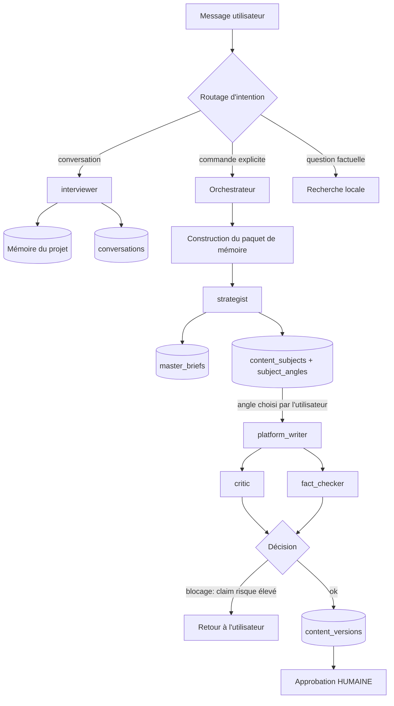
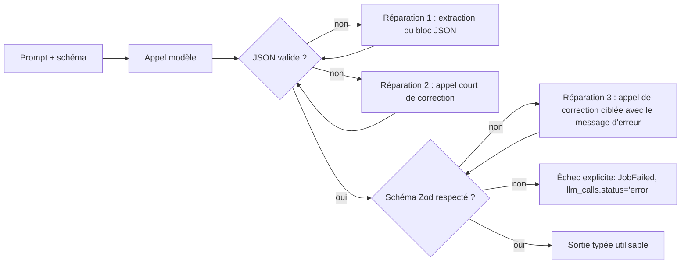
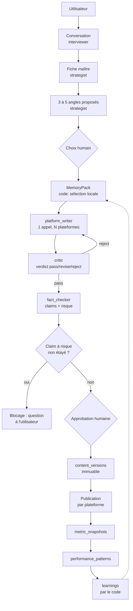

# 04 — Orchestrateur et agents IA

> Répond aux sections E, 10, 23, 25, 26, 27, 36, 37 et aux questions 5, 7, 8, 11 du
> [cahier des charges](00-cahier-des-charges.md).

Ce document décide **qui parle au modèle, pour quoi faire, avec quel contexte et à quel prix**.
C'est le document qui protège la contrainte de 5 USD/semaine : la plupart des architectures
multi-agents échouent ici, en multipliant les appels là où un seul suffisait.

---

## 1. Le principe qui gouverne tout le reste

> **Chaque appel LLM doit produire une valeur qu'aucun code déterministe ne peut produire.**

C'est la règle qui décide de la frontière entre « IA » et « code ». Elle a une conséquence
immédiate et inconfortable : **beaucoup de ce que le cahier des charges attribue à des « agents »
doit être fait en TypeScript pur.**

| Tâche | IA ou code ? | Pourquoi |
|---|---|---|
| Extraire les affirmations d'un texte | **IA** (sortie structurée) | Compréhension du langage |
| Chercher une affirmation dans les faits du projet | **Code** | Recherche par mots-clés et embeddings, vérifiable |
| Rédiger un post LinkedIn | **IA** | Écriture |
| Calculer une longueur, compter des hashtags, valider un format | **Code** | Déterministe, gratuit, instantané |
| Détecter un contenu trop proche d'un ancien post | **Code** (similarité) + **IA** pour juger | Le seuil est mesurable, la décision de reformuler ne l'est pas |
| Classer une actualité par pertinence | **Code** (score pondéré) | Reproductible et gratuit ; l'IA ne note que les 5–10 meilleures |
| Choisir le modèle d'un agent | **Code** (table de routage) | Un LLM qui choisit un LLM est un coût pur |
| Décider de publier | **Humain** | C'est la contrainte n°1 du produit |

**Corollaire** : tout ce qui est fait en code est **gratuit, instantané, testable et
reproductible**. Tout ce qui est fait par un LLM est **payant, lent, non déterministe et
difficile à tester**. Chaque transfert de responsabilité du code vers le modèle doit être
justifié dans ce document.

---

## 2. Décision structurante : 8 agents, pas 12

Le cahier des charges propose douze agents (stratégie éditoriale, LinkedIn, Reddit, TikTok,
YouTube Shorts, YouTube long, hooks/titres, hashtags, scripts, médias, vérification, analytics).

**Douze agents = douze fois le contexte de projet envoyé.** Avec la fiche maître, les faits du
projet et le profil de style, chaque appel coûte environ 2 000 à 4 000 tokens d'entrée. Douze
agents génèrent donc 30 000 à 50 000 tokens d'entrée par contenu — soit plusieurs fois le budget
hebdomadaire pour un seul post, sans compter qu'aucun des douze n'aurait vu le travail des autres.

### 2.1 Les 8 agents retenus

| Agent | Rôle unique | Remplacé dans le plan par | Étape |
|---|---|---|---|
| `interviewer` | Tenir la conversation, poser les bonnes questions, extraire la mémoire | Assistant conversationnel | 2 |
| `strategist` | Fiche maître, sujets, angles, choix des plateformes | Agent stratégie éditoriale + générateur d'idées | 3–4 |
| `platform_writer` | Rédiger pour **une** plateforme donnée, avec un profil dédié | Agents LinkedIn / Reddit / TikTok / YT Shorts / YT long | 4 |
| `critic` | Critiquer la qualité éditoriale, l'anti-spam, les répétitions | Agent vérification (partie éditoriale) + anti-spam | 5 |
| `fact_checker` | Extraire les affirmations vérifiables et statuer sur leur statut | Agent vérification (partie factuelle) | 5 |
| `news_curator` | Résumer et contextualiser les actualités retenues | Agent veille | 10 |
| `media_planner` | Proposer un plan de montage et une sélection d'assets | Agent médias | 7 |
| `analyst` | Lire les patterns déjà calculés et rédiger des recommandations | Agent analytics | 11 |

### 2.2 Ce que la fusion change concrètement

| Fusion | Gain |
|---|---|
| **5 agents plateformes → 1 `platform_writer`** | Un seul appel renvoie **toutes** les déclinaisons demandées dans une sortie structurée `Record<PlatformId, Draft>`. Le modèle voit les cinq versions d'un coup : il évite naturellement de répéter le même paragraphe cinq fois — ce que cinq appels isolés ne peuvent pas faire |
| **hooks/titres/hashtags → champs de `platform_writer`** | Ces éléments **ne sont pas des tâches indépendantes** : un hook et un corps de texte se jugent ensemble. Les séparer coûtait 3 appels et produisait des accroches qui n'annonçaient pas le contenu |
| **scripts vidéo → `platform_writer` avec un format `script`** | Un script YouTube long est un texte. Le champ `format` de la sortie suffit, il n'y a pas lieu d'avoir un agent |
| **vérification factuelle / éditoriale → 2 agents** | **Au contraire, celle-ci reste séparée.** Un agent qui écrit et se vérifie lui-même valide ses propres erreurs. Le `critic` et le `fact_checker` doivent être des appels **indépendants**, avec un contexte différent et une consigne explicitement critique |

**La séparation écriture/vérification est la seule qui ne se négocie pas.** Tout le reste est
une optimisation de coût sans perte de qualité — et souvent avec un gain, parce qu'un appel avec
une vue complète produit un résultat plus cohérent que six appels aveugles les uns aux autres.

---

## 3. L'orchestrateur

L'orchestrateur n'est **pas un agent**. Il n'appelle jamais un LLM pour décider. C'est du code
déterministe qui décide **quel** agent appeler, **avec quel** contexte, et **quand** s'arrêter.

### 3.1 Ses neuf responsabilités

| # | Responsabilité | Nature |
|---|---|---|
| 1 | Comprendre l'intention de la demande utilisateur (route ou LLM selon le cas) | Mixte |
| 2 | Récupérer le contexte nécessaire **depuis la base** | Code |
| 3 | Constituer le **paquet de mémoire** (memory pack) sous contrainte de budget | Code |
| 4 | Choisir les agents à exécuter et leur ordre | Code |
| 5 | Fournir à chaque agent le **contexte minimal** nécessaire | Code |
| 6 | Valider chaque sortie contre son schéma Zod | Code |
| 7 | Détecter les contradictions entre les sorties d'agents | Code + `critic` |
| 8 | Persister les résultats et gérer l'état (`content_items.content_state`) | Code |
| 9 | S'arrêter avant d'appeler : vérifier budget, quotas, clés et santé provider | Code |

**Ce que l'orchestrateur ne fait pas** : il ne rédige rien, il ne juge pas la qualité éditoriale
et il **ne décide jamais de publier**. La publication est déclenchée par une action explicite de
l'utilisateur, jamais par un agent.

### 3.2 Le graphe d'exécution (V1)



**Deux points de contrôle humain** dans ce graphe, et non un seul :

1. **Le choix de l'angle** — après le `strategist`, l'utilisateur sélectionne l'angle. Aucune
   rédaction ne démarre sans ce choix. Cela évite de dépenser sur dix angles dont neuf seront
   jetés.
2. **L'approbation du contenu** — le seul chemin vers la publication.

### 3.3 Le contrat d'agent

Tous les agents respectent la même forme. Aucun agent n'est un objet à état, aucun n'a de
mémoire interne : **tout leur état est en base**.

```ts
export interface AgentContext {
  /** Contexte déjà assemblé et déjà budgété par l'orchestrateur */
  memoryPack: MemoryPack;
  /** Trace : remonte dans llm_calls */
  callContext: LLMCallContext;
  /** Annulation coopérative (l'utilisateur ferme l'onglet / annule le job) */
  signal: AbortSignal;
  /** Journalisation SSE des étapes */
  emit: (event: JobEventInput) => void;
}

export interface Agent<TIn, TOut> {
  readonly name: string;
  readonly task: string;
  /** Le schéma de sortie — le modèle ne renvoie jamais du texte libre */
  readonly outputSchema: ZodType<TOut>;
  /** Estimé sans appel réseau, pour refuser AVANT de dépenser */
  estimateTokens(input: TIn): { input: number; output: number };
  /** Un prompt = un fichier versionné (packages/prompts/{agent}/{task}.md) */
  readonly promptFile: string;
  run(input: TIn, ctx: AgentContext): Promise<TOut>;
}
```

**`estimateTokens` est un contrat, pas une politesse.** Il est calculé localement (approximation
par caractères, corrigée par un facteur appris sur les appels réels), et il permet à
l'orchestrateur de refuser une génération **avant** qu'elle ne coûte quoi que ce soit. Un agent
qui ne sait pas estimer son coût ne peut pas être planifié dans un budget serré.

### 3.4 Détection de contradiction

Les contradictions entre agents sont détectées par du **code**, pas par un LLM supplémentaire :

| Contradiction | Détection |
|---|---|
| Le `fact_checker` contredit une affirmation du `platform_writer` | Comparaison des `content_claims` extraits avec le texte |
| Le `critic` signale un problème que le `fact_checker` ignorait | Fusion des `content_review_notes` par `severity` |
| Deux versions plateforme affirment des chiffres différents | Extraction des nombres par plateforme + comparaison |
| Un claim est marqué `supported` sans `evidence` | Contrainte d'intégrité sur `content_claims` |

Si la contradiction reste indécidable en code, elle est **remontée à l'utilisateur** comme une
note de revue `severity='haute'`. On ne dépense pas un appel LLM pour arbitrer — l'utilisateur
arbitre, en trois secondes, avec les deux versions sous les yeux.

---

## 4. Les agents en détail

Chaque fiche suit la même structure : **rôle / entrée / sortie / prompt / modèle cible / coût
estimé / garde-fou**. Les noms de modèles sont **indicatifs** : le routage est en configuration,
pas en dur dans le code.

> ⚠️ **À VÉRIFIER** au moment de l'implémentation : les prix et les capacités des modèles
> changent tous les trimestres. Tous les chiffres de coût de ce document sont des **ordres de
> grandeur de conception**, pas des tarifs. Le tableau de routage (§7.1) doit être revérifié avant
> la mise en service, et à chaque changement de fournisseur.

### 4.1 `interviewer` — l'intervieweur (étape 2)

| Aspect | Détail |
|---|---|
| **Rôle** | Converser, comprendre le projet en cours, poser **les questions qui manquent**, extraire de la mémoire durable |
| **Entrée** | Historique de conversation (fenêtré), faits connus du projet, compétences connues, **liste des lacunes identifiées** |
| **Sortie structurée** | `{ reply, extracted_facts: Fact[], skill_deltas: SkillDelta[], open_questions: string[], suggested_next: 'continue' \| 'make_brief' }` |
| **Prompt** | `prompts/interviewer/converse.md` |
| **Modèle** | Modèle **cheap** (classe DeepSeek-chat / GPT-4o-mini) — c'est l'agent le plus appelé, donc celui où le prix compte le plus |
| **Coût cible** | < 0,01 USD par échange |
| **Garde-fou** | N'invente **jamais** un fait : `extracted_facts` doit citer un extrait du message de l'utilisateur dans `source_quote`. Un fait sans citation est rejeté par le validateur |

**Ce qui distingue cet agent d'un chatbot générique** : il ne cherche pas à être agréable, il
cherche à **combler les trous** de la fiche maître. La sortie contient donc `open_questions`
alimenté par un calcul de lacunes fait en code : « tu as parlé d'un gain de temps, mais je n'ai
pas le chiffre », « tu n'as jamais décrit ton public pour ce projet ».

**Un seul agent pour toute la conversation, y compris la réception d'audio.** La transcription
est faite en amont (`transcripts`), et le texte transcrit entre dans la conversation comme un
message normal. Un « agent vocal » séparé serait un agent de plus pour zéro capacité
supplémentaire.

### 4.2 `strategist` — le stratège (étapes 3–4)

| Aspect | Détail |
|---|---|
| **Rôle** | Transformer une matière en **fiche maître**, puis en **sujets** et **angles** classés |
| **Entrée** | Paquet de mémoire + derniers contenus publiés (anti-répétition) |
| **Sortie structurée** | `{ master_brief: MasterBrief, subjects: Subject[], angles_by_subject: Record<string, Angle[]> }` |
| **Prompt** | `prompts/strategist/master_brief.md`, `prompts/strategist/angles.md` |
| **Modèle** | Modèle **intermédiaire** — c'est ici que la qualité du raisonnement éditorial se joue |
| **Coût cible** | 0,03–0,08 USD par fiche maître |
| **Garde-fou** | Chaque `Subject` et chaque `Angle` doit citer **au moins un fait du projet** (`project_fact_ids`). Un sujet sans ancrage factuel est rejeté par le validateur, pas par le modèle |

**`master_brief` n'est pas un résumé de conversation**, c'est une **structure** : problème
traité, ce qui a été réellement construit, chiffres, erreurs rencontrées, opinion défendable,
public visé. Le schéma Zod impose ces champs ; un modèle qui n'a pas l'information renvoie `null`
et l'interface affiche explicitement « à compléter » — ce qui déclenche les questions de
l'`interviewer`. **Un trou visible vaut mieux qu'une invention plausible.**

**Sortie volontairement multiple** : la même passe produit la fiche maître, les sujets et les
angles. Découper en trois appels triplerait le coût pour un contenu que le modèle a déjà en
mémoire — c'est exactement l'erreur que la fusion des agents évite.

### 4.3 `platform_writer` — le rédacteur multi-plateformes (étape 4)

| Aspect | Détail |
|---|---|
| **Rôle** | Rédiger **la** version adaptée à chaque plateforme demandée, à partir d'un angle choisi |
| **Entrée** | Angle choisi + faits liés + `style_profile` + `audience_profile` + contraintes de format |
| **Sortie structurée** | `Record<PlatformId, Draft>` avec `Draft = { title?, hook, body, cta?, hashtags?, mentions?, notes }`, plus `ScriptDraft` pour YouTube long |
| **Prompt** | `prompts/platform_writer/rules.md` (règles communes) puis un fichier par plateforme : `{linkedin,reddit,tiktok,youtube_short,youtube_long}.md` |
| **Modèle** | Modèle **intermédiaire à fort** — c'est la sortie la plus visible de l'utilisateur |
| **Coût cible** | 0,05–0,15 USD pour un lot de 3 à 5 plateformes |
| **Garde-fou** | Longueurs vérifiées **en code** après génération ; un dépassement déclenche une **régénération ciblée** de la seule plateforme concernée, jamais du lot |

**Un prompt par plateforme, mais un seul appel par lot.** Le fichier de prompt décrit le ton, la
structure et les interdits de la plateforme ; l'orchestrateur ne passe que les profils demandés.
Régénérer coûte cher : on ne régénère que ce qui a échoué.

**Ce qui est envoyé au modèle est la concaténation de `rules.md` et des sections des cibles
demandées, dans l'ordre de `content_targets`.** L'empreinte journalisée est celle du **lot entier** :
modifier le prompt d'une seule plateforme crée donc une nouvelle version de contenu, et un lot
rejoué à l'identique porte la même empreinte. Les limites chiffrées (longueurs, nombre de
hashtags, chapitres) sont lues dans le code au moment de construire le prompt : recopiées dans un
fichier, elles finiraient par diverger du contrôle qui les vérifie après génération.

**Le `critic` et le `fact_checker` ne sont jamais appelés par le `platform_writer`.** C'est
l'orchestrateur qui les déclenche, après écriture. Un agent qui pourrait décider de se faire
vérifier lui-même choisirait de ne pas le faire.

**Les cinq plateformes ne reçoivent pas le même texte.** Le prompt LinkedIn produit un récit avec
une leçon et peu de hashtags ; le prompt Reddit produit un texte utile, sans promotion, ton
neutre ; le prompt TikTok produit un script court avec une accroche de trois secondes ; YouTube
Shorts produit un script de 45–60 s ; YouTube long produit un plan structuré. Le détail des
contraintes par plateforme est dans
[`06-connecteurs-et-publication.md`](06-connecteurs-et-publication.md).

### 4.4 `critic` — le critique éditorial (étape 5)

| Aspect | Détail |
|---|---|
| **Rôle** | Trouver ce qui ne va pas : contenu vide, répétitions, jargon inutile, exagérations, hooks mensongers, clickbait, ton trop commercial sur Reddit, proximité avec un ancien post |
| **Entrée** | Les brouillons générés + les **5 derniers contenus publiés** (texte réel, pas un résumé) + les règles anti-spam de chaque plateforme |
| **Sortie structurée** | `{ verdict: 'pass' \| 'revise' \| 'reject', score, notes: ReviewNote[], repetition_report }` |
| **Prompt** | `prompts/critic/review.md` + `prompts/critic/rules-{platform}.md` |
| **Modèle** | Modèle **intermédiaire**, **différent** de celui du `platform_writer` quand c'est possible (biais croisés) |
| **Coût cible** | 0,02–0,05 USD par contenu |
| **Garde-fou** | Le critique **n'a pas le droit de réécrire** : sa sortie ne contient aucun texte de remplacement, uniquement des constats. Un LLM autorisé à réécrire se contente de réécrire au lieu de juger |

**Le `critic` doit pouvoir dire « ce sujet n'est pas assez intéressant en l'état ».** C'est
explicitement dans son prompt et le verdict `reject` est un résultat valide. Un système incapable
de refuser produit du contenu médiocre en continu — le pire résultat possible pour la réputation
de son utilisateur.

**La comparaison avec les anciens posts est faite en deux temps** : similarité calculée en code
(embeddings ou n-grammes) pour isoler les cas suspects, puis jugement du `critic` sur ces seuls
cas. On ne lui envoie pas tout l'historique.

### 4.5 `fact_checker` — le vérificateur factuel (étape 5)

| Aspect | Détail |
|---|---|
| **Rôle** | Extraire **chaque** affirmation vérifiable et statuer : étayée, non étayée, à confirmer par l'utilisateur |
| **Entrée** | Les brouillons + **les faits du projet** (`project_facts`) + valeurs de référence connues |
| **Sortie structurée** | `{ claims: Claim[] }` où `Claim = { text, claim_type, verifiability, risk, status, evidence?, evidence_source }` |
| **Prompt** | `prompts/fact_checker/extract.md`, `prompts/fact_checker/assess.md` |
| **Modèle** | Modèle **intermédiaire** |
| **Coût cible** | 0,02–0,04 USD par contenu |
| **Garde-fou** | Un claim `risk='eleve'` et `status≠'supported'` **bloque l'approbation** (déclencheur en base, cf. [`03-modele-de-donnees.md`](03-modele-de-donnees.md) §15.2) |

**Deux passes, une seule sortie.** L'extraction des claims est une tâche mécanique (modèle cheap
suffit) ; l'évaluation du risque demande du discernement. En pratique, les deux tiennent dans un
seul appel structuré, mais le prompt sépare explicitement les deux phases de raisonnement.

**Le `fact_checker` ne va pas sur le web.** En V1, il compare aux faits du projet, aux valeurs de
référence saisies par l'utilisateur et à sa propre connaissance du domaine (qu'il doit citer). Une
vérification web automatisée est un pipeline entier — elle est traitée en V3 (§11.3) et sa
limite est assumée. Un claim qui ne peut pas être étayé localement devient
`needs_user_confirmation`, ce qui est un résultat **honnête** et actionnable.

### 4.6 `news_curator` — le curateur de veille (étape 10)

| Aspect | Détail |
|---|---|
| **Rôle** | Résumer et contextualiser **uniquement** les actualités déjà retenues par le scoring local |
| **Entrée** | Les 5 à 10 `news_items` retenus (titre, extrait, URL, source) + les sujets déjà traités par l'utilisateur |
| **Sortie structurée** | `{ items: { news_id, summary, why_it_matters, angle_hint, related_project_fact_ids }[] }` |
| **Prompt** | `prompts/news_curator/summarize.md` |
| **Modèle** | Modèle **cheap** |
| **Coût cible** | 0,01–0,02 USD par cycle de veille |
| **Garde-fou** | Le résumé doit **citer l'URL source** et ne peut pas ajouter de fait absent de l'extrait fourni. Un `why_it_matters` qui mentionne un chiffre absent de l'extrait est rejeté |

**Cet agent ne fait jamais de veille.** Il ne découvre rien, il ne cherche rien : il commente une
liste déjà constituée. Toute la découverte (flux, déduplication, scoring, péremption) est du code
déterministe, parce qu'elle doit être reproductible — cf.
[`05-pipelines.md`](05-pipelines.md) §7.

**Un agent qui « cherche des actualités » est le chemin le plus court vers une hallucination
présentée comme un fait.** C'est exactement le risque identifié au §36 et §47 du cahier des
charges ; la séparation stricte découverte (code) / commentaire (LLM) est la réponse.

### 4.7 `media_planner` — le planificateur média (étape 7)

| Aspect | Détail |
|---|---|
| **Rôle** | Proposer un **plan de montage** à partir du transcript et des assets disponibles |
| **Entrée** | Transcript segmenté (avec timestamps), inventaire des assets du projet, `style_profile.video` |
| **Sortie structurée** | `{ plan: EditPlan, selected_asset_ids: string[], rationale: string }` |
| **Prompt** | `prompts/media_planner/video_plan.md` |
| **Modèle** | Modèle **intermédiaire**, appel **optionnel** — un mode « montage manuel » ne l'utilise pas |
| **Coût cible** | < 0,02 USD par vidéo |
| **Garde-fou** | Le plan doit référencer des **`source_asset_ids` existants** et des **bornes temporelles présentes dans le transcript**. Un plan qui invente un timecode est rejeté avant tout appel FFmpeg |

**Ce qui est proposé par l'agent et ce qui est calculé en code :**

| Étape du montage | Qui décide |
|---|---|
| Suppression des silences > 0,6 s | **Code** (`ffmpeg silencedetect` + coupes) |
| Détection du langage et des sous-titres | **Code** (whisper) |
| Choix du format vertical et du recadrage | **Code** (preset + position du visage si simple) |
| Choix des segments à garder / ordonner | **Agent** (`media_planner`) |
| Choix des assets à incruster | **Agent** (`media_planner`) |
| Vitesse, fondus, musique | **Code** (preset `style_profile.video`) |

**Le plan est proposé, jamais exécuté aveuglément.** L'utilisateur voit le plan (segments,
durée estimée, assets) **avant** de lancer l'encodage. Un rendu vidéo est l'opération la plus
longue du produit : on ne la lance pas sur une proposition non relue.

### 4.8 `analyst` — l'analyste (étape 11)

| Aspect | Détail |
|---|---|
| **Rôle** | Lire les `performance_patterns` **déjà calculés** et rédiger des recommandations actionnables |
| **Entrée** | Patterns (avec `sample_size`), derniers contenus, objectifs du projet (`project_goals`) |
| **Sortie structurée** | `{ recommendations: { text, based_on_pattern_ids: string[], confidence, suggested_action }[], caveats: string[] }` |
| **Prompt** | `prompts/analyst/recommend.md` |
| **Modèle** | Modèle **intermédiaire**, appelé **à la demande** (pas automatiquement chaque semaine) |
| **Coût cible** | < 0,03 USD par analyse |
| **Garde-fou** | Toute recommandation doit citer **au moins un pattern** avec son `sample_size`. Une recommandation sans pattern est rejetée. Si `sample_size < 5`, la recommandation doit contenir la mention d'incertitude |

**L'`analyst` ne découvre aucun pattern.** Il interprète des corrélations déjà calculées en
local (cf. [`03-modele-de-donnees.md`](03-modele-de-donnees.md) §12.2). Lui demander de
« trouver ce qui marche » sur une base de 20 publications produirait une histoire plausible et
fausse — le biais classique du récit. Les patterns sont d'abord mesurés, puis commentés.

**Où sont alimentés les `learnings`** : jamais directement par cet agent. Les `learnings` sont
créés par le code à partir des patterns qui passent les garde-fous anti-superstition (cf.
[`03-modele-de-donnees.md`](03-modele-de-donnees.md) §6.5). L'`analyst` produit du **texte
d'interface** ; le code produit de la **mémoire**. Mélanger les deux ferait entrer des
affirmations non mesurées dans le contexte de toutes les générations suivantes.

---

## 5. La mémoire : ce que voit le modèle

La mémoire est le différenciateur du produit. Mais une mémoire mal injectée est un coût pur :
chaque token de contexte envoyé à chaque appel doit **changer** la réponse.

### 5.1 Le paquet de mémoire (`MemoryPack`)

```ts
export interface MemoryPack {
  /** Toujours inclus */
  project: { id: string; name: string; kind: string; one_liner: string };
  skillFacts: SkillFact[];          // ce que l'utilisateur maîtrise — 100 %
  facts: ProjectFact[];             // faits vérifiés, sélectionnés
  style: StyleProfile | null;
  audience: AudienceProfile | null;
  learnings: Learning[];            // 3 maximum, fiables seulement
  recentContent: {                  // anti-répétition
    title: string; hook: string; publishedAt: number; platform: string;
  }[];
  /** Traces pour llm_calls.context_fingerprint */
  manifest: { factIds: string[]; learningIds: string[]; styleId: string | null };
}
```

L'ordre de sélection et les critères sont définis dans
[`03-modele-de-donnees.md`](03-modele-de-donnees.md) §6.6. Ce document ajoute **les règles de
budget** : combien de tokens pour chaque rubrique, et ce qui est sacrifié en premier.

### 5.2 Budget de contexte par rubrique

Référence : un contenu LinkedIn + TikTok + Reddit doit tenir dans **~6 000 tokens d'entrée**.
C'est la contrainte directrice ; tout le reste en découle.

| Rubrique | Budget | Si dépassement |
|---|---|---|
| Instructions du prompt | 800–1 200 | Jamais coupé (c'est le prompt, il est versionné et concis) |
| `skillFacts` | 400 | Jamais coupé : sans cela le produit perd son invariant (§2 du cahier des charges) |
| `facts` sélectionnés | 1 500 | 5 faits, puis 4… **jamais moins de 3** |
| `style` + `audience` | 700 | Jamais coupé (c'est la voix de l'utilisateur) |
| `learnings` | 300 | 3 → 2 → 1 → 0 |
| Contenu anti-répétition | 800 | 5 derniers → 3 derniers ; les hooks seuls en dernier recours |
| Sortie attendue réservée | 2 000 | Détermine ce qui est envoyé, jamais l'inverse |

**Règle d'arbitrage** : on sacrifie d'abord les `learnings`, puis la fenêtre anti-répétition, puis
les faits au-delà de trois. On ne sacrifie **jamais** le style, l'audience ni les compétences :
un contenu sans voix n'est pas un contenu de cet utilisateur.

**`skillFacts` est la rubrique la moins chère et la plus utile.** Elle est courte (une ligne par
compétence) et elle empêche l'erreur la plus grave du produit : laisser croire que l'utilisateur
maîtrise ce que le pipeline a automatisé. C'est l'invariant du §6.2 du modèle de données, et il
se joue à **la sélection du contexte**.

### 5.3 Trois niveaux de contexte, et pourquoi pas de RAG en V1

| Niveau | Mécanisme | Coût | Version |
|---|---|---|---|
| **Sélection structurée** | Requêtes SQL sur `importance`, récence, `used_count` | 0 | **V1** |
| **Recherche par mots-clés** | `LIKE`/FTS5 sur les faits et les anciens contenus | 0 | **V1** (complément) |
| **Recherche sémantique** | Embeddings + similarité cosinus | faible (local) | V2 |
| **RAG agentique** | Le modèle décide quoi chercher, plusieurs tours | élevé | **Non prévu** |

**Pourquoi pas de RAG en V1** : un projet personnel produit **des dizaines** de faits, pas des
milliers. La sélection par SQL et par mots-clés est plus précise, plus rapide, gratuite et
**explicable** (« ce fait a été inclus parce qu'il est important et récent »). Un RAG
vectoriel à cette échelle ajoute une dépendance (base vectorielle ou `sqlite-vec`), un modèle
d'embeddings et une couche d'incertitude, pour résoudre un problème qui n'existe pas encore.

**Le seuil de bascule** est explicite : au-delà de **500 faits vérifiés** dans un projet, ou dès
que `facts` dépasse régulièrement 8 éléments pertinents, la recherche sémantique locale devient
justifiée. On l'ajoute alors **derrière la même interface** `MemorySelector`, sans toucher aux
agents.

### 5.4 Ce que la mémoire ne contient jamais

| Interdit | Raison |
|---|---|
| Le secret ou le jeton d'une plateforme | Aucune raison éditoriale, risque de fuite |
| Un fait non vérifié présenté comme vérifié | C'est la définition de l'hallucination, mais côté contexte |
| Un `learning` de confiance faible | Propage une superstition à toutes les générations suivantes |
| L'intégralité d'un ancien post comme « style » | Le style est décrit dans `style_profiles`, pas imité par recopie |
| Un contenu rejeté par l'utilisateur comme exemple négatif | Sauf demande explicite : le modèle imiterait ce qu'on lui montre |

**Le paquet est immuable pendant un job.** Il est construit une fois au début, journalisé par son
`manifest`, et tous les agents du même job voient **le même** contexte. Un contexte qui change en
cours de job rendrait toute comparaison entre les sorties impossible.

---

## 6. Prompts, sorties structurées et garde-fous

### 6.1 Les prompts sont des fichiers du dépôt

```text
packages/prompts/
├── _shared/
│   ├── rules-honesty.md            # interdits universels (pas d'invention, pas de chiffre non sourcé)
│   └── rules-style.md              # règles de style transverses
├── interviewer/converse.md
├── strategist/master_brief.md
├── strategist/angles.md
├── platform_writer/rules.md      # règles communes : un appel couvre toutes les cibles demandées
├── platform_writer/linkedin.md
├── platform_writer/reddit.md
├── platform_writer/tiktok.md
├── platform_writer/youtube_short.md
├── platform_writer/youtube_long.md
├── critic/review.md
├── critic/rules-reddit.md
├── fact_checker/extract.md
├── news_curator/summarize.md
├── media_planner/video_plan.md
└── analyst/recommend.md
```

| Règle | Pourquoi |
|---|---|
| **Un fichier = un prompt = un `content_hash`** | On sait exactement quelle version a produit quel texte (`content_versions.prompt_version_hash`) |
| **Synchronisation en base au démarrage** | `prompt_versions` sert d'index ; le contenu reste dans Git, donc relisible dans un diff |
| **Jamais modifié pendant un job** | Sinon deux moitiés d'un contenu suivraient deux instructions |
| **Rollback = changer `is_active`** | Revenir à la version précédente sans redéployer |
| **Les prompts partagés sont inclus explicitement** | Un prompt qui commence par `@include _shared/rules-honesty.md` rend la règle visible dans le fichier |
| **`notes` obligatoire pour toute nouvelle version** | Un prompt qui change sans raison écrite ne sera jamais compris six mois plus tard |

**Ce qui n'est jamais dans un prompt** : un fait du projet, un extrait de mémoire, un exemple de
contenu de l'utilisateur. Ces éléments sont **injectés** par l'orchestrateur, jamais figés dans
le fichier. Un prompt est une **instruction**, pas un document de données.

### 6.2 Sorties structurées : la règle et le mécanisme

**Aucun code ne consomme du texte libre produit par un LLM.** La règle est absolue : si du code
lit la sortie, la sortie a un schéma Zod.

```ts
const LinkedinDraft = z.object({
  hook: z.string().min(10).max(200),
  body: z.string().min(200).max(3000),
  cta: z.string().max(160).nullable(),
  hashtags: z.array(z.string().regex(/^#[\p{L}\p{N}_]+$/u)).max(5),
  notes: z.string().max(500),
});

// Le provider tente : prompt → JSON → validation → réparation ciblée → échec explicite
const { data, repaired } = await provider.structuredOutput(prompt, LinkedinDraft, opts, ctx);
```

**Chaîne de traitement d'une réponse**



**`repaired` est journalisé.** Un taux de réparation élevé signale un prompt mal écrit, pas un
modèle capricieux. C'est un indicateur de santé des prompts, suivi dans `llm_calls`.

**Pourquoi une réparation avant l'échec** : les erreurs de format valent ~1 % des appels et une
régénération complète coûte 100 %, tandis qu'un appel de correction coûte ~10 % de plus. C'est un
gain d'un ordre de grandeur, mais **limité à deux tentatives** : au-delà, c'est le prompt qu'il
faut corriger.

### 6.3 Les cinq niveaux de garde-fou anti-hallucination

| Niveau | Mécanisme | Où c'est appliqué |
|---|---|---|
| **1. Le contexte** | Le modèle ne reçoit que des faits **vérifiés** et marqués ; un trou est signalé comme un trou | `MemoryPack` (déjà appliqué) |
| **2. Le prompt** | Interdiction explicite d'inventer un chiffre, une date, un nom ou un résultat ; « si l'information manque, écris `null` » | `_shared/rules-honesty.md` |
| **3. La sortie structurée** | Les faits doivent citer un `source_quote` / `project_fact_id` : un fait inventé n'a pas de citation | Validateurs Zod + `refine()` |
| **4. La vérification** | `fact_checker` extrait les claims et les classe par risque ; `critic` relit le texte | Agents indépendants |
| **5. La base de données** | Claim `risk='eleve'` non étayé → l'approbation est refusée **par la base** | Déclencheur SQL |

**Aucun de ces cinq niveaux n'est suffisant seul** :

- Le contexte seul : le modèle extrapole toujours un peu.
- Le prompt seul : un modèle qui veut plaire ignore les instructions.
- Le schéma seul : une citation peut être inventée aussi.
- La vérification seule : elle-même peut se tromper, et elle coûte un appel.
- La base seule : elle ne sait pas *ce qui* est faux, seulement que quelque chose l'est.

**Les cinq ensemble** rendent l'erreur difficile : il faudrait que le modèle invente un chiffre,
qu'il invente aussi une citation plausible, que le `fact_checker` ne voie rien et que
l'utilisateur approuve sans lire. C'est encore possible — et c'est pour cela que l'approbation
humaine reste obligatoire.

### 6.4 Le test des prompts

Un changement de prompt est un **changement de comportement**, donc un sujet de test :

1. **Jeu de cas figés** : 10 à 15 entrées représentatives (projet, angle, plateforme) stockées
   comme fixtures.
2. **Exécution manuelle** en CI `--prompts-only`, coût plafonné à quelques centimes.
3. **Assertions déterministes** : schéma respecté, longueurs dans les bornes, nombre de
   hashtags, présence d'une citation pour chaque fait, absence des expressions bannies.
4. **Revue humaine du diff de sortie** : la qualité éditoriale ne s'automatise pas, mais elle se
   **compare**. On garde les sorties précédentes pour voir ce qui a changé.

**Un prompt ne se modifie pas « pour voir ».** Il se modifie avec un cas de test qui échouait, et
ce cas devient une non-régression. Sans cela, chaque ajustement de prompt est un pari.

---

## 7. Routage des modèles et estimation des coûts

### 7.1 Table de routage

Le routage est une **table de configuration versionnée**, pas une décision laissée au modèle ni
écrite en dur dans chaque agent.

| Tâche | Classe de modèle | Défaut envisagé | Pourquoi cette classe |
|---|---|---|---|
| `classify_news`, `tag`, `dedupe` | cheap | DeepSeek-chat | Classification courte, sortie minuscule |
| `interviewer.converse` | cheap | DeepSeek-chat | Appelé très souvent ; la qualité perçue vient des questions, pas du style |
| `strategist.angles` | intermédiaire | DeepSeek-chat / GPT-4o-mini | Raisonnement éditorial léger |
| `strategist.master_brief` | intermédiaire | DeepSeek-reasoner / o4-mini | La fiche maître conditionne tout le reste : c'est là qu'il faut payer |
| `platform_writer.*` | intermédiaire à fort | DeepSeek-chat, escalade si `critic` rejette | Volume modéré, impact maximal |
| `critic.review` | intermédiaire | **modèle différent** de l'écrivain si possible | Biais croisés : un modèle ne voit pas ses propres tics |
| `fact_checker.*` | intermédiaire | DeepSeek-chat | Extraction et jugement bornés |
| `news_curator.summarize` | cheap | DeepSeek-chat | Résumé court sur extrait fourni |
| `media_planner.video_plan` | intermédiaire | DeepSeek-chat | Optionnel |
| `analyst.recommend` | intermédiaire | DeepSeek-reasoner | Interprétation de statistiques, appelé rarement |

**Une seule escalade automatique en V1** : si le `critic` renvoie `reject` **deux fois** sur le
même contenu, la troisième tentative utilise la classe supérieure. C'est la seule dépense
automatique non planifiée — et elle est plafonnée à une tentative par contenu.

### 7.2 Estimation avant appel

```ts
// Ordre d'appel obligatoire, dans le domaine :
const estimate = await provider.estimateCost(prompt, options);   // jamais d'appel réseau
const budget = await budgetService.check(projectId, estimate);   // lit budget_limits
if (!budget.allowed) throw new BudgetExceededError(budget.reason);
const { data, usage } = await provider.structuredOutput(prompt, schema, options, ctx);
await ledger.record(usage, ctx);                                  // llm_calls
```

**Le contrôle du budget est avant l'appel, jamais après.** Un système qui découvre le dépassement
après la dépense n'est pas un contrôle de budget, c'est une comptabilité.

**L'estimation est volontairement grossière** : approximation par nombre de caractères × facteur
de correction par modèle, réévalué à partir des appels réels (`llm_calls` contient les tokens
réels, donc le facteur s'améliore tout seul). Une estimation à ±30 % suffit : le but est de
refuser une dépense absurde, pas de prédire au centime.

### 7.3 Ce que coûte réellement un contenu (estimation)

Hypothèse : 1 fiche maître, 1 angle, un lot de 3 plateformes, 1 passe de critique, 1 passe de
vérification, 1 régénération moyenne.

| Étape | Tokens entrée | Tokens sortie | Coût estimé |
|---|---|---|---|
| Fiche maître + angles | ~5 000 | ~1 500 | 0,03–0,08 USD |
| Rédaction 3 plateformes (1 appel) | ~6 000 | ~2 500 | 0,05–0,15 USD |
| Critique | ~7 000 | ~800 | 0,02–0,05 USD |
| Vérification factuelle | ~5 000 | ~700 | 0,02–0,04 USD |
| Régénération ciblée (moyenne pondérée) | ~3 000 | ~1 000 | 0,02–0,05 USD |
| **Total par contenu multi-plateformes** | **~26 000** | **~6 500** | **0,14–0,37 USD** |
| Conversation (10 échanges) | ~15 000 | ~3 000 | 0,03–0,07 USD |
| **Semaine type : 2 contenus + 40 échanges** | | | **~0,4–0,9 USD** |

**Conclusion : le budget de 5 USD/semaine est tenable avec une marge d'un facteur 5.** Cette
marge n'est pas un luxe : c'est ce qui absorbe les régénérations, les essais de prompts et une
éventuelle utilisation d'un modèle plus cher pour la fiche maître. Un modèle « raisonneur »
utilisé partout multiplierait la facture par 5 à 10 et ferait tomber le budget.

> ⚠️ **À VÉRIFIER** : ces estimations dépendent des tarifs réels et de la longueur réelle des
> prompts. Le premier travail de l'étape 3 du plan est de **mesurer** ces coûts sur 20 appels
> réels et de corriger cette table. Tant que ce n'est pas fait, elle est une hypothèse de
> conception.

---

## 8. Cache, déduplication et mode économie

### 8.1 Ce qui n'est jamais redemandé deux fois

| Situation | Mécanisme | Économie |
|---|---|---|
| Même contenu, même plateforme, deuxième génération | **Aucun appel** : la version existante est réutilisée, l'utilisateur peut demander une variante explicite | 100 % de l'appel |
| Même `context_fingerprint` + même `prompt_version_hash` + même tâche, dans les 7 jours | Cache de résultat (`llm_calls.cache_key`) | 100 % |
| Régénération d'une seule plateforme après rejet du `critic` | **Régénération ciblée** : le lot n'est pas rejoué | 60–80 % du lot |
| Nouvel angle sur le même sujet | La fiche maître est **réutilisée** (elle ne dépend pas de l'angle) | 15–30 % du contenu |
| Deuxième publication sur une plateforme depuis le même contenu | Aucun appel : `content_versions` est immuable et déjà rédigée | 100 % |

**Le cache est un cache de *décision*, pas de *texte*.** On ne met pas en cache « un texte
plausible pour ce sujet » : on met en cache « ce job, avec ce contexte exact et ce prompt exact,
a produit cette sortie ». Toute différence de contexte invalide le cache — sinon on servirait un
contenu écrit pour d'autres faits.

**Le cache est désactivable par appel** (`cache: false`), et il ne s'applique **jamais** à
`critic` : deux critiques du même texte doivent rester deux jugements indépendants. Un critique
qui relit son propre verdict n'est pas un contrôle, c'est une signature.

### 8.2 Mode économie

Un interrupteur global (`settings.economy_mode`), activable projet par projet :

| Effet | Détail |
|---|---|
| Pas d'escalade de modèle | Un `reject` du `critic` ne déclenche pas de tentative sur un modèle plus cher |
| Vérification factuelle en un seul appel | Extraction et évaluation fusionnées |
| `learnings` réduits à 1 | Moins de contexte, sorties un peu plus génériques |
| Pas de `media_planner` | Montage en preset pur, sans plan proposé |
| `news_curator` désactivé | La veille s'affiche sans résumé : les titres et les liens suffisent à trier |
| Plafond hebdomadaire abaissé | Le plafond est celui de `budget_limits`, pas une constante du code |

**Le mode économie ne dégrade pas la vérité, seulement la richesse.** Aucune règle de garde-fou
n'est contournée : `fact_checker`, blocage par claims à risque élevé et approbation humaine
restent identiques. Un mode « économie » qui produirait des contenus non vérifiés ne serait pas
une économie, ce serait une dette de réputation.

### 8.3 Déduplication de la veille (code, pas LLM)

```text
1. Normalisation d'URL (retrait des paramètres de tracking, des ancres, des redirections)
2. Clé de déduplication : url_canonique → si existante, on ignore
3. Similarité de titre : n-grammes de caractères (Jaccard > 0,85 → doublon cross-source)
4. Filtre temporel : ignore tout item plus vieux que news_sources.max_age_days
5. Scoring (0–100) : pertinence lexicale avec les mots-clés du projet
                   + fraîcheur
                   + autorité de la source (pondération saisie par l'utilisateur, jamais apprise)
6. Seuil : seuls les items au-dessus du seuil sont envoyés au news_curator
```

**Étapes 1 à 6 : zéro jeton.** Un cycle de veille qui ne trouve rien d'intéressant ne coûte rien.
C'est la propriété qui rend acceptable de lancer la veille plusieurs fois par jour sans réfléchir
au budget.

---

## 9. Local ou cloud : l'arbitrage

### 9.1 Règle d'arbitrage

> **Cloud quand la qualité se voit dans le livrable. Local quand le volume est élevé, la tâche
> mécanique et l'erreur récupérable.**

| Tâche | Choix | Raison |
|---|---|---|
| Rédaction, stratégie, critique, vérification | **Cloud** | C'est ce que l'utilisateur lit et publie |
| Transcription audio/vidéo (whisper.cpp) | **Local** | Volume élevé, gratuit, qualité suffisante, aucune fuite du contenu |
| Extraction des frames, thumbnails | **Local** (FFmpeg) | Déterministe |
| Embeddings (V2) | **Local** | Gratuit, reproductible, pas de fuite de la base de connaissances |
| Classification de la veille | **Cloud (cheap)** | Plus robuste qu'un classifieur maison, coût quasi nul |
| Détection de silences, découpage, encodage | **Local** | Déterministe et déjà outillé |

### 9.2 Contrainte matérielle à assumer

Le montage vidéo local est la **seule promesse du produit qui dépend du matériel de
l'utilisateur** :

| Opération | Temps réaliste (machine sans GPU, 8 cœurs) | Temps avec GPU |
|---|---|---|
| Transcription whisper (10 min de vidéo, `medium`) | 8–20 min | 1–3 min |
| Rendu 9:16 avec sous-titres (3 min) | 4–10 min | 1–2 min |
| Rendu long avec incrustations (15 min) | 30–60 min | 5–10 min |

> ⚠️ **À VÉRIFIER** : mesurer sur la machine cible réelle. Les ordres de grandeur varient d'un
> facteur 3 selon le CPU et la présence d'un GPU.

**Conséquence de conception** : le rendu vidéo **n'est jamais dans le chemin critique**. Il
s'exécute en file d'attente, avec progression, et peut être fermé puis repris. Un produit qui
bloque l'interface pendant 45 minutes est un produit qu'on n'utilise pas.

**Le produit doit dire la vérité sur ses temps** : « rendu estimé : 6 min », mis à jour à partir
des rendus précédents (`video_renders.duration_ms`). Une barre de progression fausse est perçue
comme un bug.

---

## 10. Suivi, plafonds et alertes de coûts

### 10.1 Trois niveaux de plafond

| Niveau | Portée | Comportement au dépassement |
|---|---|---|
| **Par jour** | projet | Les nouveaux jobs non critiques sont refusés ; le message dit quoi faire |
| **Par semaine** | projet | Idem + avertissement dans l'interface dès 80 % |
| **Par job** | un job précis | Le job s'arrête proprement avec `JobFailed` et conserve son travail déjà fait |
| **Global** | installation | Coupe-circuit de sécurité : refus de **tout** nouvel appel |

**Le blocage est visible, explicite et explicable.** Un refus qui affiche « plafond hebdomadaire
atteint : 4,87 / 5,00 USD, réinitialisation lundi » est acceptable. Un échec silencieux ne l'est
pas — c'est le pire scénario possible pour un produit de confiance.

### 10.2 Ce que le tableau de bord doit montrer

| Indicateur | Source | Fréquence |
|---|---|---|
| Coût du jour / de la semaine, en USD et en % du plafond | `llm_calls` agrégé | temps réel |
| Coût par contenu (moyenne, médiane, maximum) | `llm_calls` groupé par job | quotidien |
| Répartition par agent et par modèle | `llm_calls.agent`, `model` | quotidien |
| Taux d'échec et de réparation par prompt | `llm_calls.status`, `repaired` | quotidien |
| Nombre de claims bloquants | `content_claims` | par contenu |
| Nombre de régénérations | `job_events` | quotidien |
| Temps de rendu vidéo | `video_renders.duration_ms` | par rendu |

**Le coût par contenu est l'indicateur de pilotage principal.** Il relie une dépense abstraite
(jetons) à une unité que l'utilisateur comprend (un contenu publié). C'est la seule métrique qui
permet de décider sereinement d'augmenter ou de réduire le budget.

### 10.3 Politique de retry (rappel)

| Classe d'erreur | Retry ? | Comportement |
|---|---|---|
| Erreur réseau, 5xx, timeout fournisseur | Oui, backoff exponentiel (3 tentatives max) | Aucune intervention utilisateur |
| 429 (quota) | Oui, attente selon `Retry-After`, une seule fois | Puis échec explicite |
| Sortie non conforme au schéma | 2 réparations puis échec | Compté dans `repaired` |
| Contenu bloqué par `critic`/`fact_checker` | **Non** | C'est un résultat métier, pas une erreur technique |
| Publication dont le résultat est ambigu | **Non** | `needs_human_decision` : on ne republie jamais à l'aveugle |
| Erreur de validation d'entrée | **Non** | L'utilisateur corrige |

**La règle qui prime : ne jamais rejouer automatiquement une action à effet de bord externe.**
Un retry sur un appel LLM coûte quelques centimes ; un retry sur une publication coûte un
doublon public supprimé à la main, ou pire, un doublon invisible. C'est le raisonnement derrière
l'`idempotency_key` de [`06-connecteurs-et-publication.md`](06-connecteurs-et-publication.md).

---

## 11. Frontières : ce qu'on ne construit pas

### 11.1 L'agent autonome qui décide seul

**Non construit.** Aucune boucle du type « le modèle décide de l'étape suivante », aucun agent
qui choisit ses outils librement, aucun « planificateur » LLM en chef.

**Pourquoi** : le produit doit être **reproductible, explicable et plafonné**. Un orchestrateur
déterministe donne ces trois propriétés gratuitement. Un orchestrateur LLM les perd toutes les
trois et rend le débogage impossible (« pourquoi ce job a-t-il coûté 3 USD ? »). Le seul endroit
où la créativité est utile, c'est dans le texte — et les agents d'écriture sont déjà là pour ça.

**Ce à quoi ça ressemblerait si on cédait** : un LangGraph générique où le modèle appelle tour à
tour la veille, l'écriture, la critique, et où le coût par contenu devient impossible à prévoir.
C'est une démonstration technique séduisante et un produit inutilisable.

### 11.2 Le RAG agentique

**Non prévu, même en V3.** La recherche sémantique locale est prévue (V2, cf. §5.3) : elle est
bornée, gratuite et explicable. Un RAG où le modèle décide **ce qu'il cherche et combien de fois**
est écarté : il introduit une variabilité de coût non bornée par appel.

**Le seuil de réexamen est explicite** : si le produit devait gérer des bases de plusieurs
dizaines de milliers de documents (un usage qui n'est pas le sien), la question se rouvrirait.

### 11.3 La vérification web automatisée (reportée en V3)

**Reportée, et c'est une limite assumée.** En V1 et V2, `fact_checker` n'accède pas au web
(cf. §4.5). La vérification web est un **pipeline à part entière** :

| Brique nécessaire | Pourquoi ce n'est pas trivial |
|---|---|
| Recherche (API tierce) | Coût par requête, quota, dépendance externe |
| Extraction de page | Contenu dynamique, paywalls, blocage |
| Choix de la source | Autorité inconnue : un blog quelconque ne vaut pas une source officielle |
| Attribution | Un claim confirmé doit citer **l'URL exacte** qui le confirme |
| Cache et fraîcheur | Une page change ; une vérification a une date de péremption |
| Coût | 3 à 10 requêtes par contenu : la ligne « vérification » du §7.3 est multipliée |

**Ce qu'on fait à la place en V1/V2** : on marque le claim `needs_user_confirmation` avec la
question précise à poser. L'utilisateur vérifie en 30 secondes dans son navigateur, et son
verdict est enregistré — il profite à tous les contenus suivants. **C'est plus lent et c'est
meilleur** : la vérification humaine est de meilleure qualité que n'importe quel pipeline
automatisé de V1.

**Motif général de ce chapitre** : chaque fois qu'une fonctionnalité est reportée, ce document
dit **pourquoi** et **à quelle condition** elle deviendrait justifiée. Reporté n'est pas oublié.

---

## 12. Synthèse

### 12.1 Les douze décisions structurantes

| # | Décision | Raison en une phrase |
|---|---|---|
| 1 | **L'orchestrateur est du code déterministe, jamais un LLM** | Reproductibilité, coût borné, débogabilité |
| 2 | **8 agents, pas 12** | Un agent existe quand le *jugement* diffère, pas quand le *format de sortie* diffère |
| 3 | **Un seul `platform_writer` pour 5 plateformes, un appel par lot** | Les plateformes diffèrent par leur prompt, pas par leur logique |
| 4 | **`critic` et `fact_checker` toujours séparés de l'écrivain** | Un agent ne doit jamais pouvoir se faire vérifier lui-même |
| 5 | **`critic` interdit de réécrire** | Un LLM autorisé à réécrire se contente de réécrire au lieu de juger |
| 6 | **`news_curator` ne découvre rien : la découverte est du code** | Le chemin le plus court vers une hallucination présentée comme un fait |
| 7 | **`analyst` n'invente aucun pattern : il commente des mesures** | Éviter le biais du récit sur des échantillons de 20 publications |
| 8 | **Aucun code ne consomme du texte libre** | Si du code lit la sortie, la sortie a un schéma Zod |
| 9 | **Le budget est vérifié *avant* l'appel** | Contrôler après coup n'est pas contrôler, c'est constater |
| 10 | **Pas de RAG agentique, pas d'agent autonome** | Variabilité de coût non bornée, débogage impossible |
| 11 | **Le paquet de mémoire est immuable pendant un job** | Comparer deux sorties d'un même job exige un contexte identique |
| 12 | **Aucun retry automatique sur un effet de bord externe** | Un doublon publié coûte plus cher que dix appels LLM |

### 12.2 Le flux complet, en une page



**La boucle de retour est le cœur du produit.** Sans elle, c'est un générateur de texte. Avec
elle, c'est un système qui apprend — et la flèche pointillée rappelle que la mémoire revient
**par le code**, jamais par le texte d'un agent.

### 12.3 Les invariants non négociables

Ces propriétés doivent rester vraies après **chaque** évolution du produit. Toute demande de
fonctionnalité qui les casse est refusée :

1. **Rien ne se publie sans approbation humaine.** Jamais, sous aucun réglage.
2. **Un claim à risque élevé non étayé bloque l'approbation** (garanti par la base, pas par le code applicatif).
3. **Aucune donnée de contenu ne sort de la machine** sans un appel LLM explicite et journalisé.
4. **Les secrets ne sont jamais journalisés, jamais en clair, jamais dans un prompt.**
5. **Tout coût est attribuable** à un projet, un job, un agent et un prompt.
6. **Toute sortie consommée par du code est validée par un schéma.**
7. **Le budget est vérifié avant la dépense.**
8. **Un résultat ambigu n'est jamais rejoué automatiquement.**
9. **Le produit ne prétend pas avoir vérifié ce qu'il n'a pas vérifié.**

### 12.4 Ce que ce document ne couvre pas

| Sujet | Où il est traité |
|---|---|
| Les pipelines pas à pas, leurs états et leurs reprises | [`05-pipelines.md`](05-pipelines.md) |
| API de chaque plateforme, formats, limites, OAuth | [`06-connecteurs-et-publication.md`](06-connecteurs-et-publication.md) |
| Chiffrement des secrets, sessions, permissions | [`07-securite-secrets-auth.md`](07-securite-secrets-auth.md) |
| Ordonnanceur, observabilité, tableaux de bord | [`08-jobs-observabilite-couts.md`](08-jobs-observabilite-couts.md) |
| Stratégie de test des agents et des prompts | [`09-tests-et-qualite.md`](09-tests-et-qualite.md) |
| Ordre de construction réel | [`10-plan-de-developpement-12-etapes.md`](10-plan-de-developpement-12-etapes.md) |
| Décisions alternatives, risques et limites | [`11-risques-decisions-et-limites.md`](11-risques-decisions-et-limites.md) |

---

*Fin du document. Les agents, leurs garde-fous et leurs coûts sont spécifiés ; l'enchaînement
exact de leurs appels est décrit dans [`05-pipelines.md`](05-pipelines.md).*


