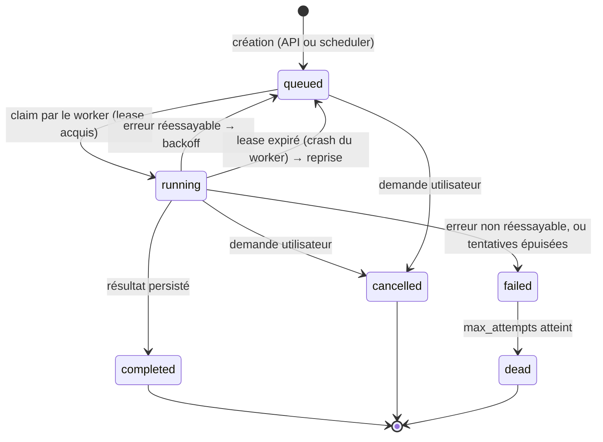
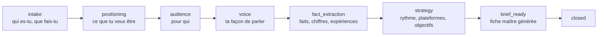
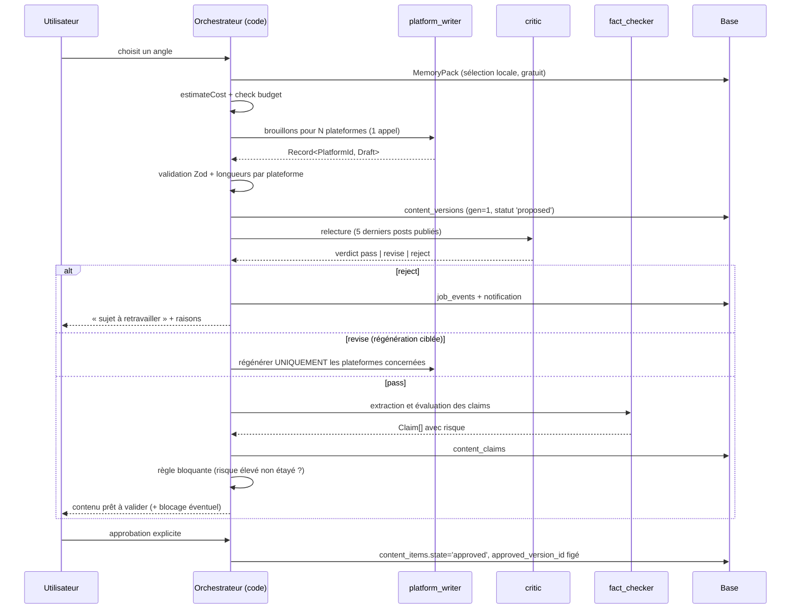
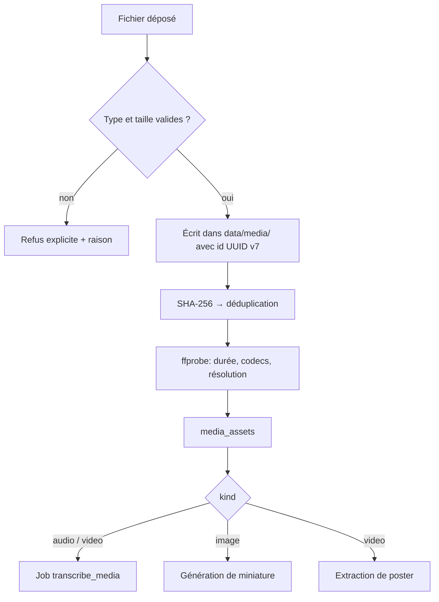
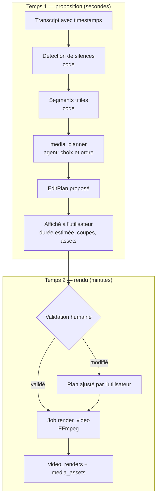
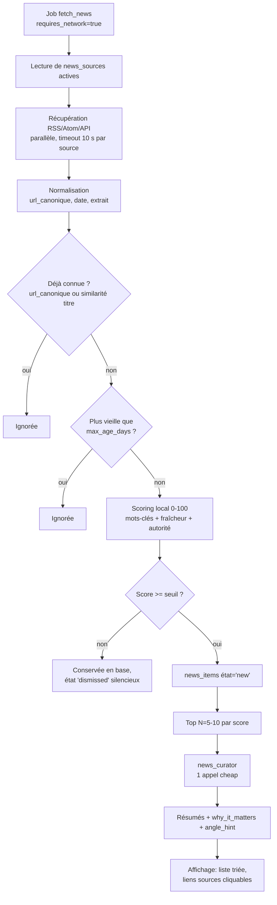
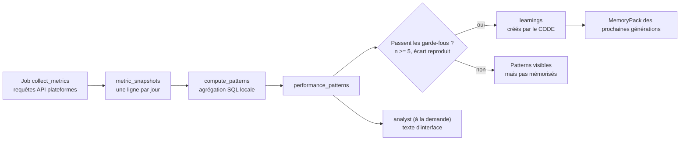

# 05 — Pipelines

> Répond aux sections G, H, I, J, K, L et aux questions 11, 12, 13, 17, 29, 30, 31 du
> [cahier des charges](00-cahier-des-charges.md). S'appuie sur
> [`02-architecture.md`](02-architecture.md) (contrats et ports), [`03-modele-de-donnees.md`](03-modele-de-donnees.md)
> (tables et états) et [`04-orchestrateur-et-agents-ia.md`](04-orchestrateur-et-agents-ia.md) (agents).

Ce document décrit les **flux de bout en bout** : ce qui se déclenche, dans quel ordre, ce qui
est persisté à chaque étape, comment on reprend après un échec, et ce qu'on refuse de faire.

---

## 1. Règles communes à tous les pipelines

| # | Règle | Conséquence pratique |
|---|---|---|
| 1 | **Un pipeline est piloté par des jobs, jamais par un appel HTTP long** | L'utilisateur ferme son onglet, le travail continue |
| 2 | **Chaque étape écrit son résultat avant de passer à la suivante** | Un crash au milieu ne perd pas le travail déjà payé (les appels LLM coûtent) |
| 3 | **Chaque étape est idempotente ou protégée par une clé** | Reprendre un job ne produit jamais un doublon |
| 4 | **Un pipeline s'arrête toujours dans un état lisible** | `completed`, `failed`, `cancelled` ou `manual_required` — jamais « bloqué » |
| 5 | **Le coût est accumulé sur le job au fil de l'eau** | Une interruption montre ce qui a été dépensé |
| 6 | **Aucune étape ne publie sans approbation** | Les pipelines qui produisent s'arrêtent à `in_review` |
| 7 | **Le réseau est une dépendance explicite** | `requires_network` sur le job : un mode hors ligne ne les consomme pas |
| 8 | **Les secrets ne traversent jamais un log ni un prompt** | Le connecteur les injecte au dernier moment |
| 9 | **La progression est un pourcentage honnête, pas une animation** | Estimé au nombre d'étapes réelles, pas au temps écoulé |
| 10 | **Un pipeline n'appelle jamais un agent que l'orchestrateur n'a pas prévu** | Les agents sont listés par étape ; aucune découverte dynamique |

### 1.1 Pourquoi cette discipline

Ces dix règles coûtent un peu de code d'écriture, et rendent possibles trois propriétés que
l'utilisateur remarque immédiatement :

1. **On peut fermer l'application** — le travail continue (règle 1).
2. **Un échec ne fait pas perdre 15 minutes de rédaction** — le travail déjà fait est conservé
   (règle 2), et le budget déjà dépensé n'est pas redépensé (règle 3).
3. **On sait toujours où on en est** — un état lisible, un coût connu, une étape nommée
   (règles 4, 5, 9).

Un système d'agents « simple » (une fonction async qui enchaîne tout puis renvoie un résultat)
échoue sur ces trois points en même temps. C'est le piège classique des premières versions.

---

## 2. Anatomie d'un job

### 2.1 Cycle de vie



| État | Signification | Ce que l'utilisateur voit |
|---|---|---|
| `queued` | En attente, `available_at` fixe le moment où il peut être pris | « En file (position 2) » |
| `running` | Un worker le détient (lease actif, heartbeat frais) | « En cours — 60 % — rédaction » |
| `completed` | Terminé, résultat en base | « Terminé à 14 h 32 — 0,18 USD » |
| `failed` | Erreur définitive (ou tentatives épuisées) | « Échec — cause : quota API dépassé » + bouton réessayer |
| `dead` | Échec après épuisement des tentatives, en quarantaine | Visible dans le tableau de bord, jamais silencieux |
| `cancelled` | Annulé (par l'utilisateur ou par un plafond de budget) | « Annulé — plafond atteint » |

### 2.2 Reprise après crash

```text
1. Le worker prend un job : status='running', worker_id, lease_expires_at = now + 5 min
2. Toutes les 30 s : heartbeat_at = now, lease_expires_at prolongé
3. Toutes les 60 s : reclaimExpired()
   → les jobs 'running' dont lease_expires_at < now repassent en 'queued' (attempt inchangé)
4. La reprise ré-exécute l'étape courante, pas les précédentes
   → les étapes terminées sont relues depuis leurs tables de sortie
```

**La reprise est possible parce que les étapes sont découpées et persistées.** Un pipeline écrit
« en une seule transaction » ne serait pas reprenable ; c'est exactement pourquoi les tables
intermédiaires de [`03-modele-de-donnees.md`](03-modele-de-donnees.md) existent (elles ne sont pas
un excès de normalisation, elles **sont** le mécanisme de reprise).

### 2.3 Idempotence des étapes

| Étape | Protection |
|---|---|
| `interviewer` (tour de conversation) | Message déjà persisté avec son rôle : on ne régénère pas une réponse existante |
| Fiche maître | `UNIQUE(content_subject_id, version)` : régénérer crée une nouvelle ligne, jamais un doublon |
| Angle | `UNIQUE(subject_id, angle_label)` |
| Rédaction | Une `content_version` par `(content_item_id, generation)` |
| Critique / vérification | Nouvelles lignes liées à la version ; relancer = nouvelles lignes, l'ancien verdict reste consultable |
| Publication | `idempotency_key` + `UNIQUE(content_version_id, platform_account_id)` |
| Métriques | `UNIQUE(publication_id, captured_date, source)` — un upsert par jour, jamais d'écrasement |

### 2.4 Annulation et plafond

Un job est **annulable à une frontière d'étape** : entre deux appels LLM, jamais au milieu d'une
requête HTTP ni d'un encodage FFmpeg. FFmpeg est arrêté proprement (`SIGTERM`, puis `SIGKILL`
après 10 s) et le fichier partiel est supprimé — un rendu tronqué qui persiste est une source de
confusion durable.

Un job annulé par un plafond de budget est marqué `cancelled` avec un `reason` explicite, jamais
`failed` : la différence entre « on n'a pas voulu dépenser » et « ça a cassé » est essentielle
pour ne pas désorienter l'utilisateur.

---

## 3. Pipeline conversation (étape 2)

**Déclencheur** : l'utilisateur ouvre une conversation (`POST /conversations/:id/messages`).

### 3.1 Les huit phases d'une conversation

L'agent `interviewer` n'est **pas** libre : il suit une trame, et chaque phase produit une donnée
persistée. La phase courante vit dans `conversations.stage`.



| Phase | Ce que l'agent cherche | Ce qui est écrit en base |
|---|---|---|
| `intake` | Activité, métier, contexte | `projects`, `project_skill_facts` (ce que l'utilisateur sait faire) |
| `positioning` | Ce qu'il veut être reconnu pour | `projects.one_liner`, `positioning` |
| `audience` | À qui il parle, leur niveau | `audience_profiles` |
| `voice` | Ton, interdits, formulations qu'il aime | `style_profiles` |
| `fact_extraction` | Chiffres, résultats, expériences vécues | `project_facts` (statut `proposed` jusqu'à validation) |
| `strategy` | Cadence, plateformes, objectifs mesurables | `project_goals`, `projects.platforms` |
| `brief_ready` | Rien : on génère | `content_subjects` + fiche maître |

**Le passage d'une phase à la suivante est décidé par le code**, sur la base de champs
obligatoires remplis — pas par le jugement du modèle. Le modèle peut signaler « je pense qu'on
peut avancer », mais c'est une validation de complétude en base qui déclenche la transition.

### 3.2 Déroulé d'un tour

```text
1. Message utilisateur reçu → messages (role='user')   [aucun coût]
2. Complétude de la phase courante calculée localement (SQL)    [aucun coût]
3. Si complète → stage suivant ; sinon → question suivante
4. MemoryPack construit (sélection locale)                       [aucun coût]
5. estimateCost() → budgetService.check()                        [aucun coût réseau]
6. Appel interviewer → sortie structurée { message, proposed_updates, next_phase? }
7. Validation Zod. type='question' exige au moins un choix ou un champ libre
8. proposed_updates validé : aucune écriture directe sur une table de faits sans validation
9. messages (role='assistant') + llm_calls + job_events
10. Réponse SSE poussée au navigateur, avec le coût du tour
```

**Point clé de l'étape 8** : le modèle **propose** des écritures, le domaine les applique après
validation. Un fait « entendu » dans une phrase ne devient jamais un fait du projet tout seul —
il passe par `status='proposed'` puis validation utilisateur. C'est ce qui rend la mémoire fiable
(principe 6 de [`03-modele-de-donnees.md`](03-modele-de-donnees.md) §1).

### 3.3 Entrée vocale et fichiers

```text
Upload (audio) → media_assets (kind='audio', purpose='voice_input')
              → job 'transcribe_media' (requires_network=false)
              → transcripts (scope='final')
              → le texte est injecté comme message utilisateur normal
```

L'utilisateur **voit la transcription avant qu'elle soit utilisée**. Une transcription fausse qui
entre silencieusement dans la mémoire du projet est une erreur qui se propage longtemps.

### 3.4 Reprise et limites de conversation

| Situation | Comportement |
|---|---|
| Appel LLM échoue | Le message utilisateur est **déjà** persisté ; « réessayer » ne redemande rien à l'utilisateur |
| L'utilisateur ferme l'onglet | Le tour terminé est en base ; le suivant reprend au même point |
| La conversation dépasse 60 messages | Le `MemoryPack` ne garde que les 10 derniers ; les faits extraits, eux, restent |
| L'utilisateur contredit un fait ancien | Détection de contradiction (§3.4 de [`04-orchestrateur-et-agents-ia.md`](04-orchestrateur-et-agents-ia.md)) → question explicite, jamais d'écrasement silencieux |

**Aucun pipeline ne se déclenche automatiquement depuis la conversation.** Même quand
`brief_ready` est atteint, la génération de contenu demande un clic. Un agent qui décide de
produire pendant une conversation est une dépense que l'utilisateur n'a pas demandée.

---

## 4. Pipeline éditorial (étapes 3–5)

C'est le pipeline central : celui qui transforme une conversation en contenu publiable. Il est
**découpé en trois jobs distincts**, pas un seul, pour que chaque étape soit reprenable et payée
une seule fois.

| Job | Rôle | Coût |
|---|---|---|
| `generate_brief` | Fiche maître + angles | ~0,03–0,08 USD |
| `generate_content` | Rédaction + critique + vérification | ~0,09–0,24 USD |
| `finalize_content` | Gel de la version approuvée | 0 |

### 4.1 Vue d'ensemble



### 4.2 Étape A — `generate_brief`

```text
Entrée  : conversation en phase 'brief_ready' + faits validés
Sortie  : content_subjects (fiche maître) + 3-5 subject_angles
Coût    : 1 appel « fiche maître » (modèle intermédiaire) + 1 appel « angles » (cheap)

Pourquoi la fiche maître est chère et le reste non : elle est réutilisée pour tous les angles
et tous les formats du même sujet. Une bonne fiche maître amortie sur 5 contenus vaut mieux
qu'un modèle cheap partout et une fiche maître vague.
```

| Garde-fou | Détail |
|---|---|
| Couverture des compétences | Chaque `skill_fact` est marqué `couverte` / `partielle` / `non_couverte` **localement**, par comparaison lexicale — pas par un LLM |
| Angles refusés | Un angle qui recouvre un contenu déjà publié à plus de 70 % est filtré avant d'être montré |
| Nombre d'angles | 3 à 5. Un seul angle = pas de choix ; huit angles = paralysie |

**La couverture des compétences est calculée avant l'appel et transmise au `strategist`** comme
une consigne : « les compétences X, Y, Z ne sont pas encore couvertes ». C'est le mécanisme par
lequel le produit évite l'écueil du §6.2 du modèle de données — affirmer une expertise
automatisée.

### 4.3 Étape B — `generate_content` : le découpage en sous-étapes

Le job `generate_content` exécute une suite de sous-étapes nommées (`jobs.current_step`). Après
chacune, l'état est persisté : une reprise repart de la sous-étape suivante.

| # | `current_step` | Écrit | Coût | Reprenable |
|---|---|---|---|---|
| 1 | `build_context` | `llm_calls.manifest` (empreinte) | 0 | oui (recalcul gratuit) |
| 2 | `write_initial` | `content_versions` (gen=1) | oui | oui (déjà écrite → sautée) |
| 3 | `validate_shapes` | `content_review_notes` (erreurs) | 0 | oui |
| 4 | `write_retry` | `content_versions` (gen=2…) | oui | oui |
| 5 | `critique` | `content_review_notes` | oui | oui |
| 6 | `fact_check` | `content_claims` | oui | oui |
| 7 | `enforce_blocking` | `content_items.state` | 0 | oui |

**`validate_shapes` avant `critique`.** Cela ne coûte rien et évite de payer une relecture sur un
texte hors format. On ne paie jamais pour critiquer un brouillon qui ne respecte pas ses propres
contraintes de longueur.

### 4.4 Boucle de régénération : bornes explicites

| Situation | Action | Borne |
|---|---|---|
| Longueur hors bornes (une plateforme) | Régénération **de cette plateforme seule** | 1 |
| `critic` → `revise` | Régénération des plateformes citées dans les notes | 2 |
| `critic` → `reject` | **Aucune** régénération automatique après 2 `reject` | — |
| Claim bloquant | **Aucune** régénération automatique : on demande la confirmation utilisateur | — |
| Erreur de schéma | 2 réparations (cf. [`04-orchestrateur-et-agents-ia.md`](04-orchestrateur-et-agents-ia.md) §6.2) | 2 |

```text
budget du job = min( max_regenerations, plafond_job_restant )
Si le budget est épuisé et que le critique n'est toujours pas satisfait :
   → le contenu est présenté quand même, avec les remarques visibles et un avertissement explicite.
   → Jamais de boucle infinie, jamais d'échec silencieux.
```

**« Présenter quand même avec les remarques »** est un choix délibéré. Le contenu et son
historique de relecture sont utiles à l'utilisateur, même imparfaits : il peut éditer lui-même.
Détruire le travail parce qu'un critique automatique n'est pas content serait un gaspillage pur —
et donnerait à un LLM un droit de veto sur la production.

### 4.5 Étape C — Approbation et gel

```text
1. L'utilisateur ouvre /content/:id → state='in_review'
2. Toutes les notes du critic et tous les claims sont visibles, y compris ceux à risque faible
3. Blocage en base : claim risk='eleve' et status != 'supported' → l'approbation est REFUSÉE
   (déclencheur trg_approval_requires_claims_ok, cf. 03 §15.2)
4. Approbation explicite → state='approved', approved_version_id = version courante
5. La version approuvée est IMMUABLE : toute modification ultérieure crée une nouvelle version
6. L'édition manuelle est mesurée (edit_ratio) : c'est le meilleur indicateur d'utilité réelle
```

**`edit_ratio` est une métrique de qualité du produit, pas du contenu.** S'il est proche de 0,
l'utilisateur accepte tout : le produit paie des appels LLM pour rien et l'utilisateur risque de
publier du texte qu'il n'a pas lu. S'il est proche de 100 %, le produit ne sert à rien. La zone
utile est l'intervalle intermédiaire, et elle mérite d'être suivie (cf.
[`08-jobs-observabilite-couts.md`](08-jobs-observabilite-couts.md)).

### 4.6 Chemins d'erreur du pipeline éditorial

| Événement | Comportement | État final |
|---|---|---|
| Budget dépassé avant l'appel | Aucun appel LLM ; message avec le montant et le plafond | `cancelled` |
| Fournisseur indisponible (5xx, timeout) | 3 tentatives, backoff exponentiel | `failed` après épuisement |
| Quota 429 | Une attente selon `Retry-After`, puis échec | `failed` avec `retry_after` |
| 401 / clé invalide | **Aucun retry** : le fournisseur est marqué en erreur, l'utilisateur est prévenu | `failed` |
| Schéma Zod non respecté après 2 réparations | Échec, la réponse brute est conservée dans `llm_calls.raw_response` | `failed` |
| Toutes les plateformes rejetées par le `critic` | Pas d'échec technique : remarques affichées | `completed` (contenu à retravailler) |
| Claim bloquant | Contenu visible, approbation impossible | `in_review` (persistant) |

**Aucun de ces chemins ne publie.** La publication est un pipeline séparé, déclenché par un
état `approved` — jamais par un pipeline de génération.

---

## 5. Pipeline médias (étape 6)

**Déclencheur** : dépôt d'un fichier (glisser-déposer, import, ou capture).

### 5.1 Ingestion



| Contrôle | Valeur V1 | Raison |
|---|---|---|
| Types acceptés | mp4, mov, mkv, webm, mp3, wav, m4a, png, jpg, webp | Liste blanche, jamais de liste noire |
| Taille max | 2 Go configurables | Un fichier plus gros ne passe pas en mémoire pour `ffprobe` |
| Durée max vidéo | 30 min configurables | Au-delà, la transcription locale devient dissuasive |
| Nom de fichier | **Ignoré** : on stocke sous `{id}.{ext}` | Un nom fourni par l'utilisateur est une entrée non fiable (traversée de chemin, caractères de contrôle) |
| Doublon | SHA-256 déjà connu → on réutilise l'asset, on ne recopie pas | Économise l'espace et évite deux transcripts du même audio |

**`ffprobe` d'abord, confiance ensuite.** Un fichier `.mp4` qui n'est pas une vidéo est rejeté
par `ffprobe`, pas par son extension. On ne fait jamais confiance à ce que le client annonce.

### 5.2 Transcription

```text
Job transcribe_media : requires_network = false
1. Extraction audio si vidéo : ffmpeg -vn -ac 1 -ar 16000 (WAV mono 16 kHz)
2. Détection de langue (échantillon des 30 premières secondes)
3. whisper.cpp (ou faster-whisper selon le CPU)
4. Sauvegarde incrémentale : transcripts (scope='rolling') toutes les 60 s
5. Fin → transcripts (scope='final') : segments avec timestamps
6. Le rolling est remplacé par le final (jamais deux 'final' pour le même asset)
```

**La sauvegarde incrémentale n'est pas un luxe** : une transcription de 20 minutes qui échoue à
19 minutes sans rien conserver coûte 20 minutes de CPU et beaucoup de patience. C'est la même
règle que pour les jobs (règle 2 du §1), appliquée à une étape non payante mais longue.

### 5.3 Ce que le pipeline médias ne fait pas

| Non fait | Pourquoi |
|---|---|
| Séparation de la voix (diarisation) | Complexe, coûteux, sans usage produit dans V1 (un seul locuteur en général) |
| Recherche d'images automatique | Dépendance externe, droits d'usage incertains |
| Génération d'images par IA | Hors périmètre assumé (cf. [`11-risques-decisions-et-limites.md`](11-risques-decisions-et-limites.md)) |
| Traduction du transcript | V1 monolingue ; le champ `language` est stocké pour ne pas fermer la porte |

---

## 6. Pipeline vidéo (étape 7)

**Déclencheur** : l'utilisateur clique « Préparer un clip » depuis un asset vidéo transcrit.

C'est le pipeline **le plus long** et le seul avec une étape réellement bloquante. Il est donc
conçu autour d'une contrainte : **rien de long ne se fait sans avoir montré le plan**.

### 6.1 Deux temps nettement séparés



**Pourquoi cette séparation** : un rendu de 6 minutes lancé sur un plan automatique non relu
produit souvent un fichier inutilisable, et il faut tout recommencer. Montrer le plan coûte
quelques secondes et évite des dizaines de minutes perdues.

### 6.2 Ce qui est calculé, ce qui est proposé

| Élément du montage | Qui décide | Détail |
|---|---|---|
| Coupes de silence | **Code** | `silencedetect` (seuil −35 dB, durée ≥ 0,6 s), marge de 0,1 s |
| Segmentation grossière | **Code** | On découpe aux frontières de phrases du transcript |
| Sélection des segments | **Agent** `media_planner` | Renvoie des `segment_ids` existants |
| Ordre des segments | **Agent** | Peut proposer un récit plus clair que l'ordre brut |
| Format et cadrage | **Code** | Preset `vertical_9_16` / `square_1_1` / `landscape_16_9` |
| Vitesse (1×, 1,05×…) | **Code** | `style_profile.video` |
| Sous-titres et position | **Code** | Style issu du profil, jamais d'un modèle |
| Assets incrustés | **Agent** | Uniquement parmi les `asset_id` fournis |
| Musique de fond | **Code** | Fichier choisi par l'utilisateur, pas de recherche automatique |

**Le partage est volontairement déséquilibré en faveur du code.** Un LLM n'a aucune légitimité à
décider d'un niveau de décibels ou d'une vitesse de lecture : ce sont des préférences, et une
préférence se stocke dans un profil.

### 6.3 Validation du plan avant tout appel FFmpeg

```ts
const EditPlan = z.object({
  segments: z.array(z.object({
    source_asset_id: z.string(),
    start_ms: z.number().int().nonnegative(),
    end_ms: z.number().int().positive(),
  })).min(1).max(40),
  overlays: z.array(z.object({
    asset_id: z.string(),
    at_ms: z.number().int().nonnegative(),
    duration_ms: z.number().int().positive(),
  })).max(15),
  rationale: z.string().max(600),
}).refine(p => p.segments.every(s => s.end_ms > s.start_ms), {
  message: 'segment invalide : fin avant début',
}).refine(/* toutes les bornes existent dans le transcript */, { /* … */ });
```

**Trois vérifications en code après la validation du schéma** :

1. Chaque `start_ms`/`end_ms` correspond à une frontière réelle du transcript (à ±500 ms).
2. Chaque `source_asset_id` et `asset_id` appartient bien au projet.
3. Durée totale du plan ≤ `max_clip_ms` du preset.

Un plan qui échoue est **rejeté et redemandé une fois**, puis remplacé par un plan par défaut
calculé en code (segments les mieux notés par densité de parole). **Le pipeline ne s'arrête
jamais sur un plan invalide** : une vidéo médiocre est préférable à un échec, et l'utilisateur
peut toujours corriger le plan à la main.

### 6.4 Rendu

```text
Job render_video : requires_network = false, priority = 8 (batch)
1. video_renders (status='queued')
2. Construction de la commande ffmpeg : filter_complex unique, un seul passage d'encodage
3. Progression : parsing des lignes ffmpeg (-progress pipe:1) → jobs.progress
4. Sortie dans data/media/renders/{render_id}.mp4
5. Vérification : ffprobe confirme durée et résolution attendues
6. media_assets (kind='video', purpose='vertical'|'subtitled') + video_renders (status='completed')
7. L'asset source n'est JAMAIS modifié
```

| Règle de rendu | Raison |
|---|---|
| Un seul passage FFmpeg avec `filter_complex` | Deux passages = deux encodages = deux fois plus long et une perte de qualité |
| `SIGTERM` puis `SIGKILL` sur annulation, puis suppression du fichier partiel | Un fichier tronqué laissé sur disque est un piège |
| Écriture dans un fichier temporaire puis `rename` atomique | Un fichier visible est un fichier terminé |
| Le rendu est un **nouvel asset**, jamais un remplacement | Principe 1 du modèle de données : on ne perd rien |
| Un seul rendu lourd à la fois (sémaphore de taille 1) | Deux FFmpeg simultanés sur un PC modeste rendent la machine inutilisable |

**Le sémaphore de taille 1 est un choix de confort, pas de performance.** Empêcher l'encodage en
parallèle garde la machine réactive pendant un rendu ; c'est plus important que de finir plus tôt.

---

## 7. Pipeline de veille (étape 10)

**Déclencheur** : planificateur (toutes les 2 heures par défaut, configurable) ou bouton manuel.

C'est le pipeline où le partage **code / LLM** est le plus strict : la découverte est
entièrement déterministe, le LLM ne fait que commenter ce qui a déjà été retenu (cf.
[`04-orchestrateur-et-agents-ia.md`](04-orchestrateur-et-agents-ia.md) §4.6).

### 7.1 Déroulé complet



### 7.2 Les garanties

| Garantie | Mécanisme |
|---|---|
| **Zéro jeton si rien d'intéressant** | Scoring et déduplication sont locaux ; le `news_curator` est appelé seulement si le top N est non vide |
| **Aucun doublon cross-source** | `url_canonique` unique + similarité de titre (Jaccard > 0,85) |
| **Aucune actualité périmée** | Filtre `max_age_days` par source, appliqué avant tout traitement |
| **Toute affirmation est traçable** | Chaque item conserve son `source_url`, son `source_id` et sa `published_at` d'origine |
| **Rien n'entre dans la mémoire sans validation** | Un item utilisé pour un contenu devient `state='used'` **seulement** via une action explicite de l'utilisateur |
| **Une source morte n'empoisonne pas le cycle** | Un flux en erreur 3 fois consécutives est marqué `broken`, ignoré, et signalé dans l'interface |

**Le principe qui protège le produit : un item non retenu est conservé, pas supprimé.** Il est en
`dismissed` avec son score. Le jour où l'utilisateur élargit ses mots-clés, l'historique existe
déjà — et on peut vérifier a posteriori que le filtre n'était pas trop agressif. Jeter
silencieusement du contenu est une perte d'information irréversible (principe 1 du modèle de
données).

**Une actualité devient un sujet comme un autre.** Elle ne bénéficie d'aucun traitement
privilégié et subit **les mêmes** garde-fous : critique, vérification factuelle, approbation.
C'est nécessaire : c'est exactement le cas où la tentation d'aller vite est la plus forte, et
où le risque de publier une erreur de compréhension est le plus élevé.

### 7.3 Ce que la veille ne fait pas

| Non fait | Raison |
|---|---|
| Chercher sur le web (moteur, scraping large) | Coût, fragilité, et risque d'hallucination présentée comme un fait |
| Suivre des comptes sur les réseaux sociaux | Nécessite une authentification par plateforme, périmètre V3 |
| Résumer un article **non récupéré** | Inventer un résumé à partir d'un titre est une fabrication |
| Détecter automatiquement un « sujet tendance » | Notion non mesurable sans données externes fiables |
| Envoyer une notification à chaque cycle | Le bruit tue l'outil : seuls les items au-dessus d'un seuil élevé notifient |

---

## 8. Pipeline de publication (étape 8)

**Déclencheur** : échéance `scheduled_for` atteinte, ou action manuelle « publier maintenant ».

C'est le pipeline **le plus risqué du produit** : il produit un effet de bord irréversible et
public. Sa conception est dominée par une seule question : *que se passe-t-il si on ne sait pas
si ça a marché ?*

### 8.1 Trois niveaux de publication

| Niveau | Moyens | Comportement |
|---|---|---|
| **A — API officielle** | OAuth + POST de l'API | Automatique, avec `idempotency_key` |
| **B — brouillon distant** | API qui crée un brouillon (LinkedIn, YouTube) | Automatique jusqu'au brouillon, publication finale manuelle |
| **C — paquet local** | `manual_packages` : texte + assets + métadonnées | Manuel entièrement, mais préparé en un clic |

**Le niveau C n'est pas un échec, c'est une fonctionnalité.** Pour Reddit et TikTok en V1, la
voie officielle est soit absente, soit risquée. Préparer un paquet prêt à coller (texte formaté,
image nommée, hashtags séparés) est le meilleur service qu'on puisse rendre — et cela évite toute
transgression des conditions d'utilisation des plateformes.

### 8.2 Déroulé (niveaux A et B)

```text
1. publications (status='planned') pour chaque platform_account ciblé
2. Vérification en base : la version est approuvée (trg_publication_requires_approval)
3. Vérification du compte : platform_accounts.status='connected', jeton non expiré
4. idempotency_key = hash(publication_id)
   → si une tentative précédente a réussi, on ne republie PAS
5. publications (status='publishing') + publication_attempts (attempt=1)
6. Appel connecteur : publication_attempts.request_json  (jamais le jeton)
7. Résultat :
   - 2xx + identifiant distant      → published + external_post_id + external_url
   - 2xx sans identifiant exploitable → ambiguous + needs_human_decision
   - 429                            → rate_limited, retry planifié selon Retry-After
   - 401 / 403                      → auth_error, compte 'expired', AUCUN retry
   - 5xx / timeout réseau           → retry (max 3, backoff)
   - 4xx de validation              → failed définitif avec le message de la plateforme
8. publication_attempts (status, response_json, duration_ms)
9. metric_snapshots initialisé à 0 pour que le suivi démarre dès la publication
```

### 8.3 Le cas `ambiguous` : la décision la plus importante du pipeline

**Situation** : la requête a été acceptée, mais on n'a pas reçu de confirmation exploitable
(timeout après envoi, réponse tronquée, identifiant absent).

**Ce qu'on fait** : `publications.status='ambiguous'`, `needs_human_decision=1`, **aucun retry
automatique**, et une notification avec un lien direct vers le post probable.

**Ce qu'on ne fait pas** : réessayer « pour être sûr ». C'est précisément l'erreur qui crée des
doublons publics — et un doublon supprimé à la main est plus coûteux (et plus gênant pour la
réputation) que dix minutes d'attente.

| Option envisagée | Verdict |
|---|---|
| Retenter automatiquement | **Rejeté** : doublon probable |
| Marquer comme publié | **Rejeté** : mensonge dans la base, métriques faussées |
| Chercher le post via l'API de la plateforme | **Envisagé en V2** : dépend d'un endpoint de listing fiable par plateforme |
| Demander à l'utilisateur | **Retenu en V1** : 30 secondes de vérification humaine contre un risque de doublon |

### 8.4 Planification et fenêtres d'envoi

```text
1. content_items.scheduled_for = échéance choisie (fuseau utilisateur)
2. Un job publish_content est créé avec scheduled_for, PAS exécuté à l'avance
3. Le planificateur ne fait que mettre available_at = now à l'échéance
4. Anti-collision : deux publications du même compte à moins de 30 min sont décalées
   (ou refusées avec une explication), jamais publiées simultanément
```

**On ne publie jamais « au meilleur moment » automatiquement en V1.** Le produit peut
**suggérer** une heure à partir des `performance_patterns`, mais la décision reste explicite. Un
système qui publie seul sur la base d'une corrélation faible sur 15 posts prend des décisions
engageantes avec une confiance injustifiée (cf. les règles anti-superstition de
[`03-modele-de-donnees.md`](03-modele-de-donnees.md) §6.5).

---

## 9. Pipeline analytics et apprentissage (étape 11)

**Déclencheur** : planificateur quotidien, 2 h après la fenêtre habituelle de publication.

C'est le pipeline qui **ferme la boucle**. Sans lui, le produit est un générateur de texte.

### 9.1 Trois étages bien séparés



| Étage | Nature | Coût |
|---|---|---|
| 1. Collecte des métriques | Code + API plateformes | 0 (jetons) |
| 2. Calcul des patterns | **SQL local** | 0 |
| 3. Création des `learnings` | **Code**, après garde-fous | 0 |
| 4. Interprétation (`analyst`) | Agent, appelé **à la demande** | < 0,03 USD |

**Trois étages sur quatre ne coûtent rien.** Toute la valeur mesurable est produite localement ;
le LLM n'intervient qu'au dernier moment, pour traduire des chiffres en phrases compréhensibles.
C'est l'inverse de l'approche « demandons au modèle de trouver ce qui marche ».

### 9.2 Collecte des métriques

```text
Pour chaque publication published et suivie :
  1. Fenêtre : 5 premiers jours en quotidien (J+1 … J+5), puis hebdomadaire (S+1, S+2, S+4)
  2. Appel connecteur : getMetrics(external_post_id, date)
  3. metric_snapshots : UPSERT sur (publication_id, captured_date, source)
  4. Les valeurs indisponibles restent NULL, jamais 0
     (un 0 est une mesure ; une absence n'est pas une mesure)
```

| Règle | Raison |
|---|---|
| **Jamais d'écrasement** : un jour déjà capturé est relu mais pas remplacé, sauf `source='manual'` | Une métrique passée est un fait historique |
| **NULL plutôt que 0** | Confondre « pas de données » et « zéro engagement » fausserait toutes les moyennes |
| **Fenêtre dégressive** | Le rythme de collecte s'adapte à la réalité : 90 % des vues d'un post arrivent dans les premiers jours |
| **Métriques manuelles acceptées** | Pour les plateformes sans API, l'utilisateur saisit ses chiffres ; `source='manual'` est toujours prioritaire |

### 9.3 Calcul des patterns (SQL, pas LLM)

```sql
-- Exemple : l'heure de publication influence-t-elle le taux d'engagement sur LinkedIn ?
SELECT dimension_value, COUNT(*) AS sample_size, AVG(value_x100) AS avg_x100
FROM (
  SELECT (s.captured_at / 3600000) % 24 AS dimension_value, s.engagement_rate_x100 AS value_x100
  FROM metric_snapshots s
  JOIN publications p ON p.id = s.publication_id
  WHERE p.platform = 'linkedin' AND s.metric = 'engagement_rate' AND s.source != 'estimated'
) GROUP BY dimension_value HAVING COUNT(*) >= 5;
```

**`HAVING COUNT(*) >= 5` est la garde anti-superstition appliquée au niveau SQL.** Elle est
impossible à contourner par un appel LLM : c'est la base qui refuse de produire un pattern
sur un échantillon trop petit.

### 9.4 De la corrélation à la mémoire : les conditions

Un `learning` n'est créé que si **les quatre** conditions sont réunies :

1. `sample_size >= 5` sur la période.
2. L'écart dépasse le `baseline` d'un seuil minimal (ex. `|delta_percent| >= 15 %`).
3. L'écart **se reproduit** sur au moins deux périodes consécutives ou deux valeurs voisines.
4. La dimension n'a pas déjà un `learning` actif contradictoire.

Sinon, le pattern reste **visible** dans l'interface mais n'entre **pas** dans le `MemoryPack`.
L'utilisateur peut toujours décider de le promouvoir manuellement (`human_reviewed=1`), ce qui
est une décision explicite et documentée.

**Pourquoi cette sévérité** : un `learning` entre dans le contexte de **toutes** les générations
suivantes. Une superstition mémorisée (« publier le mardi ») dégrade la qualité réelle du contenu
pendant des mois, et elle est invisible parce qu'elle est « apprise ». Il vaut mieux une mémoire
qui apprend lentement qu'une mémoire qui apprend des bruits.

---

## 10. Déclencheurs, ordonnancement et concurrence

### 10.1 Table des pipelines

| Pipeline | Job(s) | Déclencheur | Réseau | Priorité | Durée typique |
|---|---|---|---|---|---|
| Conversation | synchrone (pas un job) | Message utilisateur | oui | — | 2–8 s |
| Transcription | `transcribe_media` | Upload | **non** | 4 | 8–20 min |
| Brief | `generate_brief` | Action utilisateur | oui | 5 | 20–40 s |
| Éditorial | `generate_content` | Angle choisi | oui | 5 | 40–90 s |
| Assemblage | `finalize_content` | Approbation | non | 6 | < 1 s |
| Rendu vidéo | `render_video` | Validation d'un plan | **non** | 8 | 4–60 min |
| Veille | `fetch_news` | Cron (2 h) ou manuel | oui | 6 | 10–60 s |
| Publication | `publish_content` | Échéance ou manuel | oui | 3 | 2–10 s |
| Métriques | `collect_metrics` | Cron quotidien | oui | 7 | 10–90 s |
| Patterns | `compute_patterns` | Cron quotidien | non | 7 | < 2 s |
| Analyse | `compute_insights` | Action utilisateur | oui | 7 | 5–15 s |
| Maintenance | `cleanup`, `vacuum`, `backup` | Cron nocturne | non | 9 | 5–120 s |

**Deux priorités seulement comptent en pratique** : ce qu'un humain attend (3–5) et ce qui peut
attendre (7–9). La priorité intermédiaire (6) est un luxe de raffinement ; elle est là parce que
la colonne existe, pas parce qu'elle est fine.

### 10.2 Concurrence

| Contrainte | Valeur | Raison |
|---|---|---|
| Jobs simultanés au total | 3 par défaut | PC modeste ; évite de saturer le CPU et le réseau |
| Jobs réseau simultanés | 4 | Les appels LLM sont limités par le fournisseur, pas par nous |
| Jobs FFmpeg simultanés | **1** | Un seul encodage lourd à la fois (cf. §6.4) |
| Jobs whisper simultanés | 1 | Modèle en mémoire, CPU intensif |
| Appels LLM par job | Illimité mais plafonné par le budget de job | Le plafond est une contrainte de coût, pas de débit |

**Pas de préemption.** Un job long (rendu vidéo) n'est pas interrompu par un job urgent. En
revanche, un job urgent peut être **exécuté en parallèle** d'un job batch, ce qui suffit dans un
usage mono-utilisateur : personne n'attend une réponse éditoriale à la seconde près quand sa
vidéo encode.

### 10.3 Planificateur

```text
Toutes les 60 s, le worker exécute tick() :
  1. reclaimExpired()                     → récupération des leases morts
  2. promoteScheduled()                   → available_at = now pour jobs échus
  3. enqueueCron()                        → crée les jobs récurrents dus (veille, métriques, nuit)
  4. claim()                              → prend jusqu'à N jobs disponibles par priorité
  5. run()                                → exécution séquentielle dans le worker
```

| Tâche planifiée | Fréquence | Idempotence |
|---|---|---|
| `fetch_news` | Toutes les 2 h | `dedupe_key = 'fetch_news:{date}:{hour}'` |
| `collect_metrics` | 1×/jour à 09 h locale | `dedupe_key = 'metrics:{date}'` |
| `compute_patterns` | 1×/jour après la collecte | Chaîné en fin de `collect_metrics` |
| `backup` | 1×/jour à 03 h locale | `dedupe_key = 'backup:{date}'` |
| `cleanup` | 1×/semaine | Politique de rétention de [`03-modele-de-donnees.md`](03-modele-de-donnees.md) §16 |

**Chaque tâche planifiée porte une `dedupe_key` journalière.** Deux workers lancés par erreur (ou
un redémarrage pendant un tick) ne produisent donc pas deux exécutions. C'est le même mécanisme
que pour les clics utilisateur répétés, appliqué au planificateur.

**Le fuseau est celui de l'utilisateur, stocké une fois** (`app_settings.timezone`). Un
planificateur en UTC sur un produit mono-utilisateur est une source permanente de confusion
(« pourquoi l'analyse de la semaine dernière est-elle arrivée hier ? »).

### 10.4 Mode hors ligne

```text
settings.offline_mode = true
  → les jobs requires_network=true ne sont PLUS claimés
  → ils restent 'queued', disponibles, visibles avec la mention « en attente de connexion »
  → transcription, rendu vidéo, patterns, maintenance continuent de tourner
```

C'est une conséquence directe de `requires_network` (cf. [`03-modele-de-donnees.md`](03-modele-de-donnees.md) §14.1).
Le produit reste partiellement utile sans connexion — ce qui est la bonne réponse à une coupure
réseau, plutôt qu'une avalanche d'échecs et une file de retries.

**Le retour en ligne est détecté par la réussite d'un appel distant**, jamais par un ping. Un ping
qui réussit ne garantit pas qu'une API métier répond ; un appel qui réussit, oui.

---

## 11. Ce qu'il ne faut PAS construire (maintenant)

| Tentation | Pourquoi c'est refusé à ce stade |
|---|---|
| **Un pipeline « tout-en-un »** qui fait conversation → publication en un job | Impossible à reprendre, impossible à plafonner, impossible à diagnostiquer |
| **Un workflow visuel** (n8n, Node-RED, LangFlow) | Interface d'administration à maintenir, logique métier invisible dans un JSON, débogage opaque. Le produit doit expliquer ses échecs, pas les cacher dans un graphe |
| **Redis / RabbitMQ / BullMQ** | La file en base suffit (cf. [`02-architecture.md`](02-architecture.md) §9.3). Un broker est un service permanent de plus sur un PC modeste |
| **Kubernetes, Docker obligatoire** | Contrainte matérielle explicite du cahier des charges (§39) |
| **Publication automatique sans approbation, même « en mode confiance »** | Invariant n°1. Un mode confiance qui publie seul est exactement le produit qu'on ne veut pas |
| **Reprise automatique d'une publication ambiguë** | Doublon public. Décision humaine obligatoire (§8.3) |
| **Webhooks entrants des plateformes** | Nécessite un serveur exposé publiquement — incompatible avec l'exécution locale. Le polling planifié suffit largement |
| **Édition collaborative en temps réel** (CRDT, OT) | Usage mono-utilisateur. Complexité considérable pour un bénéfice nul |
| **Pipeline d'analyse vidéo par IA** (détection de scènes, visages, objets) | Modèles lourds, résultats incertains, aucun besoin exprimé. Les coupes se font sur les silences et le transcript |
| **Génération de contenu programmée à l'avance en masse** (« 30 posts d'un coup ») | Contredit le principe de conversation et d'approbation. Produit du contenu générique et non relu, c'est-à-dire le pire usage possible du budget LLM |
| **Traduction multi-langue** | Doublerait le coût et la complexité de vérification pour un besoin non prioritaire |
| **Multi-utilisateur, rôles, permissions** | Un seul utilisateur. Le modèle de données ne ferme pas la porte (toutes les tables ont un `project_id`), mais aucun code de permission n'est écrit |

### 11.1 Le test appliqué à chaque nouvelle idée de pipeline

Trois questions, dans l'ordre :

1. **Le pipeline peut-il être repris après un crash à n'importe quelle étape ?** Si non, il est
   découpé davantage.
2. **Peut-on dire à l'utilisateur, à tout instant, ce qui se passe et combien ça a coûté ?**
   Si non, l'observabilité est ajoutée avant la fonctionnalité.
3. **Que se passe-t-il si on exécute deux fois la même étape ?** Si la réponse est « ça dépend »,
   la clé d'idempotence manque.

Une fonctionnalité qui échoue à ces trois questions n'est pas mauvaise : elle n'est pas prête.

---

## 12. Synthèse

### 12.1 Les sept propriétés qui définissent un bon pipeline ici

| # | Propriété | Vérifiable par |
|---|---|---|
| 1 | **Reprenable** | Couper le worker en plein job, le relancer : le job finit sans repayer ce qui était fait |
| 2 | **Idempotent** | Exécuter deux fois : aucun doublon en base, aucune double publication |
| 3 | **Plafonné** | Un budget de job bas fait échouer proprement, pas à moitié |
| 4 | **Explicable** | Chaque étape a un nom dans `job_events`, un coût dans `llm_calls`, un état dans la table métier |
| 5 | **Observable** | L'interface répond à « pourquoi ça a échoué ? » sans lire un log brut |
| 6 | **Sans effet de bord non confirmé** | Aucune publication, aucun écrasement de données, sans certitude du résultat |
| 7 | **Borné dans le temps** | Chaque étape a un timeout ; aucune étape ne peut bloquer indéfiniment |

### 12.2 Ce que les pipelines garantissent au produit

| Promesse du cahier des charges | Mécanisme dans ce document |
|---|---|
| « Je peux fermer mon PC, ça continue » | File en base + leases (§1, §2.2) |
| « Je ne veux pas payer deux fois » | Idempotence par étape (§2.3), budget avant appel (§4) |
| « Je veux savoir ce qui s'est passé » | `job_events`, `current_step`, coût cumulé (§2) |
| « Rien ne se publie sans mon accord » | État `approved` obligatoire, déclencheur en base (§4.5, §8) |
| « Je ne veux pas de contenu inventé » | Vérification factuelle obligatoire, même pour une actualité (§4, §7.2) |
| « Je ne veux pas qu'il apprenne n'importe quoi » | Garde-fous anti-superstition en SQL (§9.3, §9.4) |
| « Ça doit tourner sur mon PC » | Concurrence limitée, un seul FFmpeg, un seul whisper (§10.2) |

### 12.3 Enchaînement des documents

```text
02-architecture.md                  → les composants et les contrats
03-modele-de-donnees.md             → les tables, les états, les invariants
04-orchestrateur-et-agents-ia.md    → les agents, les prompts, les coûts
05-pipelines.md                     → l'enchaînement réel (ce document)
06-connecteurs-et-publication.md    → l'API de chaque plateforme, une par une
08-jobs-observabilite-couts.md      → les tableaux de bord et le suivi fin
```

---

*Fin du document. Les pipelines sont décrits de bout en bout ; le détail de chaque plateforme
(authentification, formats, quotas, politique de contenu) est traité dans
[`06-connecteurs-et-publication.md`](06-connecteurs-et-publication.md).*


